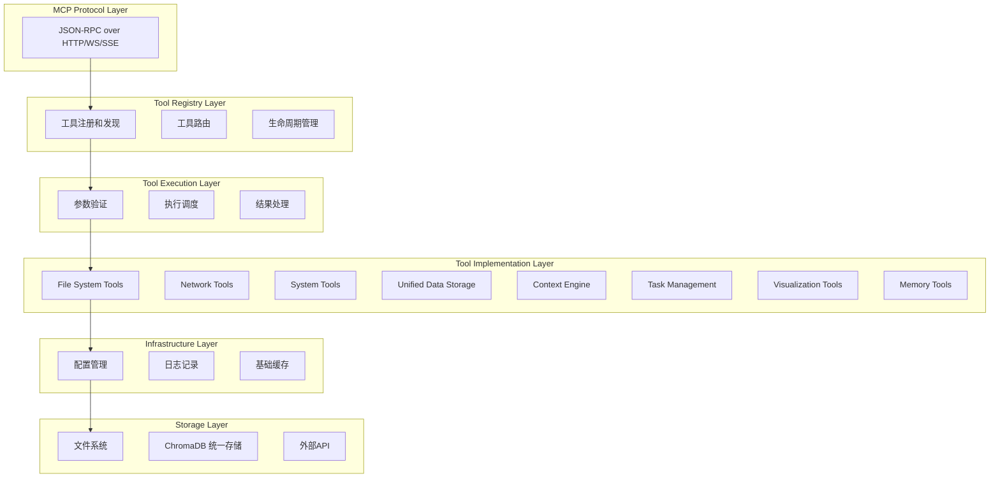
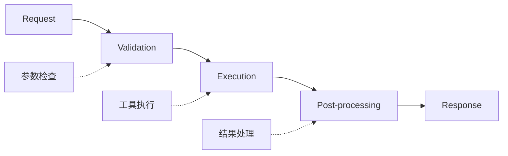
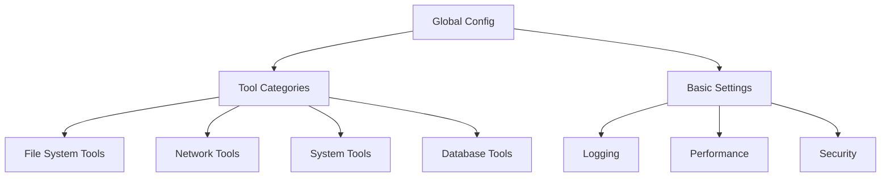
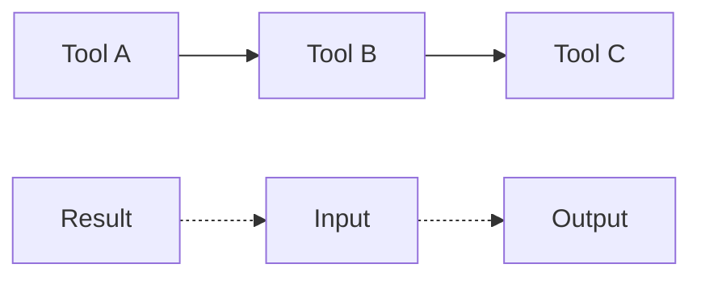
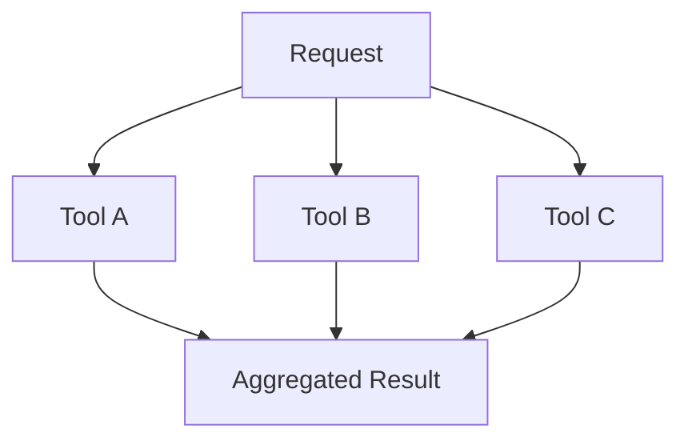
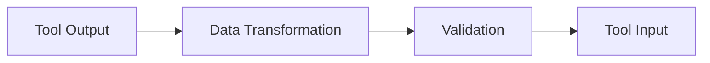
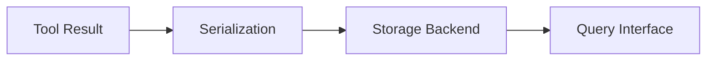

# 整体架构设计

## 🏗️ 架构概览

MCP Toolkit 基础工具采用分层、模块化的架构设计，确保高内聚、低耦合，支持灵活扩展和维护。

## 📐 架构层次



## 🔧 核心组件设计

### 1. Tool Registry (工具注册中心)

**职责**：
- 工具生命周期管理 (注册、注销、更新)
- 工具发现和路由
- 依赖关系管理
- 版本控制和兼容性检查

**关键接口**：
```
ToolRegistry:
  - register_tool(tool: BaseTool) -> bool
  - unregister_tool(tool_name: str) -> bool
  - get_tool(tool_name: str) -> Optional[BaseTool]
  - list_tools(category: Optional[str]) -> List[ToolInfo]
  - resolve_dependencies(tool_name: str) -> List[str]
```

### 2. Tool Execution Engine (工具执行引擎)

**职责**：
- 执行上下文管理
- 基础并发控制
- 简单错误处理
- 基础结果缓存

**执行流程**：


### 3. Security Manager (安全管理器)

**职责**：
- 基础路径验证
- 简单资源限制
- 基础日志记录

**安全层级**：
- **基础安全**：路径验证、文件大小限制
- **工具安全**：参数验证、基础权限检查
- **数据安全**：敏感路径保护

### 4. Configuration Manager (配置管理器)

**职责**：
- 配置文件解析和验证
- 动态配置更新
- 环境变量管理
- 配置版本控制

**配置层次**：


## 🔄 工具交互模式

### 1. 直接调用模式


### 2. 链式调用模式


### 3. 并行执行模式


## 📊 数据流设计

### 1. 请求数据流


### 2. 工具间数据流


### 3. 持久化数据流


## 🚀 性能优化策略

### 1. 异步执行
- 基础 I/O 操作异步化
- 简单并发工具执行
- 非阻塞文件访问

### 2. 缓存机制
- **内存缓存**：工具结果、配置数据
- **文件缓存**：临时文件、查询结果
- **简单缓存策略**：LRU 和 TTL

### 3. 资源管理
- 基础连接复用
- 简单线程池
- 内存使用监控

### 4. 基础调度
- 简单优先级队列
- 基础资源限制
- 超时控制

## 🔌 扩展性设计

### 1. 简单插件架构


### 2. 工具开发框架
- 基础工具类 (BaseTool)
- 简单验证框架
- 基础测试工具

### 3. 配置扩展
- YAML 配置文件
- 环境变量支持
- 简单配置继承

## 🔍 监控和可观测性

### 1. 指标收集
- 工具执行时间和成功率
- 资源使用情况
- 错误率和异常统计
- 用户行为分析

### 2. 日志系统
- 结构化日志记录
- 分级日志管理
- 日志聚合和搜索
- 实时日志流

### 3. 健康检查
- 工具可用性检查
- 依赖服务状态
- 资源健康状态
- 性能基准测试

## 🛡️ 容错和恢复

### 1. 错误处理策略
- 分级错误处理
- 优雅降级机制
- 自动重试逻辑
- 错误传播控制

### 2. 故障恢复
- 检查点机制
- 状态恢复
- 数据一致性保证
- 服务自愈能力

### 3. 资源保护
- 内存泄漏防护
- 文件句柄管理
- 网络连接清理
- 超时控制机制

---

这个架构设计为后续的具体工具实现提供了坚实的基础，确保系统的可扩展性、可维护性和高性能。
