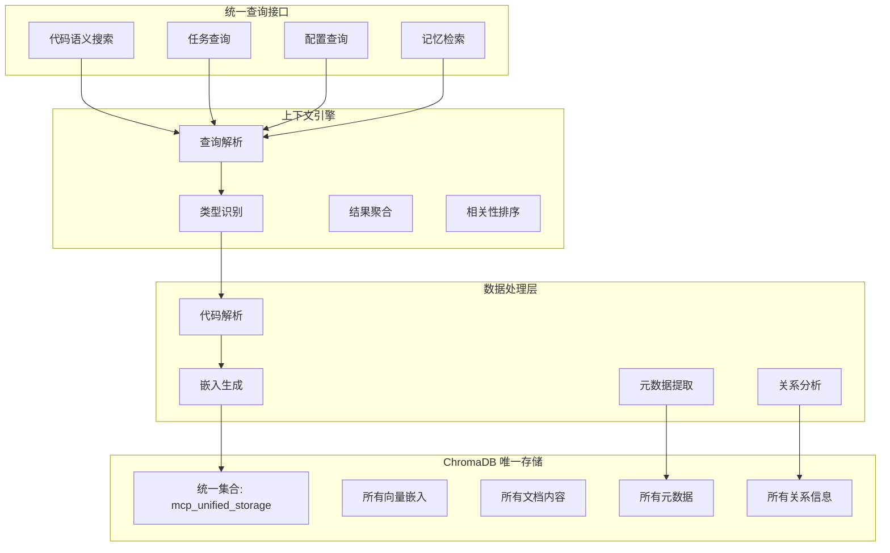
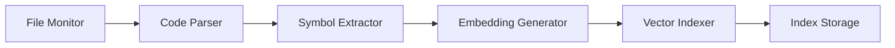
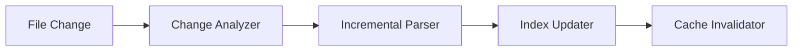

# 上下文引擎设计

## 🎯 设计目标

上下文引擎是 MCP 服务器的核心智能组件，基于 **ChromaDB 纯统一存储架构**，与所有其他组件共享同一个 ChromaDB 实例。提供代码库理解、语义搜索、上下文聚合等能力，同时作为整个系统的统一数据访问层。

## 🧠 核心架构

### 1. ChromaDB 纯统一架构


## 🛠️ 核心组件

### 1. ChromaDB 存储引擎

#### 1.1 统一存储架构
**设计原则**：
- 使用 ChromaDB 作为唯一存储后端
- 向量嵌入 + 元数据 + 文档内容统一管理
- 避免混合架构的数据一致性问题
- 简化查询和维护逻辑

#### 1.2 Multi-Language Parser (多语言解析器)
**支持语言**：
- **主流语言**：Python, JavaScript/TypeScript, Java, C/C++, Go, Rust
- **标记语言**：HTML, XML, Markdown, YAML, JSON
- **配置文件**：TOML, INI, Properties, Dockerfile
- **查询语言**：SQL

**解析功能**：
```yaml
code_parser:
  languages:
    python:
      parser: tree-sitter-python
      features: [ast, symbols, imports, docstrings]
    javascript:
      parser: tree-sitter-javascript
      features: [ast, symbols, imports]
      typescript_support: true
    java:
      parser: tree-sitter-java
      features: [ast, symbols, packages]

  parsing_options:
    max_file_size: 5MB  # 适合个人项目
    timeout: 15s
    error_recovery: true
    incremental_parsing: false  # 简化实现
```

#### 1.2 Symbol Extractor (符号提取器)
**提取内容**：
- 类、接口、枚举定义
- 函数、方法、属性
- 变量、常量、参数
- 导入和依赖关系
- 注释和文档字符串
- 类型注解和泛型

#### 1.3 Dependency Analyzer (依赖分析器)
**分析能力**：
- 模块依赖关系
- 函数调用图
- 类继承层次
- 接口实现关系
- 数据流分析
- 控制流分析

### 2. ChromaDB 集成引擎

#### 2.1 统一集合设计
**单一集合结构**：
```yaml
chromadb_unified_collection:
  name: "mcp_unified_storage"
  embedding_function: "sentence-transformers/all-MiniLM-L6-v2"

  # 通过 data_type 字段区分不同类型的数据
  unified_metadata_schema:
    # 通用字段
    data_type: str          # "file", "task", "config", "memory", "knowledge"
    created_time: float
    updated_time: float

    # 文件相关字段（当 data_type="file" 时使用）
    file_path: str
    language: str
    function_name: str
    class_name: str
    line_start: int
    line_end: int
    file_size: int

    # 任务相关字段（当 data_type="task" 时使用）
    task_status: str        # "pending", "in_progress", "completed"
    task_priority: str      # "low", "medium", "high"
    task_assignee: str
    task_due_date: str

    # 配置相关字段（当 data_type="config" 时使用）
    config_category: str
    config_key: str
    config_scope: str       # "global", "user", "project"

    # 记忆相关字段（当 data_type="memory" 时使用）
    memory_type: str        # "conversation", "knowledge", "experience"
    importance_score: float
    access_count: int
```

#### 2.2 Embedding Generator (嵌入生成器)
**嵌入配置**：
```yaml
embedding_generator:
  model:
    name: "sentence-transformers/all-MiniLM-L6-v2"  # 轻量级模型
    dimension: 384
    max_sequence_length: 512  # 适合代码片段
    batch_size: 16  # 适合个人设备

  preprocessing:
    code_normalization: true
    comment_extraction: true
    chunk_size: 1000  # 代码块大小
    chunk_overlap: 100  # 重叠部分
```

#### 2.3 ChromaDB 查询引擎
**查询功能**：
```python
# 语义搜索
def semantic_search(self, query: str, n_results: int = 10):
    return self.collection.query(
        query_texts=[query],
        n_results=n_results
    )

# 元数据过滤搜索
def filtered_search(self, query: str, language: str = None, content_type: str = None):
    where_clause = {}
    if language:
        where_clause["language"] = language
    if content_type:
        where_clause["content_type"] = content_type

    return self.collection.query(
        query_texts=[query],
        where=where_clause,
        n_results=10
    )

# 混合搜索（语义 + 元数据）
def hybrid_search(self, query: str, file_path_pattern: str = None):
    where_clause = {}
    if file_path_pattern:
        where_clause["file_path"] = {"$regex": file_path_pattern}

    return self.collection.query(
        query_texts=[query],
        where=where_clause,
        n_results=10
    )
```

### 3. 关系和上下文管理

#### 3.1 ChromaDB 中的关系存储
**关系表示方法**：
```python
# 在 ChromaDB 元数据中存储关系信息
def add_code_with_relations(self, content: str, metadata: dict):
    enhanced_metadata = {
        **metadata,
        # 直接关系
        "imports": ["os", "sys", "json"],
        "calls": ["function_a", "function_b"],
        "inherits": ["BaseClass"],

        # 上下文关系
        "related_files": ["/path/to/related.py"],
        "similar_functions": ["func_id_123", "func_id_456"],

        # 语义标签
        "tags": ["file_io", "data_processing", "utility"],
        "complexity": "medium",
        "usage_frequency": 0.8
    }

    self.collection.add(
        embeddings=[self.generate_embedding(content)],
        documents=[content],
        metadatas=[enhanced_metadata],
        ids=[metadata["id"]]
    )
```

#### 3.2 关系查询
**查询关系的方法**：
```python
# 查找相关代码
def find_related_code(self, code_id: str):
    # 通过元数据查找直接关系
    result = self.collection.get(
        ids=[code_id],
        include=["metadatas"]
    )

    related_ids = result["metadatas"][0].get("similar_functions", [])

    # 获取相关代码内容
    return self.collection.get(
        ids=related_ids,
        include=["documents", "metadatas"]
    )

# 查找调用链
def find_call_chain(self, function_name: str):
    return self.collection.query(
        query_texts=[f"calls {function_name}"],
        where={"calls": {"$contains": function_name}},
        n_results=20
    )
```

### 4. 上下文聚合器

#### 4.1 Context Collector (上下文收集器)
**收集策略**：
- 基于查询的上下文收集
- 基于代码结构的上下文扩展
- 基于依赖关系的上下文追踪
- 基于历史行为的上下文推荐
- 基于项目特征的上下文过滤

#### 4.2 Context Ranker (上下文排序器)
**排序算法**：
- 相关性得分算法
- 重要性权重计算
- 新鲜度衰减函数
- 多样性平衡机制
- 用户偏好学习

#### 4.3 Context Formatter (上下文格式化器)
**格式化功能**：
- 代码片段提取和高亮
- 上下文摘要生成
- 关键信息标注
- 多级详细程度控制
- 交互式展示支持

## 🔄 工作流程

### 1. 索引构建流程


### 2. 查询处理流程


### 3. 增量更新流程


## 📊 ChromaDB 性能优化

### 1. ChromaDB 配置优化
**优化策略**：
```yaml
chromadb_optimization:
  client_settings:
    persist_directory: "./chroma_context_db"
    anonymized_telemetry: false

  collection_settings:
    hnsw_space: "cosine"  # cosine, l2, ip
    hnsw_construction_ef: 200
    hnsw_search_ef: 100
    hnsw_M: 16

  embedding_settings:
    batch_size: 16  # 适合个人设备
    normalize_embeddings: true

  performance:
    max_batch_size: 100
    query_cache_size: 1000
    embedding_cache_size: 5000
```

### 2. 查询优化
**优化技术**：
```python
class OptimizedContextEngine:
    def __init__(self):
        self.client = chromadb.PersistentClient(path="./context_db")
        self.collection = self.client.get_or_create_collection(
            name="mcp_context",
            metadata={"hnsw:space": "cosine", "hnsw:M": 16}
        )

        # 查询缓存
        self.query_cache = {}
        self.embedding_cache = {}

    def cached_search(self, query: str, cache_ttl: int = 3600):
        cache_key = hash(query)
        now = time.time()

        if cache_key in self.query_cache:
            result, timestamp = self.query_cache[cache_key]
            if now - timestamp < cache_ttl:
                return result

        # 执行搜索
        result = self.collection.query(query_texts=[query], n_results=10)
        self.query_cache[cache_key] = (result, now)
        return result
```

### 3. 内存管理
**管理策略**：
- ChromaDB 持久化存储
- 查询结果缓存
- 嵌入向量缓存
- 定期缓存清理

## 🔒 安全和隐私

### 1. 数据安全
**安全措施**：
- 代码内容加密存储
- 访问权限控制
- 敏感信息过滤
- 审计日志记录
- 数据脱敏处理

### 2. 隐私保护
**保护机制**：
- 本地化处理优先
- 最小化数据收集
- 用户数据隔离
- 匿名化处理
- 数据保留策略

## 🔄 工具协作模式

### 1. 与文件系统工具协作
```
File Watcher → Code Analyzer → Context Indexer → Search Engine
```

### 2. 与数据库工具协作
```
Context Query → Database Search → Result Merger → Context Enricher
```

### 3. 与任务管理工具协作
```
Task Context → Code Analysis → Dependency Tracker → Progress Updater
```

## 📈 监控和指标

### 1. 性能指标
- 查询响应时间
- 索引构建时间
- 内存使用情况
- 缓存命中率
- 并发处理能力

### 2. 质量指标
- 搜索结果准确率
- 上下文相关性得分
- 用户满意度评分
- 错误率统计
- 覆盖率分析

### 3. 使用指标
- 查询频率分布
- 热门搜索关键词
- 用户行为模式
- 功能使用统计
- 性能瓶颈识别

## 🧪 测试策略

### 1. 功能测试
- 代码解析准确性测试
- 语义搜索质量测试
- 知识图谱构建验证
- 上下文聚合效果测试
- 多语言支持测试

### 2. 性能测试
- 大代码库索引性能
- 高并发查询处理
- 内存使用压力测试
- 实时更新性能
- 缓存效率测试

### 3. 质量测试
- 搜索结果相关性评估
- 上下文准确性验证
- 用户体验测试
- A/B 测试框架
- 持续质量监控

---

上下文引擎是 MCP 服务器的智能核心，通过深度代码理解和语义搜索，为用户提供精准的上下文相关信息和建议。
