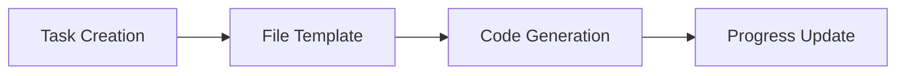
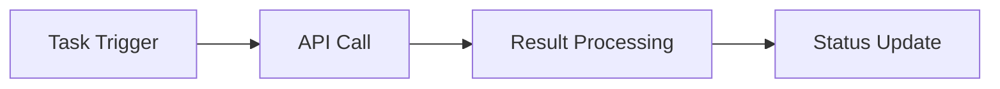
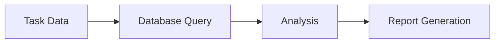
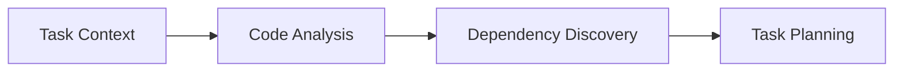

# 任务管理工具设计

## 🎯 设计目标

任务管理工具基于 **ChromaDB 纯统一存储架构**，与所有其他组件共享同一个 ChromaDB 实例。通过元数据字段管理任务状态、依赖关系等结构化信息，同时利用语义搜索能力提供智能任务检索和推荐功能。

## 🛠️ 工具清单

### 1. 任务核心管理

#### 1.1 ChromaDB Task Manager (ChromaDB 任务管理器)
**核心功能**：
- 任务数据存储在统一 ChromaDB 集合中
- 通过元数据管理任务状态和属性
- 利用语义搜索查找相关任务
- 智能任务推荐和关联
- 任务描述的自然语言检索

**任务存储示例**：
```python
# 任务存储在统一的 ChromaDB 集合中
def create_task(self, title: str, description: str, **kwargs):
    task_metadata = {
        "data_type": "task",
        "task_title": title,
        "task_status": kwargs.get("status", "NOT_STARTED"),
        "task_priority": kwargs.get("priority", "MEDIUM"),
        "task_assignee": kwargs.get("assignee", ""),
        "task_due_date": kwargs.get("due_date", ""),
        "task_tags": kwargs.get("tags", []),
        "created_time": time.time(),
        "updated_time": time.time()
    }

    task_id = f"task_{uuid.uuid4()}"
    self.unified_manager.store_data(
        data_type="task",
        content=f"{title}\n\n{description}",
        metadata=task_metadata,
        data_id=task_id
    )
    return task_id
```

**任务状态模型**：
```yaml
task_states:
  lifecycle:
    - NOT_STARTED    # 未开始
    - IN_PROGRESS    # 进行中
    - BLOCKED        # 被阻塞
    - WAITING        # 等待中
    - REVIEW         # 审查中
    - COMPLETED      # 已完成
    - CANCELLED      # 已取消
    - FAILED         # 失败

  transitions:
    NOT_STARTED: [IN_PROGRESS, CANCELLED]
    IN_PROGRESS: [BLOCKED, WAITING, REVIEW, COMPLETED, FAILED, CANCELLED]
    BLOCKED: [IN_PROGRESS, CANCELLED]
    WAITING: [IN_PROGRESS, CANCELLED]
    REVIEW: [IN_PROGRESS, COMPLETED, FAILED]
    COMPLETED: []
    CANCELLED: [NOT_STARTED]
    FAILED: [NOT_STARTED, CANCELLED]
```

#### 1.2 Task Hierarchy Manager (任务层次管理器)
**层次功能**：
- 父子任务关系
- 任务分解和聚合
- 子任务进度汇总
- 层次结构可视化
- 批量操作支持
- 层次权限控制

#### 1.3 Task Metadata Manager (任务元数据管理器)
**元数据类型**：
- 任务描述和详情
- 创建和修改时间
- 执行者和负责人
- 预估和实际工时
- 标签和分类
- 自定义属性

### 2. 工作流编排

#### 2.1 Workflow Engine (工作流引擎)
**编排功能**：
- 工作流定义和设计
- 任务依赖关系管理
- 条件分支和循环
- 并行和串行执行
- 工作流版本控制
- 动态工作流调整

**工作流配置**：
```yaml
workflow_engine:
  execution_modes:
    - sequential    # 顺序执行
    - parallel      # 简单并行执行

  scheduling:
    max_concurrent_workflows: 10  # 适合个人使用
    task_timeout: 1800s  # 30分钟
    retry_policy:
      max_attempts: 2
      backoff_strategy: linear

  monitoring:
    progress_tracking: true
    basic_logging: true
```

#### 2.2 Dependency Manager (依赖管理器)
**依赖类型**：
- 前置依赖 (Prerequisite)
- 后置依赖 (Successor)
- 资源依赖 (Resource)
- 条件依赖 (Conditional)
- 时间依赖 (Temporal)
- 数据依赖 (Data)

#### 2.3 Scheduler (调度器)
**调度功能**：
- 任务优先级调度
- 资源可用性调度
- 时间窗口调度
- 负载均衡调度
- 动态调度调整
- 调度策略配置

### 3. 执行和监控

#### 3.1 Task Executor (任务执行器)
**执行功能**：
- 任务执行环境准备
- 执行进度跟踪
- 实时状态更新
- 错误处理和恢复
- 执行结果收集
- 资源清理

#### 3.2 Progress Tracker (进度跟踪器)
**跟踪功能**：
- 实时进度更新
- 里程碑跟踪
- 时间估算和预测
- 瓶颈识别
- 进度可视化
- 进度报告生成

#### 3.3 Performance Monitor (性能监控器)
**监控指标**：
- 任务执行时间
- 资源使用情况
- 成功率和失败率
- 队列长度和等待时间
- 系统负载和吞吐量
- 用户活跃度

### 4. 协作和通信

#### 4.1 Collaboration Manager (协作管理器)
**协作功能**：
- 任务分配和委派
- 团队成员管理
- 权限和角色控制
- 协作历史记录
- 冲突检测和解决
- 协作效率分析

#### 4.2 Notification System (通知系统)
**通知类型**：
- 任务状态变更通知
- 截止日期提醒
- 依赖任务完成通知
- 错误和异常告警
- 里程碑达成通知
- 自定义事件通知

**通知配置**：
```yaml
notification_system:
  channels:
    console:
      enabled: true
      log_level: info

    file:
      enabled: true
      log_file: "task_notifications.log"

    webhook:
      enabled: false  # 可选功能
      endpoints: []

  rules:
    - condition: "task.status == 'FAILED'"
      channels: ["console", "file"]
    - condition: "task.status == 'COMPLETED'"
      channels: ["console"]
```

#### 4.3 Comment and Discussion System (评论讨论系统)
**讨论功能**：
- 任务评论和讨论
- 文件附件支持
- @提及和通知
- 讨论线程管理
- 历史记录保存
- 搜索和过滤

### 5. 报告和分析

#### 5.1 Analytics Engine (分析引擎)
**分析功能**：
- 任务完成率分析
- 时间估算准确性
- 团队效率分析
- 瓶颈识别和分析
- 趋势预测
- 绩效评估

#### 5.2 Report Generator (报告生成器)
**报告类型**：
- 项目进度报告
- 团队绩效报告
- 资源使用报告
- 时间跟踪报告
- 质量分析报告
- 自定义报告

#### 5.3 Dashboard Manager (仪表板管理器)
**仪表板功能**：
- 实时数据展示
- 可定制化视图
- 交互式图表
- 钻取和过滤
- 导出和分享
- 移动端适配

### 6. 集成和扩展

#### 6.1 Integration Manager (集成管理器)
**集成能力**：
- 版本控制系统集成 (Git, SVN)
- 项目管理工具集成 (Jira, Trello)
- 通信工具集成 (Slack, Teams)
- 日历系统集成 (Google Calendar, Outlook)
- CI/CD 系统集成 (Jenkins, GitHub Actions)
- 时间跟踪工具集成

#### 6.2 Plugin System (插件系统)
**插件功能**：
- 自定义任务类型
- 扩展工作流节点
- 自定义通知渠道
- 第三方服务集成
- 自定义报告模板
- API 扩展支持

#### 6.3 API Gateway (API 网关)
**API 功能**：
- RESTful API 接口
- GraphQL 查询支持
- Webhook 事件推送
- 批量操作 API
- 实时订阅接口
- API 版本管理

## 🔒 安全和权限

### 1. 权限控制模型
```yaml
permission_model:
  # 简化的权限模型，适合个人使用
  default_permissions:
    - read_task
    - create_task
    - update_task
    - delete_task

  resource_limits:
    max_tasks_per_user: 1000
    max_projects: 50

  data_access:
    local_storage: true
    basic_logging: true
    data_retention: 1_year  # 简化保留期
```

### 2. 数据安全
**安全措施**：
- 数据加密存储
- 传输层安全
- 访问日志记录
- 敏感信息脱敏
- 备份加密
- 合规性检查

## 📊 性能优化

### 1. 缓存策略
**缓存层次**：
- **内存缓存**：任务状态、用户会话、频繁查询
- **分布式缓存**：任务数据、工作流定义、报告结果
- **数据库缓存**：查询结果、聚合数据、索引优化

### 2. 异步处理
**异步场景**：
- 任务状态更新
- 通知发送
- 报告生成
- 数据同步
- 批量操作
- 后台清理

### 3. 数据库优化
**优化策略**：
- 索引优化
- 查询优化
- 分区策略
- 读写分离
- 连接池管理
- 慢查询监控

## 🔄 工具协作模式

### 1. 与文件系统工具协作


### 2. 与网络工具协作


### 3. 与数据库工具协作


### 4. 与上下文引擎协作


---

任务管理工具为 MCP 服务器提供了完整的项目和任务管理能力，支持复杂工作流的编排和执行。
