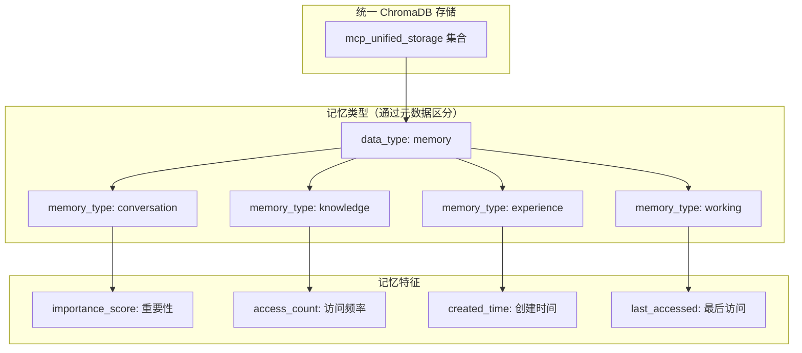

# 记忆和存储工具设计

## 🎯 设计目标

记忆和存储工具基于 **ChromaDB 纯统一存储架构**，与上下文引擎、任务管理、配置系统等所有组件共享同一个 ChromaDB 实例和集合。通过元数据字段区分不同类型的记忆数据，实现真正的统一数据管理，彻底避免数据分散和记忆混乱问题。

## 🧠 记忆系统架构

### 1. ChromaDB 统一记忆模型


## 🛠️ 工具清单

### 1. 核心记忆管理

#### 1.1 Memory Manager (记忆管理器)
**核心功能**：
- 记忆创建和存储
- 记忆检索和查询
- 记忆更新和修改
- 记忆删除和清理
- 记忆分类和标签
- 记忆重要性评估

**统一记忆配置**：
```yaml
memory_manager:
  # 与所有组件共享同一个 ChromaDB 实例
  storage_backend:
    type: chromadb
    shared_instance: true
    persist_directory: "./mcp_unified_db"
    collection_name: "mcp_unified_storage"  # 与其他组件共享同一集合

  memory_organization:
    # 通过元数据字段组织记忆
    base_metadata:
      data_type: "memory"

    memory_types:
      conversation:
        memory_type: "conversation"
        retention_period: 30d
        importance_threshold: 0.5

      knowledge:
        memory_type: "knowledge"
        retention_period: unlimited
        importance_threshold: 0.7

      experience:
        memory_type: "experience"
        retention_period: 90d
        importance_threshold: 0.6

      working:
        memory_type: "working"
        retention_period: 1d
        importance_threshold: 0.3

  unified_operations:
    # 所有记忆操作通过统一接口
    store_memory: unified_data_manager.store_data
    retrieve_memory: unified_data_manager.query_data
    update_memory: unified_data_manager.update_data
    delete_memory: unified_data_manager.delete_data
```

#### 1.2 Context Manager (上下文管理器)
**上下文功能**：
- 会话上下文维护
- 跨会话上下文恢复
- 上下文相关性计算
- 上下文压缩和摘要
- 上下文过期和清理
- 上下文共享和隔离

#### 1.3 Knowledge Organizer (知识组织器)
**组织功能**：
- 知识分类和层次化
- 概念关系建模
- 知识图谱构建
- 主题聚类分析
- 知识冲突检测
- 知识一致性维护

### 2. 智能检索系统

#### 2.1 Semantic Search Engine (语义搜索引擎)
**搜索功能**：
- 向量相似性搜索
- 混合搜索 (向量 + 关键词)
- 多模态搜索支持
- 上下文感知搜索
- 个性化搜索排序
- 搜索结果解释

#### 2.2 Memory Retrieval System (记忆检索系统)
**检索策略**：
- 基于相关性的检索
- 基于时间的检索
- 基于重要性的检索
- 基于频率的检索
- 基于上下文的检索
- 组合检索策略

**检索配置**：
```yaml
retrieval_system:
  strategies:
    relevance_based:
      similarity_threshold: 0.7
      max_results: 10
      boost_recent: 0.1

    temporal_based:
      time_decay_factor: 0.95
      recency_weight: 0.3
      max_age: 90d

    importance_based:
      importance_weight: 0.4
      frequency_weight: 0.3
      access_weight: 0.3

  ranking:
    factors:
      - semantic_similarity: 0.4
      - temporal_relevance: 0.2
      - importance_score: 0.2
      - access_frequency: 0.1
      - user_preference: 0.1

  caching:
    query_cache_size: 10000
    result_cache_ttl: 3600s
    embedding_cache_size: 100000
```

#### 2.3 Association Engine (关联引擎)
**关联功能**：
- 概念关联发现
- 模式识别和匹配
- 类比推理支持
- 关联强度计算
- 关联网络构建
- 关联路径查找

### 3. 学习和适应系统

#### 3.1 Learning System (学习系统)
**学习功能**：
- 增量学习支持
- 用户偏好学习
- 行为模式识别
- 知识更新和修正
- 遗忘曲线建模
- 强化学习机制

#### 3.2 Personalization Engine (个性化引擎)
**个性化功能**：
- 用户画像构建
- 个性化推荐
- 自适应界面
- 个性化搜索
- 定制化响应
- 偏好预测

#### 3.3 Feedback Processor (反馈处理器)
**反馈功能**：
- 用户反馈收集
- 反馈分析和处理
- 质量评估和改进
- 错误检测和修正
- 满意度跟踪
- 持续优化机制

### 4. 知识图谱工具

#### 4.1 Knowledge Graph Builder (知识图谱构建器)
**构建功能**：
- 实体识别和抽取
- 关系识别和建模
- 图谱结构优化
- 数据融合和去重
- 质量评估和验证
- 增量更新支持

#### 4.2 Graph Query Engine (图查询引擎)
**查询功能**：
- 图遍历查询
- 路径查询和分析
- 子图匹配
- 图算法执行
- 聚合查询支持
- 实时查询处理

#### 4.3 Reasoning Engine (推理引擎)
**推理功能**：
- 逻辑推理支持
- 规则引擎集成
- 概率推理
- 因果推理
- 类比推理
- 常识推理

### 5. 数据管理工具

#### 5.1 Data Lifecycle Manager (数据生命周期管理器)
**生命周期功能**：
- 数据创建和摄入
- 数据验证和清洗
- 数据存储和索引
- 数据更新和维护
- 数据归档和删除
- 数据恢复和备份

#### 5.2 Version Control System (版本控制系统)
**版本功能**：
- 记忆版本管理
- 变更历史跟踪
- 版本比较和合并
- 回滚和恢复
- 分支和标签
- 协作版本控制

#### 5.3 Data Quality Manager (数据质量管理器)
**质量功能**：
- 数据完整性检查
- 一致性验证
- 准确性评估
- 时效性监控
- 重复数据检测
- 质量报告生成

### 6. 隐私和安全工具

#### 6.1 Privacy Manager (隐私管理器)
**隐私功能**：
- 敏感信息识别
- 数据脱敏处理
- 访问权限控制
- 隐私策略执行
- 合规性检查
- 用户同意管理

#### 6.2 Encryption Manager (加密管理器)
**加密功能**：
- 数据加密存储
- 传输加密保护
- 密钥管理
- 加密算法选择
- 性能优化
- 安全审计

#### 6.3 Access Control System (访问控制系统)
**访问控制**：
- 基于角色的访问控制
- 细粒度权限管理
- 动态权限调整
- 访问日志记录
- 异常访问检测
- 权限审计报告

## 📊 性能优化

### 1. 存储优化
**优化策略**：
```yaml
storage_optimization:
  indexing:
    vector_index:
      algorithm: HNSW
      parameters:
        M: 16
        ef_construction: 200
        ef_search: 100

    text_index:
      analyzer: standard
      tokenizer: keyword
      filters: [lowercase, stop_words]

    graph_index:
      node_index: btree
      edge_index: hash
      property_index: composite

  compression:
    text_compression: gzip
    vector_compression: quantization
    graph_compression: adjacency_list

  caching:
    memory_cache: 2GB
    disk_cache: 10GB
    cache_policy: LRU

  partitioning:
    time_based: monthly
    size_based: 1GB
    hash_based: user_id
```

### 2. 查询优化
**优化技术**：
- 查询计划优化
- 索引选择优化
- 并行查询执行
- 结果缓存机制
- 预计算热点查询
- 自适应查询调整

### 3. 内存管理
**管理策略**：
- 分层存储架构
- 智能缓存策略
- 内存池管理
- 垃圾回收优化
- 内存使用监控
- 内存泄漏检测

## 🔄 工具协作模式

### 1. 与上下文引擎协作
```
Code Analysis → Knowledge Extraction → Memory Storage → Context Enhancement
```

### 2. 与任务管理协作
```
Task Execution → Experience Recording → Pattern Learning → Task Optimization
```

### 3. 与网络工具协作
```
Web Content → Information Extraction → Knowledge Integration → Memory Update
```

### 4. 与数据库工具协作
```
Database Query → Result Analysis → Knowledge Synthesis → Memory Consolidation
```

## 📈 监控和指标

### 1. 性能指标
- 查询响应时间
- 存储空间使用
- 内存使用效率
- 索引构建时间
- 并发处理能力

### 2. 质量指标
- 检索准确率和召回率
- 知识一致性得分
- 用户满意度评分
- 数据质量指标
- 学习效果评估

### 3. 使用指标
- 记忆创建频率
- 检索查询统计
- 用户行为模式
- 知识增长趋势
- 系统负载分析

## 🧪 测试策略

### 1. 功能测试
- 记忆存储和检索
- 知识图谱构建
- 学习系统验证
- 个性化功能测试
- 安全和隐私测试

### 2. 性能测试
- 大规模数据处理
- 高并发查询测试
- 长期运行稳定性
- 内存使用压力测试
- 存储扩展性测试

### 3. 质量测试
- 检索质量评估
- 知识准确性验证
- 学习效果测试
- 用户体验测试
- A/B 测试框架

---

记忆和存储工具为 MCP 服务器提供了智能的认知能力，通过持久化的知识管理和学习机制，实现真正的智能助手体验。
