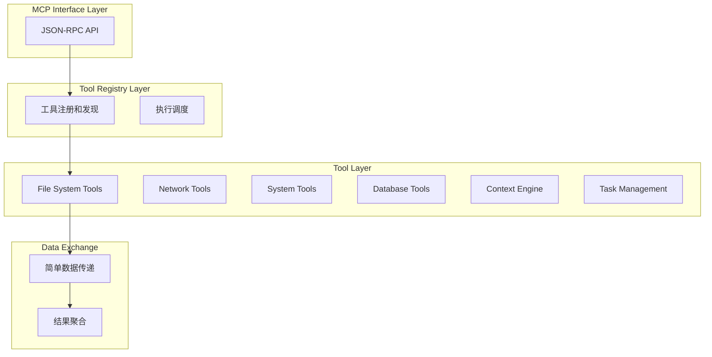

# 工具集成模式设计

## 🎯 设计目标

工具集成模式定义了不同工具之间的简单协作方式，基于当前的工具注册和执行架构，提供实用的工具协作能力，确保工具能够有效配合完成复杂任务。

## 🔄 集成架构模式

### 1. 简化集成架构


## 🛠️ 集成模式类型

### 1. 数据流集成模式

#### 1.1 Pipeline Pattern (管道模式)
**模式特征**：
- 数据在工具间单向流动
- 每个工具处理数据并传递给下一个工具
- 支持数据转换和过滤
- 适用于ETL和数据处理场景

**实现配置**：
```yaml
pipeline_pattern:
  data_processing_pipeline:
    name: "Code Analysis Pipeline"
    stages:
      - tool: file_reader
        input: file_path
        output: file_content

      - tool: code_parser
        input: file_content
        output: ast_tree

      - tool: symbol_extractor
        input: ast_tree
        output: symbols

      - tool: embedding_generator
        input: symbols
        output: embeddings

      - tool: vector_indexer
        input: embeddings
        output: index_status

    error_handling:
      strategy: fail_fast  # fail_fast, continue, retry
      retry_attempts: 3
      timeout: 300s

    monitoring:
      track_performance: true
      log_intermediate_results: true
      alert_on_failure: true
```

#### 1.2 Scatter-Gather Pattern (分散-聚合模式)
**模式特征**：
- 将任务分散到多个工具并行处理
- 收集所有结果并进行聚合
- 提高处理效率和吞吐量
- 适用于并行计算和批处理场景

#### 1.3 Event-Driven Pattern (事件驱动模式)
**模式特征**：
- 工具通过事件进行松耦合通信
- 支持异步处理和响应式架构
- 事件发布-订阅机制
- 适用于实时处理和监控场景

### 2. 控制流集成模式

#### 2.1 Orchestration Pattern (编排模式)
**编排功能**：
- 中央控制器管理工具执行顺序
- 支持条件分支和循环
- 错误处理和恢复机制
- 状态管理和监控

**编排配置**：
```yaml
orchestration_pattern:
  workflow_definition:
    name: "Project Analysis Workflow"
    version: "1.0"

    variables:
      project_path: "${input.project_path}"
      analysis_depth: "full"
      output_format: "json"

    steps:
      - name: validate_project
        tool: file_system_validator
        condition: "project_path != null"

      - name: scan_files
        tool: file_scanner
        parallel: true
        parameters:
          path: "${project_path}"
          recursive: true

      - name: analyze_code
        tool: code_analyzer
        depends_on: [scan_files]
        for_each: "${scan_files.output.files}"

      - name: build_context
        tool: context_builder
        depends_on: [analyze_code]

      - name: generate_report
        tool: report_generator
        depends_on: [build_context]

    error_handling:
      global_timeout: 1800s
      retry_policy:
        max_attempts: 3
        backoff_multiplier: 2

    notifications:
      on_success: webhook_notifier
      on_failure: email_notifier
```

#### 2.2 Choreography Pattern (编舞模式)
**编舞特征**：
- 工具自主决定何时执行
- 基于事件和状态变化触发
- 去中心化的协调机制
- 更好的可扩展性和容错性

#### 2.3 State Machine Pattern (状态机模式)
**状态机功能**：
- 定义工具执行的状态转换
- 支持复杂的业务逻辑
- 状态持久化和恢复
- 适用于长时间运行的工作流

### 3. 资源共享集成模式

#### 3.1 Shared Data Pattern (共享数据模式)
**共享机制**：
- 工具通过共享存储交换数据
- 支持数据版本控制和并发访问
- 数据一致性保证
- 适用于大数据量交换场景

#### 3.2 Message Passing Pattern (消息传递模式)
**消息机制**：
- 工具通过消息队列通信
- 支持异步和可靠消息传递
- 消息路由和过滤
- 适用于分布式系统集成

#### 3.3 Service Mesh Pattern (服务网格模式)
**网格功能**：
- 工具间通信的基础设施层
- 负载均衡和服务发现
- 安全和监控功能
- 适用于微服务架构

## 🔧 集成实现机制

### 1. 接口标准化

#### 1.1 Tool Interface Definition (工具接口定义)
```python
# 基于当前 BaseTool 实现的标准接口
class BaseTool(ABC):
    def get_definition(self) -> ToolDefinition:
        """获取工具定义和元数据"""
        pass

    def validate_parameters(self, params: Dict[str, Any]) -> ValidationResult:
        """验证输入参数"""
        pass

    async def execute(self, request: ToolExecutionRequest) -> ToolExecutionResult:
        """执行工具逻辑"""
        pass

    def get_status(self) -> ToolStatus:
        """获取工具状态"""
        pass

    def estimate_resources(self, params: Dict[str, Any]) -> ResourceEstimate:
        """估算资源使用"""
        pass

    async def cleanup(self) -> None:
        """清理资源"""
        pass
```

#### 1.2 Data Format Standardization (数据格式标准化)
**标准格式**：
- JSON Schema 定义数据结构
- 统一的错误格式
- 标准化的元数据格式
- 版本兼容性规范

#### 1.3 Communication Protocol (通信协议)
**协议规范**：
- 同步和异步调用协议
- 错误处理和重试机制
- 认证和授权规范
- 监控和日志规范

### 2. 数据转换和适配

#### 2.1 Data Transformer (数据转换器)
**转换功能**：
```yaml
data_transformer:
  transformations:
    - name: file_to_code_analysis
      source_format: file_content
      target_format: code_structure
      transformation_rules:
        - extract_functions
        - extract_classes
        - extract_imports

    - name: code_to_embeddings
      source_format: code_structure
      target_format: vector_embeddings
      transformation_rules:
        - tokenize_code
        - generate_embeddings
        - normalize_vectors

  adapters:
    - name: database_to_visualization
      source_tool: database_query
      target_tool: chart_generator
      mapping:
        query_result.rows: chart_data.data_points
        query_result.columns: chart_data.labels
```

#### 2.2 Schema Registry (模式注册表)
**注册表功能**：
- 数据模式版本管理
- 兼容性检查
- 自动模式演化
- 模式文档生成

#### 2.3 Format Converter (格式转换器)
**转换支持**：
- 多种数据格式互转
- 自动格式检测
- 批量转换支持
- 转换质量验证

### 3. 工作流引擎

#### 3.1 Workflow Definition Language (工作流定义语言)
**语言特性**：
- 声明式工作流定义
- 支持条件和循环
- 变量和表达式支持
- 模块化和重用机制

#### 3.2 Execution Engine (执行引擎)
**执行功能**：
- 工作流解析和验证
- 任务调度和执行
- 状态管理和持久化
- 错误处理和恢复

#### 3.3 Monitoring and Observability (监控和可观测性)
**监控功能**：
- 工作流执行跟踪
- 性能指标收集
- 错误和异常监控
- 可视化监控面板

## 📊 集成质量保证

### 1. 测试策略

#### 1.1 Integration Testing (集成测试)
**测试类型**：
- 工具间接口测试
- 数据流完整性测试
- 工作流端到端测试
- 性能和负载测试
- 故障恢复测试

#### 1.2 Contract Testing (契约测试)
**契约验证**：
- API 契约验证
- 数据格式契约
- 行为契约测试
- 版本兼容性测试

#### 1.3 Chaos Engineering (混沌工程)
**混沌测试**：
- 随机故障注入
- 网络分区测试
- 资源限制测试
- 依赖服务故障测试

### 2. 监控和告警

#### 2.1 Health Monitoring (健康监控)
**监控指标**：
- 工具可用性状态
- 响应时间和吞吐量
- 错误率和成功率
- 资源使用情况

#### 2.2 Performance Monitoring (性能监控)
**性能指标**：
- 端到端延迟
- 工具执行时间
- 数据传输量
- 并发处理能力

#### 2.3 Alert Management (告警管理)
**告警功能**：
- 智能告警规则
- 告警聚合和去重
- 多渠道通知
- 告警升级机制

## 🔒 安全和治理

### 1. 安全集成

#### 1.1 Authentication and Authorization (认证和授权)
**安全机制**：
- 统一身份认证
- 细粒度权限控制
- 工具间安全通信
- 审计日志记录

#### 1.2 Data Security (数据安全)
**安全措施**：
- 数据加密传输
- 敏感数据脱敏
- 数据访问控制
- 数据泄露防护

#### 1.3 Compliance Management (合规管理)
**合规功能**：
- 合规策略执行
- 合规性检查
- 合规报告生成
- 审计跟踪

### 2. 治理框架

#### 2.1 Tool Governance (工具治理)
**治理功能**：
- 工具注册和发现
- 版本管理和升级
- 质量评估和认证
- 使用统计和分析

#### 2.2 Data Governance (数据治理)
**治理机制**：
- 数据质量管理
- 数据血缘跟踪
- 数据分类和标记
- 数据生命周期管理

#### 2.3 Process Governance (流程治理)
**流程管理**：
- 工作流标准化
- 最佳实践推广
- 变更管理流程
- 持续改进机制

---

工具集成模式为 MCP 服务器提供了灵活、可扩展的工具协作框架，确保各种工具能够有效协同工作，形成强大的智能助手生态系统。
