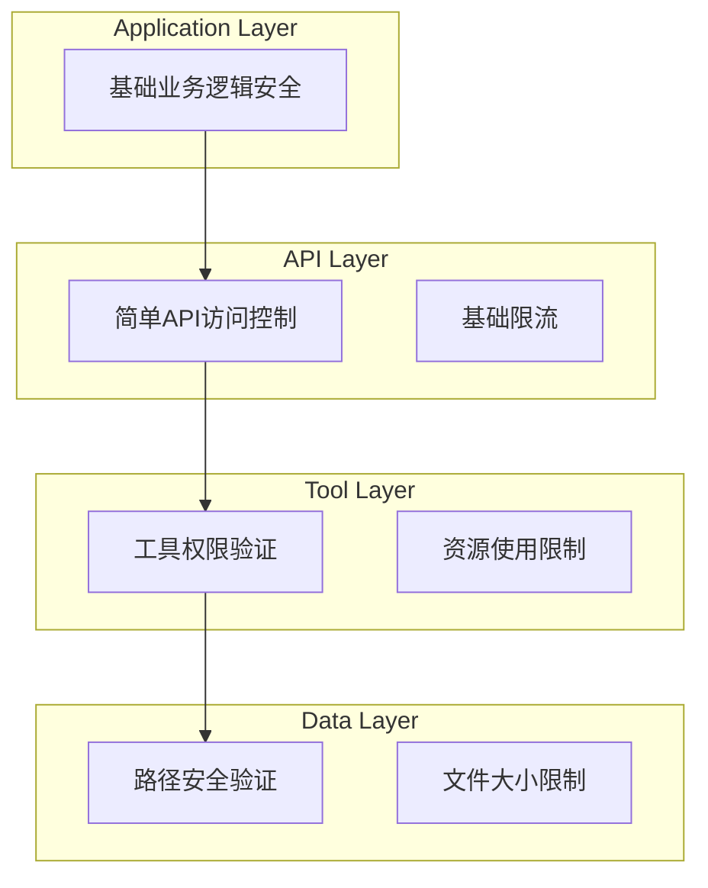

# 安全模型设计

## 🎯 设计目标

安全模型为 MCP 服务器提供实用的安全保护，重点关注基础的访问控制、数据保护和基本威胁防护，确保个人使用场景下的安全性，避免过度复杂的企业级安全要求。

## 🛡️ 安全架构

### 1. 简化安全模型


## 🔐 核心安全组件

### 1. 身份认证系统

#### 1.1 简化认证管理器
**认证方式**：
- 本地访问（默认）
- 可选 API Key 认证

**认证配置**：
```yaml
authentication:
  # 简化配置，适合个人使用
  local_access:
    enabled: true
    bind_to_localhost: true  # 默认只允许本地访问

  api_key:
    enabled: false  # 可选功能
    header_name: "X-API-Key"
    simple_key_format: true

  session_management:
    session_timeout: 3600s  # 1小时
    simple_session_storage: true  # 内存存储
```

#### 1.2 Identity Provider Integration (身份提供商集成)
**集成功能**：
- LDAP/Active Directory 集成
- SAML 2.0 支持
- Social Login 集成
- 企业 SSO 集成
- 身份联邦支持

#### 1.3 Token Management (令牌管理)
**令牌功能**：
- JWT 令牌生成和验证
- 令牌刷新机制
- 令牌撤销和黑名单
- 令牌加密和签名
- 令牌生命周期管理

### 2. 授权和访问控制

#### 2.1 简化授权引擎
**授权模型**：
- 基于智能路径验证（已实现）
- 简单资源限制

**权限配置**：
```yaml
authorization:
  # 基于当前智能路径验证实现
  smart_path_validation:
    enabled: true
    allow_user_home: true
    allow_current_directory: true
    allow_temp_directories: true

  resource_limits:
    file_operations:
      max_file_size: 10MB
      max_files_per_operation: 100

    system_operations:
      allowed_commands: []  # 默认为空，需要明确配置

    network_operations:
      allowed_domains: []  # 默认为空，需要明确配置
      max_request_size: 5MB
```

#### 2.2 Permission Manager (权限管理器)
**权限功能**：
- 权限分配和回收
- 权限继承和委派
- 临时权限授予
- 权限审计和报告
- 权限冲突检测

#### 2.3 Resource Access Control (资源访问控制)
**访问控制**：
- 文件系统访问控制
- 数据库访问控制
- 网络资源访问控制
- API 接口访问控制
- 工具功能访问控制

### 3. 数据保护系统

#### 3.1 基础数据保护
**保护功能**：
- 基础传输安全
- 敏感路径保护
- 简单日志记录

**保护配置**：
```yaml
data_protection:
  transmission:
    https_preferred: true  # 优先使用HTTPS
    basic_tls: true

  file_access:
    forbidden_paths:
      - "/etc/passwd"
      - "/etc/shadow"
      - "/sys/**"
      - "/proc/**"

  logging:
    log_file_access: true
    log_failed_attempts: true
    basic_audit_trail: true
```

#### 3.2 Data Loss Prevention (数据泄露防护)
**防护功能**：
- 敏感数据识别
- 数据分类和标记
- 数据泄露检测
- 数据使用监控
- 数据导出控制

#### 3.3 Privacy Protection (隐私保护)
**隐私功能**：
- 个人信息识别和保护
- 数据匿名化处理
- 隐私合规检查
- 用户同意管理
- 数据删除权支持

### 4. 威胁防护系统

#### 4.1 Intrusion Detection System (入侵检测系统)
**检测功能**：
- 异常行为检测
- 攻击模式识别
- 实时威胁监控
- 自动响应机制
- 威胁情报集成

#### 4.2 基础限流保护
**防护功能**：
- 简单API调用限流
- 基础并发控制
- 资源使用限制

**限流配置**：
```yaml
rate_limiting:
  # 简化的限流配置
  basic_limits:
    requests_per_minute: 100  # 适合个人使用
    max_concurrent_requests: 10

  tool_limits:
    file_system:
      operations_per_minute: 50
      max_file_size: 10MB

    network:
      requests_per_minute: 20
      max_response_size: 5MB

  resource_protection:
    max_memory_usage: 500MB
    max_cpu_usage: 80%
```

#### 4.3 Security Monitoring (安全监控)
**监控功能**：
- 安全事件收集
- 日志分析和关联
- 威胁检测和告警
- 安全指标监控
- 事件响应自动化

### 5. 审计和合规

#### 5.1 Audit System (审计系统)
**审计功能**：
- 用户行为审计
- 系统操作审计
- 数据访问审计
- 权限变更审计
- 配置变更审计

**审计配置**：
```yaml
audit:
  events:
    authentication:
      - login_success
      - login_failure
      - logout
      - password_change

    authorization:
      - permission_granted
      - permission_denied
      - role_assignment
      - role_removal

    data_access:
      - data_read
      - data_write
      - data_delete
      - data_export

    system_operations:
      - configuration_change
      - service_start_stop
      - backup_restore

  storage:
    retention_period: 7_years
    encryption: true
    immutable: true
    backup: true

  reporting:
    formats: [json, csv, pdf]
    schedules: [daily, weekly, monthly]
    recipients: ["security@company.com"]
```

#### 5.2 Compliance Manager (合规管理器)
**合规功能**：
- 合规框架支持 (GDPR, HIPAA, SOX)
- 合规检查自动化
- 合规报告生成
- 合规差距分析
- 合规培训管理

#### 5.3 Incident Response (事件响应)
**响应功能**：
- 安全事件分类
- 自动响应流程
- 事件调查工具
- 恢复和修复
- 事后分析和改进

## 🔒 安全最佳实践

### 1. 安全开发生命周期

#### 1.1 Secure Design (安全设计)
**设计原则**：
- 最小权限原则
- 深度防御策略
- 失败安全机制
- 安全默认配置
- 分离关注点

#### 1.2 Security Testing (安全测试)
**测试类型**：
- 静态代码分析
- 动态安全测试
- 渗透测试
- 依赖漏洞扫描
- 配置安全检查

#### 1.3 Vulnerability Management (漏洞管理)
**管理流程**：
- 漏洞发现和报告
- 漏洞评估和分级
- 修复计划和实施
- 修复验证和测试
- 漏洞披露管理

### 2. 运营安全

#### 2.1 Security Operations Center (安全运营中心)
**运营功能**：
- 24/7 安全监控
- 威胁狩猎
- 事件响应
- 威胁情报分析
- 安全指标报告

#### 2.2 Backup and Recovery (备份和恢复)
**备份策略**：
- 定期数据备份
- 备份加密存储
- 备份完整性验证
- 灾难恢复计划
- 恢复测试演练

#### 2.3 Security Training (安全培训)
**培训内容**：
- 安全意识培训
- 技术安全培训
- 合规培训
- 事件响应培训
- 定期安全演练

## 📊 安全监控和指标

### 1. 安全指标

#### 1.1 技术指标
- 认证成功率和失败率
- 授权检查通过率
- 加密覆盖率
- 漏洞修复时间
- 安全事件响应时间

#### 1.2 业务指标
- 用户安全满意度
- 合规达成率
- 安全投资回报率
- 业务连续性指标
- 客户信任度指标

#### 1.3 风险指标
- 威胁检测准确率
- 误报率和漏报率
- 风险暴露时间
- 安全债务指标
- 第三方风险评估

### 2. 安全仪表板

#### 2.1 实时监控面板
- 安全事件实时统计
- 威胁检测状态
- 系统安全健康度
- 用户活动监控
- 资源访问统计

#### 2.2 趋势分析面板
- 安全事件趋势
- 威胁演化分析
- 用户行为模式
- 系统性能影响
- 合规状态趋势

---

安全模型为 MCP 服务器提供了全面的安全保护框架，确保系统在面对各种安全威胁时都能保持安全可靠的运行状态。
