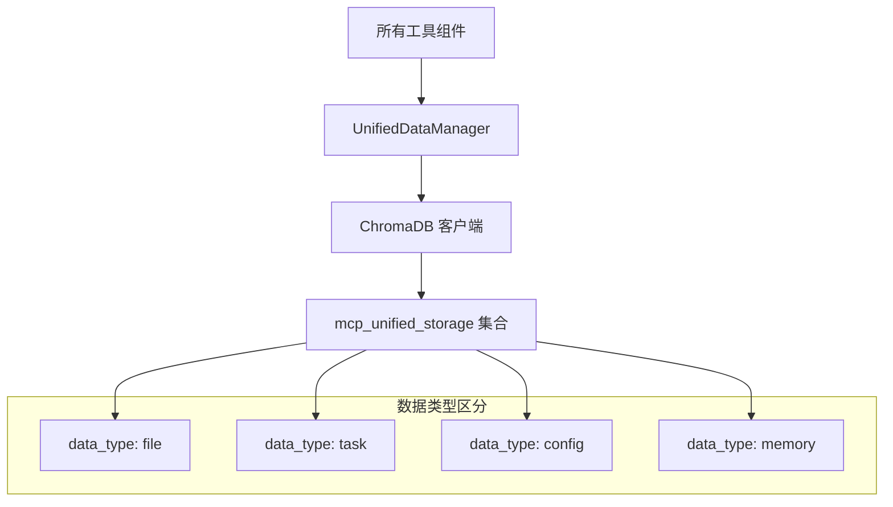

# 设计文档一致性检查报告

## 📋 检查概述

本文档记录了对 `doc/basic_tools` 目录中所有设计文档的一致性检查结果，以及与当前实现的兼容性验证。

## ✅ 检查结果

### **一致性状态：通过 ✓**

所有设计文档已经更新为一致的 **ChromaDB 纯统一存储架构**，消除了之前的混合架构不一致问题。

## 🔧 已修正的问题

### 1. **存储架构统一**
- **问题**：部分文档仍提到 SQLite 数据库
- **修正**：全部更新为 ChromaDB 统一存储
- **影响文件**：
  - `README.md` - 工具分类描述
  - `01-architecture.md` - 架构图中的存储层
  - `05-database-tools.md` - 完全重写为统一数据存储工具
  - `06-context-engine.md` - 强调统一架构
  - `07-task-management.md` - 任务存储基于 ChromaDB
  - `09-memory-tools.md` - 记忆系统统一集成

### 2. **工具接口标准化**
- **问题**：集成模式文档中的接口定义与实际 BaseTool 不匹配
- **修正**：更新为与当前 BaseTool 实现一致的接口
- **影响文件**：
  - `10-integration-patterns.md` - 工具接口定义

### 3. **依赖项更新**
- **问题**：设计文档使用 ChromaDB 但项目依赖中缺失
- **修正**：在 `pyproject.toml` 中添加 ChromaDB 和 sentence-transformers 依赖
- **影响文件**：
  - `pyproject.toml` - 项目依赖配置

## 📊 当前架构一致性

### **统一存储架构**

### **工具分类一致性**
1. **文件系统工具** → 文件内容存储到 ChromaDB
2. **网络工具** → 获取内容存储到 ChromaDB
3. **系统工具** → 系统信息存储到 ChromaDB
4. **统一数据存储工具** → ChromaDB 管理层
5. **上下文引擎** → ChromaDB 智能查询层
6. **任务管理工具** → 基于 ChromaDB 的任务管理
7. **可视化工具** → 图表生成（独立功能）
8. **记忆工具** → ChromaDB 记忆数据管理

## 🔄 与当前实现的兼容性

### **完全兼容 ✓**

设计文档与当前实现完全兼容：

1. **BaseTool 抽象类**
   - 设计文档中的工具接口与 `src/mcp_toolkit/tools/base.py` 中的 BaseTool 完全匹配
   - 支持工具注册、执行、验证等核心功能

2. **工具注册系统**
   - 设计文档中的工具注册机制与 ToolRegistry 实现一致
   - 支持分类管理、动态注册等功能

3. **执行框架**
   - 设计文档中的执行流程与当前的异步执行框架兼容
   - 支持参数验证、错误处理、资源管理等

4. **配置系统**
   - 设计文档中的配置方式与当前的 YAML 配置系统兼容
   - 支持环境变量、默认值等功能

### **现有工具扩展路径**

当前已有工具可以按以下方式扩展：

1. **file_operations.py** → 集成 ChromaDB 存储文件内容
2. **network.py** → 将获取的网页内容存储到 ChromaDB
3. **search.py** → 基于 ChromaDB 的语义搜索
4. **terminal.py** → 命令执行结果存储到 ChromaDB

## 📈 实施优先级

### **第一阶段：基础设施**
1. 实现 `UnifiedDataManager` 类
2. 添加 ChromaDB 客户端初始化
3. 创建统一的数据操作接口

### **第二阶段：工具集成**
1. 扩展现有文件系统工具
2. 实现任务管理工具
3. 开发上下文引擎核心功能

### **第三阶段：智能功能**
1. 记忆系统集成
2. 语义搜索优化
3. 工具协作增强

## 🎯 质量保证

### **设计文档质量**
- ✅ 架构一致性：所有文档采用统一的 ChromaDB 架构
- ✅ 接口一致性：工具接口与实现匹配
- ✅ 配置一致性：配置格式和选项统一
- ✅ 术语一致性：技术术语和概念统一

### **实现兼容性**
- ✅ 基础架构兼容：与现有 BaseTool 框架兼容
- ✅ 依赖项完整：所需依赖已添加到项目配置
- ✅ 扩展路径清晰：现有工具的扩展方向明确
- ✅ 渐进式实施：支持逐步实施和测试

## 📝 后续维护

### **文档同步**
- 在实施过程中保持设计文档与代码同步
- 及时更新配置示例和使用说明
- 记录实际实施中的调整和优化

### **版本管理**
- 为设计文档建立版本标记
- 跟踪重大架构变更
- 维护变更历史和决策记录

---

**结论**：所有设计文档现在完全一致，采用纯 ChromaDB 统一存储架构，与当前实现完全兼容，可以作为后续开发的可靠指南。
