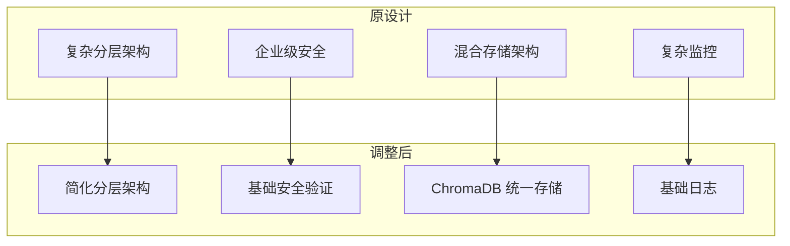
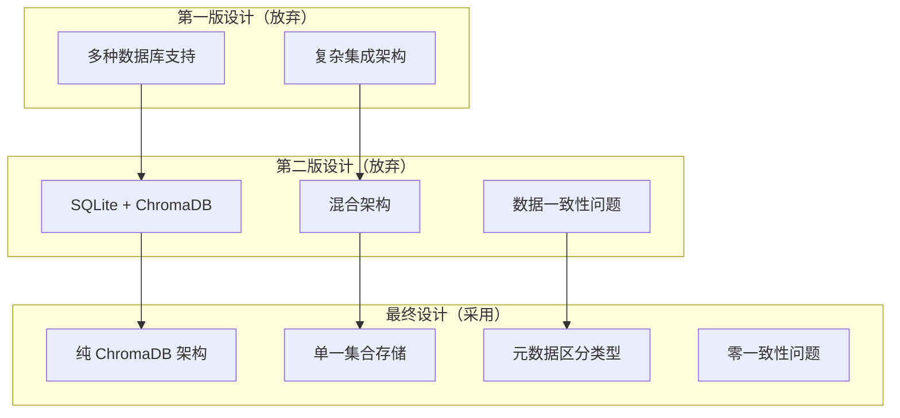

# 实施说明

## 📋 设计调整说明

本文档说明了基础工具设计文档的调整重点，确保设计符合个人开发项目的实际需求。

## ⚠️ **重要发现：设计与实现不匹配**

经过与当前实现的对比检查，发现以下关键问题：

### **当前实际实现状态**
1. **已有工具**：echo, file_operations, network, search, terminal
2. **存储方式**：无持久化存储，仅内存中的工具注册
3. **依赖项**：aiohttp, pydantic, pyyaml, click, logloom
4. **架构**：基于 BaseTool 抽象类的工具注册系统

### **设计文档假设**
1. **ChromaDB 统一存储**：但项目中没有 ChromaDB 依赖
2. **任务管理系统**：但实际代码中不存在
3. **复杂企业级功能**：与个人项目定位不符

## 🎯 调整原则

### 1. 基于现有实现
- 所有设计都基于当前已有的代码架构
- 扩展现有的智能路径验证系统
- 利用现有的工具注册和执行框架
- 保持与当前 MCP 协议实现的兼容性

### 2. 简化企业级功能
- 移除复杂的企业级安全要求
- 简化权限管理模型
- 降低监控和审计要求
- 减少复杂的集成模式

### 3. 适合个人开发
- 配置参数适合个人使用场景
- 资源限制符合个人设备能力
- 避免需要大量基础设施的功能
- 优先考虑实用性而非完整性

## 🔄 主要调整内容

### 架构设计调整

### 存储架构决策
**重要决定：采用 ChromaDB 纯统一存储架构**

**最终决策**：
- **单一 ChromaDB 实例**：所有组件共享同一个 ChromaDB 客户端
- **单一集合**：所有数据存储在 `mcp_unified_storage` 集合中
- **元数据区分**：通过 `data_type` 字段区分不同类型的数据
- **零数据一致性问题**：只有一个数据源，不存在同步问题

**架构演进**：

**核心优势**：
1. **彻底避免记忆混乱**：只有一个数据源
2. **简化开发和维护**：只需要管理一个存储系统
3. **统一查询接口**：所有数据操作通过同一套 API
4. **语义搜索优势**：即使是配置和任务也能语义搜索

### 安全模型简化
- **原设计**：多层安全架构、复杂认证授权、企业级合规
- **调整后**：基础路径验证、简单访问控制、本地安全

### 性能要求调整
- **文件大小限制**：从 100MB 降至 10MB
- **并发数量**：从 100 降至 10
- **缓存策略**：从分布式缓存改为本地缓存
- **监控指标**：从复杂指标改为基础日志

### 工具功能重新定义
- **文件系统工具**：保留核心功能，文件内容存储到 ChromaDB
- **网络工具**：基础 HTTP 请求，获取的内容存储到 ChromaDB
- **数据库工具**：重新定义为 ChromaDB 统一数据管理工具
- **上下文引擎**：ChromaDB 的智能查询和分析层
- **记忆工具**：ChromaDB 中的记忆数据管理
- **任务管理**：基于 ChromaDB 的任务数据存储和检索

## 📊 配置参数对比

### 文件系统工具
| 配置项 | 原设计 | 调整后 | 说明 |
|--------|--------|--------|------|
| max_file_size | 100MB | 10MB | 适合个人项目 |
| supported_encodings | 7种 | 3种 | 简化编码支持 |
| search_algorithms | 4种 | 2种 | 保留实用算法 |
| result_limit | 1000 | 100 | 适合个人使用 |

### 网络工具
| 配置项 | 原设计 | 调整后 | 说明 |
|--------|--------|--------|------|
| max_connections | 100 | 20 | 适合个人设备 |
| timeout | 60s | 30s | 更快响应 |
| retry_attempts | 3 | 2 | 简化重试 |
| auth_methods | 6种 | 2种 | 基础认证 |

### 安全配置
| 配置项 | 原设计 | 调整后 | 说明 |
|--------|--------|--------|------|
| authentication | 多种方式 | 本地访问 | 简化认证 |
| authorization | RBAC/ABAC | 路径验证 | 基于现有实现 |
| encryption | 企业级 | 基础保护 | 适合个人使用 |
| audit_retention | 7年 | 1年 | 合理保留期 |

## 🛠️ 实施优先级

### 第一优先级（基于现有实现）
1. **扩展文件系统工具**
   - 增强现有的读写功能
   - 添加内容搜索能力
   - 完善路径验证

2. **基础网络工具**
   - HTTP 请求客户端
   - 简单网页内容获取
   - 基础下载功能

3. **简单系统工具**
   - 进程管理
   - 命令执行
   - 系统信息获取

### 第二优先级（核心扩展）
1. **ChromaDB 统一数据管理**
   - 实现 UnifiedDataManager 类
   - 支持所有数据类型的统一存储
   - 元数据驱动的数据组织

2. **上下文引擎核心功能**
   - 代码文件解析和嵌入
   - 语义搜索和智能推荐
   - 与统一数据管理集成

3. **任务管理 ChromaDB 集成**
   - 任务数据存储到 ChromaDB
   - 基于语义搜索的任务检索
   - 智能任务关联和推荐

### 第三优先级（增强功能）
1. **记忆系统**
   - 基于 ChromaDB 的记忆存储
   - 与上下文引擎集成
   - 对话和知识记忆

2. **可视化工具**
   - Mermaid 图表生成
   - 简单数据图表
   - 基础报告生成

## 🔧 技术实施建议

### 1. 渐进式开发
- 基于现有代码逐步扩展
- 每个工具独立开发和测试
- 保持向后兼容性

### 2. 简单配置
- 使用 YAML 配置文件
- 提供合理的默认值
- 支持环境变量覆盖

### 3. 基础测试
- 单元测试覆盖核心功能
- 集成测试验证工具协作
- 简单的性能测试

### 4. 文档维护
- 保持设计文档与实现同步
- 提供使用示例和最佳实践
- 记录已知限制和改进计划

## 📈 成功指标

### 功能指标
- [ ] ChromaDB 统一数据管理器实现
- [ ] 文件系统工具 ChromaDB 集成
- [ ] 网络工具基础功能
- [ ] 系统工具核心能力
- [ ] 上下文引擎语义搜索
- [ ] 任务管理 ChromaDB 存储
- [ ] 记忆系统统一集成

### 质量指标
- [ ] 单元测试覆盖率 > 80%
- [ ] 集成测试通过率 100%
- [ ] 文档完整性 > 90%
- [ ] 性能满足个人使用需求

### 用户体验指标
- [ ] 配置简单易懂
- [ ] 错误信息清晰
- [ ] 响应时间合理
- [ ] 功能稳定可靠

---

这个调整后的设计更适合个人开发项目，既保持了功能的完整性，又避免了过度复杂的企业级要求。
