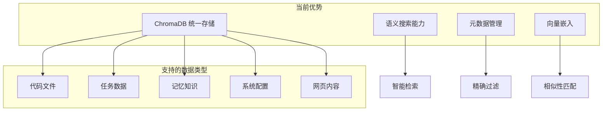

# 当前实现分析和差距评估

## 📊 当前实现状态分析

### 已实现的核心架构

#### 1. ChromaDB 统一存储架构 ✅
**实现状态**：完全实现
- **统一数据管理器** (`UnifiedDataManager`)：所有组件共享同一个 ChromaDB 实例
- **语义搜索能力**：基于 sentence-transformers 的向量嵌入和相似性搜索
- **元数据管理**：通过 `data_type` 字段区分不同类型的数据
- **多类型数据支持**：文件、任务、记忆、配置等统一存储

#### 2. 上下文引擎核心 ✅
**实现状态**：基础功能完整
- **代码分析器** (`CodeAnalyzer`)：多语言代码解析和结构分析
- **查询处理器** (`QueryProcessor`)：自然语言查询理解和意图解析
- **智能搜索**：代码语义搜索、相似代码匹配
- **项目概览**：代码库统计和结构分析

#### 3. 工具协作框架 ✅
**实现状态**：基础框架完整
- **链式调用**：工具间的顺序执行和数据传递
- **并行执行**：多工具同时执行支持
- **条件执行**：基于条件的工具选择和执行
- **数据流管理**：工具间的数据传递和变量管理

#### 4. 基础工具集 ✅
**实现状态**：32个工具完全实现
- **文件系统工具**：读写、搜索、增强存储
- **网络工具**：HTTP请求、网页获取、内容搜索
- **系统工具**：进程管理、命令执行、系统信息
- **任务管理**：创建、搜索、语义匹配
- **记忆管理**：知识存储、检索、关联分析
- **可视化工具**：Mermaid图表、数据可视化

### 当前架构优势

#### 1. 统一数据架构

#### 2. 模块化设计
- **松耦合架构**：各组件独立开发和测试
- **标准接口**：统一的工具接口和数据格式
- **可扩展性**：新工具和功能的便捷集成
- **配置驱动**：灵活的配置管理和运行时调整

## 🔍 与 Augment Code 能力对比

### Augment Code 的核心能力分析

#### 1. 代码理解能力
**Augment Code 水平**：
- 深度语义理解：函数调用关系、数据流分析
- 跨文件依赖分析：模块间关系、导入依赖
- 代码意图理解：业务逻辑和设计模式识别
- 重构建议：安全重构和代码优化建议

**当前实现水平**：
- ✅ 基础语法分析：函数、类、变量识别
- ✅ 文件级别分析：单文件结构理解
- ⚠️ 有限的跨文件分析：缺乏深度依赖关系
- ❌ 缺乏重构支持：无安全重构能力

#### 2. 精确文件操作
**Augment Code 水平**：
- 精确行级编辑：基于上下文的精确修改
- 智能代码插入：保持代码风格和结构
- 变更影响分析：修改对其他代码的影响评估
- 版本控制集成：Git 工作流的深度集成

**当前实现水平**：
- ❌ 只支持整文件替换：缺乏精确编辑能力
- ❌ 无变更追踪：缺乏修改历史和影响分析
- ❌ 无 Git 集成：缺乏版本控制支持
- ❌ 无冲突处理：缺乏合并冲突解决能力

#### 3. 长期记忆和学习
**Augment Code 水平**：
- 跨会话记忆：项目理解的持久化存储
- 经验积累：从历史操作中学习最佳实践
- 上下文感知：基于项目历史的智能建议
- 个性化适应：根据用户习惯调整行为

**当前实现水平**：
- ✅ 基础记忆存储：知识和对话历史存储
- ⚠️ 有限的学习能力：缺乏经验积累机制
- ⚠️ 基础上下文感知：项目级别理解不足
- ❌ 无个性化：缺乏用户习惯学习

## 📈 关键差距分析

### 1. 精确文件操作差距 (关键)
**当前问题**：
- 只能进行整文件替换，无法精确修改特定行或代码块
- 缺乏代码结构感知的智能编辑能力
- 无法处理复杂的代码重构操作

**影响程度**：🔴 高 - 严重影响用户体验和实用性

**解决方案**：
- 实现基于 Git 的精确 diff 和 patch 功能
- 开发代码结构感知的编辑器
- 集成 AST 级别的代码操作能力

### 2. 版本控制集成差距 (关键)
**当前问题**：
- 完全缺乏 Git 集成能力
- 无法追踪代码变更历史
- 缺乏分支管理和合并冲突处理

**影响程度**：🔴 高 - 限制了在真实项目中的应用

**解决方案**：
- 开发完整的 Git 工具集
- 实现变更追踪和历史管理
- 提供智能合并冲突解决

### 3. 深度代码理解差距 (重要)
**当前问题**：
- 跨文件依赖分析能力有限
- 缺乏函数调用关系的深度分析
- 无法进行复杂的代码重构建议

**影响程度**：🟡 中 - 影响智能化程度

**解决方案**：
- 增强代码分析器的跨文件分析能力
- 实现调用图和依赖图构建
- 开发重构建议和影响分析功能

### 4. Agent 行为一致性差距 (重要)
**当前问题**：
- Agent 行为缺乏可预测性
- 复杂任务的分解和执行策略不够智能
- 错误恢复机制不完善

**影响程度**：🟡 中 - 影响可靠性和用户信任

**解决方案**：
- 设计 Agent 行为自动机系统
- 实现智能任务分解和执行策略
- 建立完善的错误检测和恢复机制

## 🎯 优先级改进计划

### 第一优先级：精确文件操作 (立即开始)
**目标**：解决最关键的用户体验问题
- 实现基于 Git 的 diff 和 patch 功能
- 开发精确行级编辑能力
- 提供变更预览和确认机制

**预期收益**：
- 用户体验显著提升
- 实际项目应用可行性大幅增强
- 为后续功能奠定基础

### 第二优先级：Git 集成工具集 (紧随其后)
**目标**：提供完整的版本控制支持
- 实现 Git 基础操作工具
- 开发变更追踪和历史管理
- 提供分支管理和合并支持

**预期收益**：
- 真实项目开发场景的完整支持
- 团队协作能力的基础建设
- 代码安全性和可追溯性保障

### 第三优先级：Agent 行为优化 (并行进行)
**目标**：提升 Agent 的智能化和可靠性
- 设计行为自动机系统
- 实现智能决策和任务分解
- 建立错误恢复机制

**预期收益**：
- Agent 行为的可预测性和一致性
- 复杂任务的自动化处理能力
- 系统稳定性和可靠性提升

## 📊 技术债务分析

### 当前技术债务
1. **测试覆盖不足**：缺乏全面的自动化测试
2. **文档滞后**：部分实现缺乏详细文档
3. **性能优化空间**：大型项目处理效率有待提升
4. **错误处理不完善**：异常情况的处理机制需要改进

### 债务偿还计划
- **短期**：补充关键功能的测试用例
- **中期**：完善文档和性能优化
- **长期**：建立完整的质量保证体系

## 🚀 下一步行动计划

### 立即行动 (本周)
1. 设计 Git 集成工具的详细规格
2. 创建精确文件操作的技术方案
3. 制定 Agent 行为自动机的设计框架

### 短期目标 (1-2周)
1. 实现基础的 Git diff 和 patch 功能
2. 开发精确行级编辑的原型
3. 设计轻量化版本管理系统

### 中期目标 (1个月)
1. 完成 Git 集成工具集的开发
2. 实现完整的精确文件操作能力
3. 部署 Agent 行为自动机系统

这个分析为后续的详细设计文档提供了坚实的基础，明确了当前的优势、差距和改进方向。
