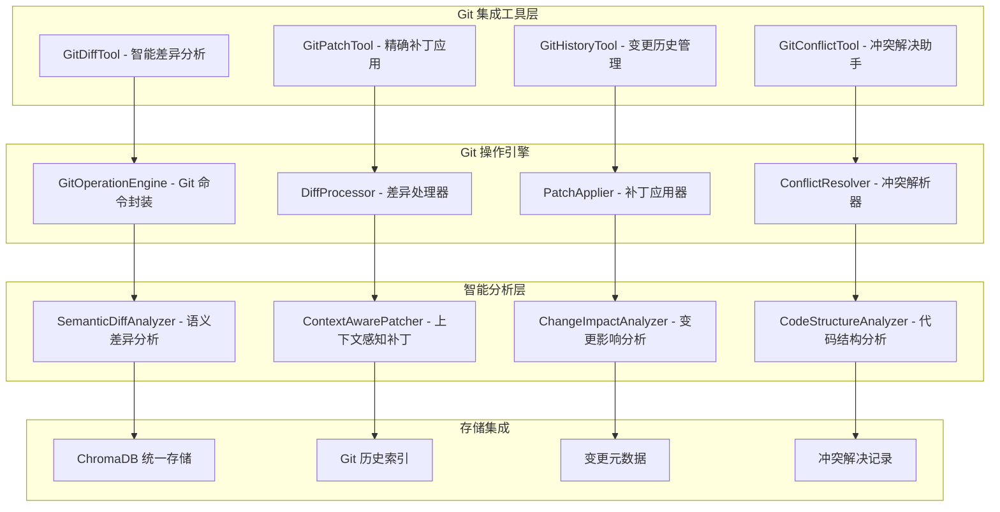
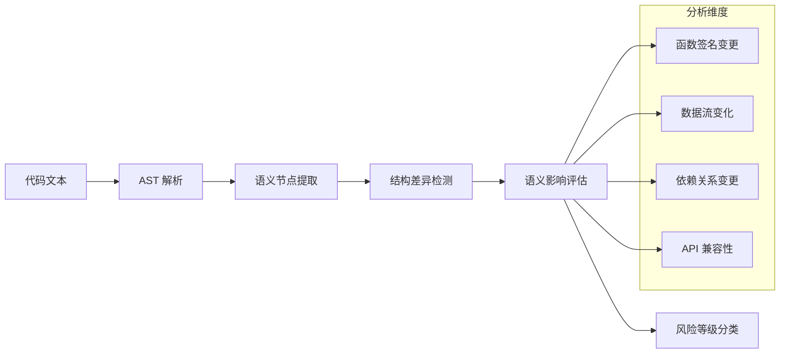

# Git 集成工具设计

## 🎯 设计目标

Git 集成工具集旨在为 MCP 工具包提供完整的版本控制能力，特别是精确的文件修改、变更追踪和智能 diff 功能，解决当前只能整文件替换的核心问题。

## 🏗️ 整体架构

### 核心组件架构


## 🔧 核心工具设计

### 1. GitDiffTool - 智能差异分析工具

#### 功能特性
- **多层次 diff 分析**：行级、语义级、结构级差异检测
- **智能变更分类**：区分新增、修改、删除、移动、重命名
- **上下文感知**：基于代码结构的智能上下文提取
- **可视化输出**：生成易读的差异报告和可视化图表

#### 工具接口
```python
{
    "name": "git_diff_analysis",
    "description": "智能分析文件或项目的 Git 差异",
    "parameters": {
        "target": {
            "type": "string",
            "description": "分析目标：文件路径、提交哈希或分支名"
        },
        "comparison_base": {
            "type": "string",
            "description": "比较基准：HEAD、特定提交或分支",
            "default": "HEAD"
        },
        "analysis_level": {
            "type": "string",
            "enum": ["line", "semantic", "structural"],
            "description": "分析级别",
            "default": "semantic"
        },
        "include_context": {
            "type": "boolean",
            "description": "是否包含上下文信息",
            "default": true
        },
        "output_format": {
            "type": "string",
            "enum": ["unified", "side-by-side", "json", "mermaid"],
            "description": "输出格式",
            "default": "unified"
        }
    }
}
```

#### 输出示例
```json
{
    "diff_summary": {
        "files_changed": 3,
        "lines_added": 45,
        "lines_deleted": 12,
        "lines_modified": 8
    },
    "file_changes": [
        {
            "file_path": "src/main.py",
            "change_type": "modified",
            "hunks": [
                {
                    "start_line": 15,
                    "end_line": 25,
                    "change_type": "modification",
                    "context_before": "def process_data(data):",
                    "context_after": "def process_data(data, options=None):",
                    "semantic_impact": "function_signature_change",
                    "risk_level": "medium"
                }
            ]
        }
    ],
    "impact_analysis": {
        "affected_functions": ["process_data", "main"],
        "potential_conflicts": [],
        "test_impact": "medium"
    }
}
```

### 2. GitPatchTool - 精确补丁应用工具

#### 功能特性
- **精确行级编辑**：基于行号和上下文的精确修改
- **智能补丁生成**：自动生成最小化的补丁文件
- **安全应用机制**：预检查、备份、回滚支持
- **冲突预防**：应用前的冲突检测和预警

#### 工具接口
```python
{
    "name": "git_apply_patch",
    "description": "精确应用代码补丁到指定文件",
    "parameters": {
        "file_path": {
            "type": "string",
            "description": "目标文件路径"
        },
        "patch_operations": {
            "type": "array",
            "items": {
                "type": "object",
                "properties": {
                    "operation": {"type": "string", "enum": ["insert", "delete", "replace"]},
                    "line_number": {"type": "integer"},
                    "content": {"type": "string"},
                    "context_lines": {"type": "integer", "default": 3}
                }
            },
            "description": "补丁操作列表"
        },
        "dry_run": {
            "type": "boolean",
            "description": "是否只进行预检查",
            "default": false
        },
        "create_backup": {
            "type": "boolean",
            "description": "是否创建备份",
            "default": true
        }
    }
}
```

#### 使用示例
```json
{
    "file_path": "src/utils.py",
    "patch_operations": [
        {
            "operation": "replace",
            "line_number": 42,
            "content": "    return process_with_options(data, default_options)",
            "context_lines": 2
        },
        {
            "operation": "insert",
            "line_number": 50,
            "content": "    # Added error handling\n    if not data:\n        raise ValueError('Data cannot be empty')"
        }
    ],
    "dry_run": false,
    "create_backup": true
}
```

### 3. GitHistoryTool - 变更历史管理工具

#### 功能特性
- **智能历史分析**：提交历史的语义分析和分类
- **变更追踪**：文件和函数级别的变更历史追踪
- **影响分析**：历史变更对当前代码的影响评估
- **回滚支持**：安全的历史版本回滚功能

#### 工具接口
```python
{
    "name": "git_history_analysis",
    "description": "分析 Git 历史和变更追踪",
    "parameters": {
        "target": {
            "type": "string",
            "description": "分析目标：文件路径、函数名或项目路径"
        },
        "time_range": {
            "type": "object",
            "properties": {
                "since": {"type": "string", "description": "开始时间或提交"},
                "until": {"type": "string", "description": "结束时间或提交"}
            }
        },
        "analysis_type": {
            "type": "string",
            "enum": ["commits", "file_changes", "function_evolution", "author_stats"],
            "description": "分析类型"
        },
        "include_diffs": {
            "type": "boolean",
            "description": "是否包含详细差异",
            "default": false
        }
    }
}
```

### 4. GitConflictTool - 冲突解决助手

#### 功能特性
- **智能冲突检测**：预测和检测潜在的合并冲突
- **语义冲突分析**：基于代码语义的冲突严重性评估
- **自动解决建议**：提供智能的冲突解决方案
- **手动解决支持**：辅助用户进行复杂冲突的手动解决

## 🧠 智能分析层设计

### 1. SemanticDiffAnalyzer - 语义差异分析器

#### 核心算法


#### 实现特性
- **多语言支持**：Python、JavaScript、TypeScript、Java 等
- **语义理解**：函数、类、变量的语义级别分析
- **影响评估**：变更对其他代码的潜在影响
- **风险分级**：低、中、高风险的自动分类

### 2. ContextAwarePatcher - 上下文感知补丁器

#### 智能特性
- **上下文匹配**：基于代码上下文的精确定位
- **结构保持**：保持代码的缩进、格式和风格
- **依赖检查**：确保修改不破坏依赖关系
- **测试影响**：评估修改对测试的影响

## 💾 ChromaDB 集成设计

### Git 数据存储模型
```python
# Git 提交信息存储
{
    "data_type": "git_commit",
    "content": "commit message and diff summary",
    "metadata": {
        "commit_hash": "abc123...",
        "author": "developer@example.com",
        "timestamp": 1234567890,
        "files_changed": ["file1.py", "file2.js"],
        "change_summary": {
            "additions": 45,
            "deletions": 12,
            "modifications": 8
        }
    }
}

# 文件变更历史存储
{
    "data_type": "file_change",
    "content": "detailed change description",
    "metadata": {
        "file_path": "src/main.py",
        "commit_hash": "abc123...",
        "change_type": "modification",
        "line_changes": {
            "added": [15, 16, 17],
            "deleted": [20, 21],
            "modified": [25, 26]
        },
        "semantic_impact": "function_signature_change"
    }
}
```

### 智能查询能力
- **语义搜索**：基于变更描述的语义搜索
- **相似变更**：查找历史上的相似修改
- **影响分析**：查询特定变更的影响范围
- **模式识别**：识别常见的修改模式和最佳实践

## 🔄 与现有系统集成

### 工具协作框架集成
```python
# Git 工具链示例
git_workflow_chain = {
    "name": "smart_code_modification",
    "steps": [
        {
            "tool": "git_diff_analysis",
            "params": {"target": "${file_path}", "analysis_level": "semantic"}
        },
        {
            "tool": "git_apply_patch",
            "params": {
                "file_path": "${file_path}",
                "patch_operations": "${modifications}",
                "dry_run": true
            }
        },
        {
            "tool": "git_conflict_check",
            "params": {"target": "${file_path}"}
        },
        {
            "tool": "git_apply_patch",
            "params": {
                "file_path": "${file_path}",
                "patch_operations": "${modifications}",
                "dry_run": false
            }
        }
    ]
}
```

### 上下文引擎增强
- **代码理解增强**：结合 Git 历史的深度代码理解
- **智能推荐**：基于历史变更的修改建议
- **风险评估**：基于历史数据的变更风险预测

## 🧪 测试和验证策略

### 功能测试
- **diff 准确性测试**：各种代码变更场景的差异检测准确性
- **patch 应用测试**：精确补丁应用的成功率和安全性
- **冲突处理测试**：复杂合并冲突的处理能力

### 性能测试
- **大文件处理**：大型文件的 diff 和 patch 性能
- **历史分析效率**：长历史项目的分析速度
- **并发操作**：多文件同时操作的性能表现

### 集成测试
- **n8n 集成测试**：通过 n8n 验证工具的实际使用效果
- **真实项目测试**：在实际开发项目中验证工具的实用性
- **错误恢复测试**：异常情况下的错误处理和恢复能力

## 🚀 实施计划

### 第一阶段：核心 diff 和 patch 功能 (1周)
- 实现基础的 GitDiffTool 和 GitPatchTool
- 集成到现有的工具协作框架
- 基础的 n8n 测试验证

### 第二阶段：智能分析和历史管理 (1周)
- 实现 SemanticDiffAnalyzer 和 ContextAwarePatcher
- 开发 GitHistoryTool 的核心功能
- ChromaDB 集成和数据存储优化

### 第三阶段：冲突处理和完善 (1周)
- 实现 GitConflictTool 和智能冲突解决
- 完善错误处理和恢复机制
- 全面的测试和文档完善

这个设计为解决精确文件修改的核心问题提供了完整的技术方案，是实现 Augment Code 级别能力的关键基础。
