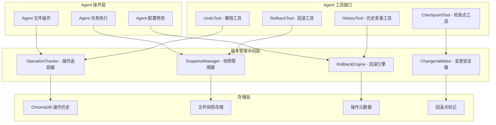
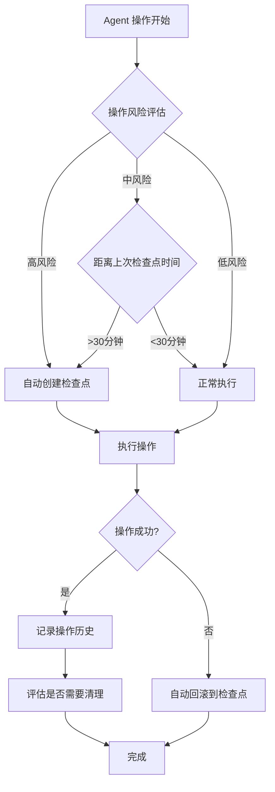

# 轻量化版本管理系统设计

## 🎯 设计目标

轻量化版本管理系统旨在为 Agent 提供"撤销更改"、"版本回滚"等能力，无需完整的 Git 功能，专注于 Agent 操作的可逆性和安全性。

## 🏗️ 系统架构

### 核心组件设计


## 🔧 核心工具设计

### 1. UndoTool - 撤销工具

#### 功能特性
- **单步撤销**：撤销最近的一次操作
- **多步撤销**：撤销指定数量的操作
- **选择性撤销**：撤销特定类型或文件的操作
- **安全检查**：撤销前的影响分析和确认

#### 工具接口
```python
{
    "name": "undo_operation",
    "description": "撤销 Agent 的操作",
    "parameters": {
        "steps": {
            "type": "integer",
            "description": "撤销的步数",
            "default": 1,
            "minimum": 1,
            "maximum": 50
        },
        "operation_type": {
            "type": "string",
            "enum": ["file_edit", "file_create", "file_delete", "config_change", "all"],
            "description": "撤销的操作类型",
            "default": "all"
        },
        "target_files": {
            "type": "array",
            "items": {"type": "string"},
            "description": "指定撤销的文件列表（可选）"
        },
        "dry_run": {
            "type": "boolean",
            "description": "是否只预览撤销效果",
            "default": false
        },
        "confirm_required": {
            "type": "boolean",
            "description": "是否需要确认",
            "default": true
        }
    }
}
```

#### 输出示例
```json
{
    "undo_summary": {
        "operations_undone": 3,
        "files_affected": ["src/main.py", "config/settings.yaml"],
        "timestamp": "2024-07-15T10:30:00Z"
    },
    "undone_operations": [
        {
            "operation_id": "op_123",
            "type": "file_edit",
            "file_path": "src/main.py",
            "description": "Modified function process_data",
            "timestamp": "2024-07-15T10:25:00Z",
            "changes_reverted": {
                "lines_restored": [15, 16, 17],
                "lines_removed": [18, 19]
            }
        }
    ],
    "current_state": "reverted_to_op_120",
    "next_available_undo": "op_119"
}
```

### 2. RollbackTool - 回滚工具

#### 功能特性
- **检查点回滚**：回滚到预设的检查点
- **时间点回滚**：回滚到指定的时间点
- **状态比较**：比较当前状态与目标状态的差异
- **批量回滚**：同时回滚多个文件或配置

#### 工具接口
```python
{
    "name": "rollback_to_checkpoint",
    "description": "回滚到指定的检查点或时间点",
    "parameters": {
        "target": {
            "type": "object",
            "properties": {
                "checkpoint_id": {"type": "string"},
                "timestamp": {"type": "string"},
                "operation_id": {"type": "string"}
            },
            "description": "回滚目标（三选一）"
        },
        "scope": {
            "type": "string",
            "enum": ["project", "files", "config"],
            "description": "回滚范围",
            "default": "project"
        },
        "include_files": {
            "type": "array",
            "items": {"type": "string"},
            "description": "包含的文件列表"
        },
        "exclude_files": {
            "type": "array",
            "items": {"type": "string"},
            "description": "排除的文件列表"
        },
        "preview_changes": {
            "type": "boolean",
            "description": "是否预览变更",
            "default": true
        }
    }
}
```

### 3. CheckpointTool - 检查点工具

#### 功能特性
- **自动检查点**：在关键操作前自动创建检查点
- **手动检查点**：用户或 Agent 主动创建的检查点
- **检查点管理**：查看、删除、重命名检查点
- **智能建议**：基于操作历史的检查点创建建议

#### 工具接口
```python
{
    "name": "manage_checkpoint",
    "description": "管理版本检查点",
    "parameters": {
        "action": {
            "type": "string",
            "enum": ["create", "list", "delete", "info"],
            "description": "操作类型"
        },
        "checkpoint_name": {
            "type": "string",
            "description": "检查点名称（创建和删除时必需）"
        },
        "description": {
            "type": "string",
            "description": "检查点描述"
        },
        "auto_cleanup": {
            "type": "boolean",
            "description": "是否自动清理旧检查点",
            "default": true
        },
        "include_metadata": {
            "type": "boolean",
            "description": "是否包含详细元数据",
            "default": false
        }
    }
}
```

## 💾 数据存储模型

### ChromaDB 存储结构

#### 操作历史记录
```python
{
    "data_type": "agent_operation",
    "content": "operation description and context",
    "metadata": {
        "operation_id": "op_12345",
        "operation_type": "file_edit",
        "timestamp": 1234567890,
        "agent_session": "session_abc",
        "file_path": "src/main.py",
        "operation_details": {
            "action": "modify_lines",
            "line_range": [15, 25],
            "before_content": "original code...",
            "after_content": "modified code...",
            "change_summary": "Added error handling"
        },
        "parent_operation": "op_12344",
        "checkpoint_id": "checkpoint_morning_work"
    }
}
```

#### 文件快照记录
```python
{
    "data_type": "file_snapshot",
    "content": "file content at snapshot time",
    "metadata": {
        "snapshot_id": "snap_67890",
        "file_path": "src/utils.py",
        "timestamp": 1234567890,
        "file_hash": "sha256_hash...",
        "file_size": 2048,
        "operation_id": "op_12345",
        "checkpoint_id": "checkpoint_before_refactor",
        "snapshot_type": "auto"  # auto, manual, checkpoint
    }
}
```

#### 检查点记录
```python
{
    "data_type": "checkpoint",
    "content": "checkpoint description and context",
    "metadata": {
        "checkpoint_id": "checkpoint_feature_complete",
        "name": "Feature Implementation Complete",
        "description": "Completed user authentication feature",
        "timestamp": 1234567890,
        "created_by": "agent",
        "project_state": {
            "files_count": 25,
            "total_lines": 3500,
            "last_operation": "op_12345"
        },
        "included_files": ["src/", "config/", "tests/"],
        "excluded_files": ["logs/", "tmp/"]
    }
}
```

## 🧠 智能管理策略

### 自动检查点策略


### 存储优化策略
- **增量快照**：只存储文件的变更部分
- **压缩存储**：对历史快照进行压缩
- **自动清理**：定期清理过期的操作历史
- **智能去重**：相同内容的快照共享存储

## 🔄 与现有系统集成

### 工具协作框架集成
```python
# 版本管理工具链示例
version_aware_workflow = {
    "name": "safe_code_modification",
    "steps": [
        {
            "tool": "manage_checkpoint",
            "params": {
                "action": "create",
                "checkpoint_name": "before_modification",
                "description": "Before ${task_description}"
            }
        },
        {
            "tool": "git_apply_patch",
            "params": {
                "file_path": "${file_path}",
                "patch_operations": "${modifications}"
            }
        },
        {
            "tool": "run_tests",
            "params": {"test_suite": "affected_tests"}
        },
        {
            "condition": "tests_failed",
            "tool": "rollback_to_checkpoint",
            "params": {"target": {"checkpoint_id": "before_modification"}}
        }
    ]
}
```

### Agent 行为增强
- **操作前检查**：每次重要操作前自动创建检查点
- **失败恢复**：操作失败时自动回滚到安全状态
- **学习优化**：基于历史操作优化检查点创建策略

## 🛡️ 安全和可靠性

### 数据完整性保护
- **操作原子性**：确保操作的原子性，避免部分失败
- **一致性检查**：定期验证存储数据的一致性
- **备份机制**：关键检查点的多重备份
- **恢复验证**：回滚操作后的状态验证

### 性能优化
- **懒加载**：按需加载历史数据和快照
- **缓存机制**：常用操作和快照的内存缓存
- **并发控制**：多操作并发时的锁机制
- **存储限制**：设置合理的历史保留策略

## 🧪 测试策略

### 功能测试场景
1. **基础撤销测试**：单步和多步撤销的准确性
2. **检查点管理测试**：创建、删除、回滚检查点
3. **复杂场景测试**：多文件、多操作的复合场景
4. **错误恢复测试**：异常情况下的数据恢复能力

### 性能测试指标
- **操作响应时间**：撤销和回滚操作的响应速度
- **存储效率**：历史数据的存储空间占用
- **内存使用**：运行时的内存占用情况
- **并发性能**：多操作并发时的性能表现

## 🚀 实施计划

### 第一阶段：基础撤销功能 (3-4天)
- 实现 OperationTracker 和基础的 UndoTool
- 集成到现有文件操作工具中
- 基础的 ChromaDB 存储和查询

### 第二阶段：检查点系统 (3-4天)
- 实现 SnapshotManager 和 CheckpointTool
- 自动检查点创建策略
- 检查点管理和清理机制

### 第三阶段：智能回滚 (2-3天)
- 实现 RollbackEngine 和 RollbackTool
- 智能回滚策略和安全检查
- 完整的测试和文档

### 第四阶段：优化和集成 (2-3天)
- 性能优化和存储优化
- 与其他工具的深度集成
- n8n 测试和用户体验优化

这个轻量化版本管理系统为 Agent 提供了强大的操作可逆性，大大提高了 Agent 操作的安全性和用户信心。
