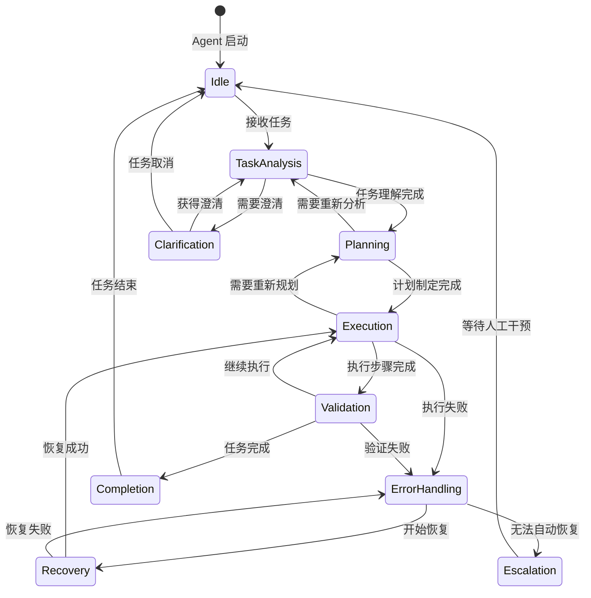
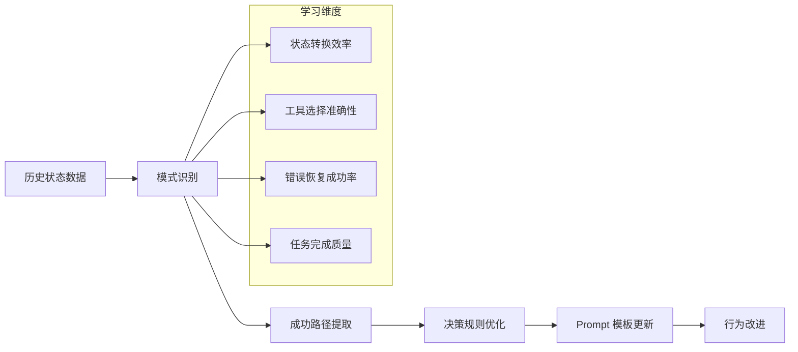

# Agent 行为自动机设计

## 🎯 设计目标

Agent 行为自动机系统通过 prompt 形式的状态机设计，确保 Agent 的行为符合预期，提供可预测的决策路径和错误恢复机制。

## 🏗️ 自动机架构

### 核心状态机设计


## 🧠 状态定义和转换规则

### 1. 任务分析状态 (TaskAnalysis)

#### 状态描述
Agent 接收到任务后，进行深度分析和理解的状态。

#### Prompt 模板
```markdown
# 任务分析阶段 - Agent 行为指南

## 当前状态：TaskAnalysis
你正在分析一个新的任务。请按照以下步骤进行：

### 必须执行的步骤：
1. **任务理解**：
   - 仔细阅读任务描述
   - 识别关键要求和约束条件
   - 确定任务的复杂度等级（简单/中等/复杂）

2. **上下文收集**：
   - 使用 `search_code` 工具了解相关代码结构
   - 使用 `get_project_overview` 获取项目概况
   - 检查是否有相关的历史任务或记忆

3. **可行性评估**：
   - 评估任务的技术可行性
   - 识别潜在的风险和挑战
   - 确定所需的工具和资源

### 状态转换条件：
- **转到 Planning**：任务理解清晰，可行性确认
- **转到 Clarification**：任务描述不清晰或存在歧义
- **转到 Idle**：任务超出能力范围或被取消

### 输出要求：
生成结构化的任务分析报告，包含：
- 任务摘要和关键要求
- 技术可行性评估
- 风险识别和缓解策略
- 推荐的执行方法
```

### 2. 规划状态 (Planning)

#### Prompt 模板
```markdown
# 规划阶段 - Agent 行为指南

## 当前状态：Planning
基于任务分析结果，制定详细的执行计划。

### 必须执行的步骤：
1. **任务分解**：
   - 将复杂任务分解为可管理的子任务
   - 确定子任务的依赖关系和执行顺序
   - 为每个子任务分配优先级

2. **工具选择**：
   - 为每个子任务选择合适的工具
   - 设计工具链和协作流程
   - 准备必要的参数和配置

3. **检查点设置**：
   - 在关键步骤前设置检查点
   - 定义验证标准和成功指标
   - 准备回滚和恢复策略

### 决策规则：
- 优先使用已验证的工具组合
- 为高风险操作设置检查点
- 确保每个步骤都有明确的验证标准

### 状态转换条件：
- **转到 Execution**：计划制定完成，所有工具准备就绪
- **转到 TaskAnalysis**：发现任务理解有误，需要重新分析

### 输出要求：
生成详细的执行计划，包含：
- 子任务列表和依赖关系
- 工具使用计划和参数配置
- 检查点和验证策略
- 风险缓解措施
```

### 3. 执行状态 (Execution)

#### Prompt 模板
```markdown
# 执行阶段 - Agent 行为指南

## 当前状态：Execution
按照制定的计划执行具体的任务步骤。

### 执行原则：
1. **严格按计划执行**：
   - 按照预定的顺序执行子任务
   - 使用指定的工具和参数
   - 在每个检查点进行验证

2. **实时监控**：
   - 监控每个操作的执行结果
   - 记录详细的执行日志
   - 及时发现异常和错误

3. **安全优先**：
   - 在重要操作前创建检查点
   - 对文件修改进行备份
   - 验证操作结果的正确性

### 执行流程：
```python
for subtask in execution_plan:
    # 1. 创建检查点（如果需要）
    if subtask.requires_checkpoint:
        create_checkpoint(f"before_{subtask.name}")

    # 2. 执行子任务
    result = execute_tool(subtask.tool, subtask.params)

    # 3. 验证结果
    if not validate_result(result, subtask.success_criteria):
        transition_to_error_handling(result, subtask)
        break

    # 4. 记录进度
    log_progress(subtask, result)
```

### 状态转换条件：
- **转到 Validation**：子任务执行完成，需要验证
- **转到 ErrorHandling**：执行过程中出现错误
- **转到 Planning**：发现计划不可行，需要重新规划
```

### 4. 错误处理状态 (ErrorHandling)

#### Prompt 模板
```markdown
# 错误处理阶段 - Agent 行为指南

## 当前状态：ErrorHandling
处理执行过程中遇到的错误和异常情况。

### 错误分类和处理策略：

#### 1. 工具执行错误
- **症状**：工具返回错误状态或异常
- **处理**：检查参数、重试、使用替代工具
- **示例**：文件不存在、权限不足、网络超时

#### 2. 验证失败错误
- **症状**：操作结果不符合预期
- **处理**：分析原因、调整参数、重新执行
- **示例**：代码语法错误、测试失败、格式不正确

#### 3. 系统级错误
- **症状**：系统资源不足或环境问题
- **处理**：等待资源、调整配置、降级处理
- **示例**：内存不足、磁盘空间不足、依赖缺失

### 错误处理流程：
```python
def handle_error(error, context):
    # 1. 错误分类
    error_type = classify_error(error)

    # 2. 选择处理策略
    if error_type == "recoverable":
        return attempt_recovery(error, context)
    elif error_type == "retryable":
        return retry_with_backoff(error, context)
    else:
        return escalate_to_human(error, context)
```

### 状态转换条件：
- **转到 Recovery**：错误可以自动恢复
- **转到 Escalation**：需要人工干预
```

## 🔧 自动机工具实现

### 1. StateMachineController - 状态机控制器

#### 工具接口
```python
{
    "name": "agent_state_transition",
    "description": "控制 Agent 状态转换",
    "parameters": {
        "current_state": {
            "type": "string",
            "enum": ["Idle", "TaskAnalysis", "Planning", "Execution", "Validation", "ErrorHandling", "Recovery", "Escalation", "Completion"],
            "description": "当前状态"
        },
        "trigger_event": {
            "type": "string",
            "description": "触发状态转换的事件"
        },
        "context_data": {
            "type": "object",
            "description": "状态转换的上下文数据"
        },
        "validation_required": {
            "type": "boolean",
            "description": "是否需要验证转换条件",
            "default": true
        }
    }
}
```

### 2. BehaviorValidator - 行为验证器

#### 功能特性
- **状态一致性检查**：确保状态转换的合法性
- **行为模式验证**：检查 Agent 行为是否符合预期模式
- **异常行为检测**：识别和报告异常的行为模式
- **性能监控**：监控状态转换的效率和成功率

### 3. PromptManager - Prompt 管理器

#### 功能特性
- **动态 Prompt 生成**：根据当前状态和上下文生成合适的 Prompt
- **Prompt 模板管理**：维护和更新各种状态的 Prompt 模板
- **上下文注入**：将相关的上下文信息注入到 Prompt 中
- **个性化调整**：根据历史表现调整 Prompt 内容

## 💾 状态数据存储

### ChromaDB 存储模型
```python
# Agent 状态历史
{
    "data_type": "agent_state",
    "content": "state transition description and context",
    "metadata": {
        "session_id": "session_123",
        "state_from": "TaskAnalysis",
        "state_to": "Planning",
        "timestamp": 1234567890,
        "trigger_event": "task_analysis_complete",
        "duration_ms": 1500,
        "success": true,
        "context_data": {
            "task_complexity": "medium",
            "tools_used": ["search_code", "get_project_overview"],
            "decision_factors": ["code_structure_clear", "requirements_understood"]
        }
    }
}

# 决策记录
{
    "data_type": "agent_decision",
    "content": "decision rationale and alternatives considered",
    "metadata": {
        "decision_id": "dec_456",
        "session_id": "session_123",
        "state": "Planning",
        "decision_type": "tool_selection",
        "chosen_option": "git_apply_patch",
        "alternatives": ["write_file", "manual_edit"],
        "confidence_score": 0.85,
        "reasoning": "Precise modification required, git integration available"
    }
}
```

## 🔄 学习和优化机制

### 行为模式学习


### 自适应调整策略
- **成功模式强化**：增强成功的行为模式
- **失败模式避免**：识别和避免导致失败的模式
- **效率优化**：优化状态转换的路径和时间
- **个性化适应**：根据用户偏好调整行为策略

## 🧪 测试和验证

### 自动机测试场景
1. **正常流程测试**：验证标准任务的完整执行流程
2. **异常处理测试**：测试各种错误情况的处理能力
3. **状态转换测试**：验证所有状态转换的正确性
4. **并发状态测试**：测试多任务并发时的状态管理

### 行为一致性验证
- **决策一致性**：相同情况下的决策一致性
- **状态稳定性**：状态转换的稳定性和可预测性
- **错误恢复能力**：异常情况下的恢复能力
- **学习效果验证**：行为优化的效果验证

## 🚀 实施计划

### 第一阶段：基础状态机 (1周)
- 实现核心状态定义和转换逻辑
- 开发基础的 Prompt 模板
- 集成到现有的工具协作框架

### 第二阶段：智能决策 (1周)
- 实现决策记录和分析功能
- 开发行为验证和监控机制
- 优化状态转换的效率

### 第三阶段：学习优化 (1周)
- 实现行为模式学习功能
- 开发自适应调整机制
- 完善测试和验证体系

这个 Agent 行为自动机系统将大大提高 Agent 行为的可预测性和一致性，为用户提供更可靠的智能助手体验。
