# 增强上下文引擎设计

## 🎯 设计目标

基于现有的上下文引擎实现，进行深度增强以达到 Augment Code 级别的代码理解和上下文感知能力，支持跨文件依赖分析、智能重构建议和深度语义理解。

## 🏗️ 增强架构设计

### 现有架构分析
当前上下文引擎包含：
- `ContextEngine` - 核心引擎类
- `CodeAnalyzer` - 代码分析器
- `QueryProcessor` - 查询处理器
- `UnifiedDataManager` - ChromaDB 统一存储

### 增强架构扩展

```mermaid
graph TB
    subgraph "现有核心组件"
        A[ContextEngine]
        B[CodeAnalyzer]
        C[QueryProcessor]
        D[UnifiedDataManager]
    end

    subgraph "新增深度分析层"
        E[DependencyAnalyzer - 依赖分析器]
        F[CallGraphBuilder - 调用图构建器]
        G[RefactoringAdvisor - 重构建议器]
        H[SemanticUnderstanding - 语义理解器]
    end

    subgraph "新增智能推荐层"
        I[CodeCompletionEngine - 代码补全引擎]
        J[PatternRecognizer - 模式识别器]
        K[BestPracticeAdvisor - 最佳实践建议器]
        L[PerformanceAnalyzer - 性能分析器]
    end

    subgraph "新增学习优化层"
        M[ExperienceLearner - 经验学习器]
        N[ContextMemory - 上下文记忆]
        O[AdaptiveRecommender - 自适应推荐器]
        P[UserPreferenceTracker - 用户偏好追踪]
    end

    A --> E
    B --> F
    C --> G
    D --> H

    E --> I
    F --> J
    G --> K
    H --> L

    I --> M
    J --> N
    K --> O
    L --> P
```


## 🔍 核心增强组件设计

### 1. DependencyAnalyzer - 依赖分析器

#### 功能特性
- **跨文件依赖追踪**：分析模块间的导入和依赖关系
- **循环依赖检测**：识别和报告循环依赖问题
- **依赖影响分析**：评估修改对依赖链的影响
- **依赖图可视化**：生成项目依赖关系图

#### 实现设计
```python
class DependencyAnalyzer:
    def __init__(self, context_engine):
        self.context_engine = context_engine
        self.dependency_graph = {}
        self.reverse_dependency_graph = {}

    def analyze_project_dependencies(self, project_path: str) -> Dict[str, Any]:
        """分析整个项目的依赖关系"""
        dependencies = {
            "direct_dependencies": {},
            "transitive_dependencies": {},
            "circular_dependencies": [],
            "dependency_depth": {},
            "critical_modules": []
        }

        # 构建依赖图
        self._build_dependency_graph(project_path)

        # 检测循环依赖
        dependencies["circular_dependencies"] = self._detect_circular_dependencies()

        # 分析关键模块
        dependencies["critical_modules"] = self._identify_critical_modules()

        return dependencies

    def get_impact_analysis(self, file_path: str) -> Dict[str, Any]:
        """分析修改特定文件的影响范围"""
        return {
            "direct_dependents": self._get_direct_dependents(file_path),
            "transitive_dependents": self._get_transitive_dependents(file_path),
            "risk_assessment": self._assess_modification_risk(file_path),
            "test_impact": self._analyze_test_impact(file_path)
        }
```

### 2. CallGraphBuilder - 调用图构建器

#### 功能特性
- **函数调用关系分析**：构建函数间的调用关系图
- **数据流分析**：追踪数据在函数间的流动
- **死代码检测**：识别未被调用的函数和代码
- **热点函数识别**：识别被频繁调用的关键函数

#### 工具接口
```python
{
    "name": "analyze_call_graph",
    "description": "分析代码的函数调用关系图",
    "parameters": {
        "scope": {
            "type": "string",
            "enum": ["file", "module", "project"],
            "description": "分析范围",
            "default": "project"
        },
        "target_path": {
            "type": "string",
            "description": "分析目标路径"
        },
        "include_external": {
            "type": "boolean",
            "description": "是否包含外部库调用",
            "default": false
        },
        "analysis_depth": {
            "type": "integer",
            "description": "分析深度",
            "default": 5,
            "minimum": 1,
            "maximum": 10
        },
        "output_format": {
            "type": "string",
            "enum": ["json", "mermaid", "graphviz"],
            "description": "输出格式",
            "default": "json"
        }
    }
}
```

### 3. RefactoringAdvisor - 重构建议器

#### 功能特性
- **代码异味检测**：识别需要重构的代码模式
- **重构机会识别**：建议具体的重构操作
- **重构安全性评估**：评估重构操作的风险
- **重构步骤规划**：提供详细的重构执行计划

#### 重构模式支持
```python
REFACTORING_PATTERNS = {
    "extract_method": {
        "description": "提取方法",
        "triggers": ["long_method", "duplicate_code"],
        "safety_level": "high"
    },
    "extract_class": {
        "description": "提取类",
        "triggers": ["large_class", "feature_envy"],
        "safety_level": "medium"
    },
    "move_method": {
        "description": "移动方法",
        "triggers": ["feature_envy", "inappropriate_intimacy"],
        "safety_level": "medium"
    },
    "rename_variable": {
        "description": "重命名变量",
        "triggers": ["unclear_naming", "inconsistent_naming"],
        "safety_level": "high"
    },
    "simplify_conditional": {
        "description": "简化条件表达式",
        "triggers": ["complex_conditional", "nested_conditionals"],
        "safety_level": "high"
    }
}
```

### 4. SemanticUnderstanding - 语义理解器

#### 功能特性
- **业务逻辑理解**：理解代码的业务含义和目的
- **设计模式识别**：识别代码中使用的设计模式
- **代码意图推断**：推断代码的设计意图和目标
- **架构模式分析**：分析项目的整体架构模式

#### 语义分析维度

```mermaid
graph LR
    A[代码文本] --> B[语法分析]
    B --> C[语义解析]
    C --> D[意图理解]
    D --> E[模式识别]
    E --> F[业务理解]

    subgraph "分析层次"
        G[语法层 - AST解析]
        H[语义层 - 类型推断]
        I[逻辑层 - 控制流分析]
        J[业务层 - 领域理解]
        K[架构层 - 模式识别]
    end

    B --> G
    C --> H
    D --> I
    E --> J
    F --> K
```


## 🧠 智能推荐系统设计

### 1. CodeCompletionEngine - 代码补全引擎

#### 增强特性
- **上下文感知补全**：基于当前代码上下文的智能补全
- **类型推断补全**：基于类型信息的精确补全
- **模式匹配补全**：基于常见编程模式的补全建议
- **个性化补全**：基于用户历史的个性化建议

#### 实现架构
```python
class CodeCompletionEngine:
    def __init__(self, context_engine):
        self.context_engine = context_engine
        self.pattern_matcher = PatternMatcher()
        self.type_inferencer = TypeInferencer()
        self.user_preference_tracker = UserPreferenceTracker()

    def get_completions(self, file_path: str, position: Dict[str, int],
                       context: str) -> List[Dict[str, Any]]:
        """获取代码补全建议"""
        # 分析当前上下文
        current_context = self._analyze_current_context(file_path, position, context)

        # 生成基础补全
        base_completions = self._generate_base_completions(current_context)

        # 应用类型推断
        typed_completions = self._apply_type_inference(base_completions, current_context)

        # 模式匹配增强
        pattern_completions = self._apply_pattern_matching(typed_completions, current_context)

        # 个性化排序
        personalized_completions = self._apply_personalization(pattern_completions)

        return personalized_completions
```

### 2. PatternRecognizer - 模式识别器

#### 识别模式类型
- **设计模式**：单例、工厂、观察者等经典设计模式
- **编程习惯**：命名约定、代码结构、错误处理模式
- **性能模式**：常见的性能优化模式和反模式
- **安全模式**：安全编程实践和常见漏洞模式

### 3. BestPracticeAdvisor - 最佳实践建议器

#### 建议类型
- **代码质量**：可读性、可维护性、可测试性建议
- **性能优化**：算法优化、资源使用优化建议
- **安全实践**：安全编程实践和漏洞预防建议
- **架构建议**：模块化、解耦、扩展性建议

## 💾 ChromaDB 存储扩展

### 增强数据模型
```python
# 依赖关系存储
{
    "data_type": "dependency_relation",
    "content": "dependency description and context",
    "metadata": {
        "source_file": "src/main.py",
        "target_file": "src/utils.py",
        "dependency_type": "import",
        "relationship": "direct",
        "strength": 0.8,
        "last_analyzed": 1234567890
    }
}

# 函数调用关系存储
{
    "data_type": "call_relation",
    "content": "function call context and parameters",
    "metadata": {
        "caller_function": "main.process_data",
        "callee_function": "utils.validate_input",
        "call_frequency": 15,
        "call_context": "data_validation",
        "parameters_passed": ["data", "schema"]
    }
}

# 重构建议存储
{
    "data_type": "refactoring_suggestion",
    "content": "refactoring rationale and benefits",
    "metadata": {
        "target_code": "src/handlers.py:45-60",
        "refactoring_type": "extract_method",
        "confidence_score": 0.85,
        "estimated_effort": "low",
        "benefits": ["improved_readability", "reduced_duplication"]
    }
}
```

## 🔄 与现有系统集成

### 现有工具增强
```python
# 增强现有的 analyze_code 工具
{
    "name": "analyze_code_enhanced",
    "description": "深度代码分析，包含依赖关系、调用图、重构建议",
    "parameters": {
        "file_path": {"type": "string", "description": "文件路径"},
        "analysis_depth": {
            "type": "string",
            "enum": ["basic", "standard", "deep", "comprehensive"],
            "default": "standard"
        },
        "include_dependencies": {"type": "boolean", "default": true},
        "include_call_graph": {"type": "boolean", "default": true},
        "include_refactoring_suggestions": {"type": "boolean", "default": true},
        "include_performance_analysis": {"type": "boolean", "default": false}
    }
}

# 新增智能重构工具
{
    "name": "suggest_refactoring",
    "description": "分析代码并提供重构建议",
    "parameters": {
        "target": {"type": "string", "description": "分析目标（文件路径或代码片段）"},
        "refactoring_types": {
            "type": "array",
            "items": {"type": "string"},
            "description": "关注的重构类型"
        },
        "safety_level": {
            "type": "string",
            "enum": ["conservative", "moderate", "aggressive"],
            "default": "moderate"
        }
    }
}
```

### 工具协作增强
```python
# 智能代码修改工作流
enhanced_code_modification_workflow = {
    "name": "intelligent_code_modification",
    "steps": [
        {
            "tool": "analyze_code_enhanced",
            "params": {
                "file_path": "${target_file}",
                "analysis_depth": "comprehensive"
            }
        },
        {
            "tool": "analyze_call_graph",
            "params": {
                "target_path": "${target_file}",
                "scope": "project"
            }
        },
        {
            "tool": "suggest_refactoring",
            "params": {
                "target": "${target_file}",
                "safety_level": "moderate"
            }
        },
        {
            "tool": "git_diff_analysis",
            "params": {
                "target": "${target_file}",
                "analysis_level": "semantic"
            }
        },
        {
            "tool": "git_apply_patch",
            "params": {
                "file_path": "${target_file}",
                "patch_operations": "${modifications}"
            }
        }
    ]
}
```

## 🧪 测试和验证策略

### 功能测试
- **依赖分析准确性**：验证依赖关系识别的准确性
- **调用图完整性**：验证函数调用关系的完整性
- **重构建议质量**：评估重构建议的实用性和安全性
- **语义理解深度**：测试代码语义理解的准确性

### 性能测试
- **大型项目处理**：测试大型项目的分析性能
- **实时分析能力**：测试实时代码分析的响应速度
- **内存使用优化**：监控内存使用和优化效果
- **并发分析能力**：测试多文件并发分析的性能

## 🚀 实施计划

### 第一阶段：依赖分析和调用图 (1周)
- 实现 `DependencyAnalyzer` 和 `CallGraphBuilder`
- 集成到现有的 `ContextEngine`
- 基础的依赖关系可视化

### 第二阶段：重构建议和语义理解 (1周)
- 实现 `RefactoringAdvisor` 和 `SemanticUnderstanding`
- 开发重构建议算法
- 语义分析和模式识别

### 第三阶段：智能推荐和学习 (1周)
- 实现智能推荐系统
- 开发学习和适应机制
- 完整的测试和优化

## 🔧 工具接口设计

### CodeCompletionEngine 工具接口
```python
{
    "name": "get_code_completions",
    "description": "获取智能代码补全建议",
    "parameters": {
        "file_path": {
            "type": "string",
            "description": "文件路径",
            "required": true
        },
        "position": {
            "type": "object",
            "properties": {
                "line": {"type": "integer", "description": "行号"},
                "column": {"type": "integer", "description": "列号"}
            },
            "description": "光标位置",
            "required": true
        },
        "context": {
            "type": "string",
            "description": "当前代码上下文",
            "required": true
        },
        "completion_types": {
            "type": "array",
            "items": {
                "type": "string",
                "enum": ["variables", "functions", "classes", "imports", "patterns"]
            },
            "description": "补全类型",
            "default": ["variables", "functions", "classes"]
        },
        "max_suggestions": {
            "type": "integer",
            "description": "最大建议数量",
            "default": 10,
            "minimum": 1,
            "maximum": 50
        }
    }
}
```

### PatternRecognizer 工具接口
```python
{
    "name": "recognize_patterns",
    "description": "识别代码中的设计模式和编程模式",
    "parameters": {
        "target": {
            "type": "object",
            "properties": {
                "type": {"type": "string", "enum": ["file", "directory", "code_snippet"]},
                "path": {"type": "string", "description": "目标路径"},
                "content": {"type": "string", "description": "代码内容（当type为code_snippet时）"}
            },
            "description": "分析目标"
        },
        "pattern_types": {
            "type": "array",
            "items": {
                "type": "string",
                "enum": ["design_patterns", "coding_patterns", "anti_patterns", "performance_patterns", "security_patterns"]
            },
            "description": "模式类型",
            "default": ["design_patterns", "coding_patterns"]
        },
        "confidence_threshold": {
            "type": "number",
            "description": "置信度阈值",
            "default": 0.7,
            "minimum": 0.0,
            "maximum": 1.0
        }
    }
}
```

### BestPracticeAdvisor 工具接口
```python
{
    "name": "get_best_practices",
    "description": "获取最佳实践建议",
    "parameters": {
        "target": {
            "type": "object",
            "properties": {
                "type": {"type": "string", "enum": ["file", "function", "class", "project"]},
                "path": {"type": "string", "description": "目标路径"},
                "name": {"type": "string", "description": "目标名称（函数名或类名）"}
            },
            "description": "分析目标"
        },
        "advice_categories": {
            "type": "array",
            "items": {
                "type": "string",
                "enum": ["code_quality", "performance", "security", "maintainability", "testing"]
            },
            "description": "建议类别",
            "default": ["code_quality", "maintainability"]
        },
        "language": {
            "type": "string",
            "description": "编程语言",
            "default": "auto_detect"
        },
        "priority_level": {
            "type": "string",
            "enum": ["low", "medium", "high", "critical"],
            "description": "优先级过滤",
            "default": "medium"
        }
    }
}
```

## 🎯 MCP 服务集成

### 与 Agent 通信的智能推荐策略

由于我们的系统本身就是 MCP 服务，可以充分利用与 Agent 的通信来解决复杂的语义理解问题：

#### 1. 上下文感知对话
```python
class AgentContextualDialog:
    """与 Agent 的上下文感知对话"""

    def __init__(self, mcp_client):
        self.mcp_client = mcp_client

    async def clarify_business_logic(self, code_snippet: str, context: Dict) -> Dict:
        """通过与 Agent 对话澄清业务逻辑"""
        prompt = f"""
        我正在分析以下代码的业务逻辑，需要你的帮助：

        代码：
        {code_snippet}

        上下文信息：
        - 文件路径：{context.get('file_path')}
        - 项目类型：{context.get('project_type')}
        - 相关文件：{context.get('related_files', [])}

        请帮我分析：
        1. 这段代码的主要业务目的是什么？
        2. 它在整个系统中扮演什么角色？
        3. 有哪些潜在的业务规则或约束？
        4. 建议的改进方向是什么？
        """

        response = await self.mcp_client.call_tool("analyze_with_agent", {
            "prompt": prompt,
            "context": context
        })

        return self._parse_agent_response(response)
```

#### 2. 智能模式识别协作
```python
class CollaborativePatternRecognition:
    """协作式模式识别"""

    async def identify_complex_patterns(self, code_structure: Dict) -> Dict:
        """识别复杂设计模式"""
        # 先进行基础模式识别
        basic_patterns = self._basic_pattern_recognition(code_structure)

        # 对于不确定的模式，请求 Agent 协助
        uncertain_patterns = [p for p in basic_patterns if p['confidence'] < 0.8]

        if uncertain_patterns:
            agent_analysis = await self._request_agent_pattern_analysis(
                code_structure, uncertain_patterns
            )

            # 合并分析结果
            return self._merge_pattern_analysis(basic_patterns, agent_analysis)

        return basic_patterns
```

#### 3. 动态最佳实践学习
```python
class AdaptiveBestPractices:
    """自适应最佳实践系统"""

    async def learn_from_agent_feedback(self, code_analysis: Dict, agent_feedback: Dict):
        """从 Agent 反馈中学习"""
        # 分析 Agent 的建议和反馈
        feedback_patterns = self._extract_feedback_patterns(agent_feedback)

        # 更新最佳实践规则库
        await self._update_practice_rules(feedback_patterns)

        # 调整推荐算法权重
        self._adjust_recommendation_weights(code_analysis, agent_feedback)
```

## 🔄 实时学习和适应机制

### 1. 用户行为学习
```python
class UserBehaviorLearner:
    """用户行为学习器"""

    def __init__(self, data_manager):
        self.data_manager = data_manager
        self.behavior_patterns = {}

    async def track_user_action(self, action: Dict):
        """跟踪用户行为"""
        # 记录用户操作
        await self.data_manager.store_data(
            data_type="user_behavior",
            content=json.dumps(action),
            metadata={
                "action_type": action.get("type"),
                "timestamp": time.time(),
                "context": action.get("context", {})
            }
        )

        # 更新行为模式
        self._update_behavior_patterns(action)

    def get_personalized_suggestions(self, context: Dict) -> List[Dict]:
        """获取个性化建议"""
        user_preferences = self._analyze_user_preferences(context)
        return self._generate_personalized_suggestions(user_preferences, context)
```

### 2. 项目特定学习
```python
class ProjectSpecificLearner:
    """项目特定学习器"""

    async def learn_project_patterns(self, project_path: str):
        """学习项目特定模式"""
        # 分析项目结构
        project_structure = await self._analyze_project_structure(project_path)

        # 识别项目特定的模式和约定
        project_patterns = await self._identify_project_patterns(project_structure)

        # 存储项目特定的知识
        await self._store_project_knowledge(project_path, project_patterns)

    async def get_project_specific_advice(self, project_path: str, code_context: Dict) -> List[Dict]:
        """获取项目特定建议"""
        project_knowledge = await self._load_project_knowledge(project_path)
        return self._generate_project_specific_advice(project_knowledge, code_context)
```

这个增强上下文引擎设计将现有的基础功能提升到 Augment Code 级别，提供深度的代码理解和智能建议能力，并充分利用 MCP 服务的特性与 Agent 进行智能协作。
