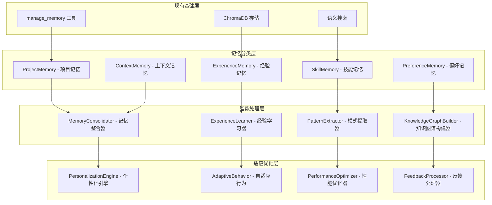

# 记忆系统进化设计

## 🎯 设计目标

基于现有的记忆管理工具，进化为具备长期学习、经验积累和智能适应能力的高级记忆系统，实现跨会话的项目理解和个性化服务。

## 🏗️ 记忆系统架构进化

### 现有记忆系统分析
当前实现：
- `manage_memory` 工具 - 基础的记忆存储和检索
- 支持多种记忆类型（知识、对话、经验、技能）
- ChromaDB 统一存储和语义搜索

### 进化架构设计


## 🧠 记忆类型分类和管理

### 1. ProjectMemory - 项目记忆

#### 功能特性
- **项目上下文持久化**：保存项目的结构、依赖、配置等信息
- **开发历史记录**：记录项目的开发历程和重要决策
- **问题解决记录**：保存遇到的问题和解决方案
- **项目特性学习**：学习项目的特定模式和约定

#### 数据模型
```python
{
    "data_type": "project_memory",
    "content": "project context and development history",
    "metadata": {
        "project_id": "project_abc123",
        "project_name": "E-commerce Platform",
        "memory_type": "project_context",
        "key_technologies": ["React", "Node.js", "PostgreSQL"],
        "architecture_pattern": "microservices",
        "coding_conventions": {
            "naming": "camelCase",
            "indentation": "2_spaces",
            "max_line_length": 100
        },
        "common_patterns": [
            "error_handling_with_try_catch",
            "async_await_preferred",
            "component_based_architecture"
        ],
        "project_phase": "development",
        "last_updated": 1234567890
    }
}
```

#### 工具接口
```python
{
    "name": "manage_project_memory",
    "description": "管理项目相关的长期记忆",
    "parameters": {
        "action": {
            "type": "string",
            "enum": ["store", "retrieve", "update", "analyze"],
            "description": "操作类型"
        },
        "project_id": {
            "type": "string",
            "description": "项目标识符"
        },
        "memory_content": {
            "type": "object",
            "description": "记忆内容（存储和更新时需要）"
        },
        "query": {
            "type": "string",
            "description": "查询内容（检索时需要）"
        },
        "analysis_type": {
            "type": "string",
            "enum": ["patterns", "evolution", "decisions", "problems"],
            "description": "分析类型"
        }
    }
}
```

### 2. ExperienceMemory - 经验记忆

#### 功能特性
- **成功模式记录**：记录成功的解决方案和最佳实践
- **失败经验学习**：从失败中学习，避免重复错误
- **效率优化记录**：记录提高效率的方法和工具使用技巧
- **决策历史分析**：分析历史决策的效果和改进空间

#### 经验分类体系
```python
EXPERIENCE_CATEGORIES = {
    "problem_solving": {
        "description": "问题解决经验",
        "subcategories": ["debugging", "performance_optimization", "architecture_design"]
    },
    "tool_usage": {
        "description": "工具使用经验",
        "subcategories": ["git_workflows", "testing_strategies", "deployment_practices"]
    },
    "code_patterns": {
        "description": "代码模式经验",
        "subcategories": ["design_patterns", "refactoring_techniques", "error_handling"]
    },
    "collaboration": {
        "description": "协作经验",
        "subcategories": ["code_review", "documentation", "communication"]
    }
}
```

### 3. SkillMemory - 技能记忆

#### 功能特性
- **技能水平追踪**：跟踪各种技术技能的掌握程度
- **学习路径记录**：记录技能学习的路径和进展
- **技能应用记录**：记录技能在实际项目中的应用
- **技能差距分析**：识别技能差距和学习需求

#### 技能评估模型
```python
class SkillAssessment:
    def __init__(self):
        self.skill_levels = {
            "beginner": {"score": 1, "description": "基础了解"},
            "intermediate": {"score": 2, "description": "能够应用"},
            "advanced": {"score": 3, "description": "熟练掌握"},
            "expert": {"score": 4, "description": "专家级别"}
        }

    def assess_skill_level(self, skill_name: str, usage_history: List[Dict]) -> Dict:
        """评估技能水平"""
        # 基于使用历史、成功率、复杂度等因素评估
        usage_frequency = len(usage_history)
        success_rate = sum(1 for h in usage_history if h["success"]) / len(usage_history)
        complexity_avg = sum(h["complexity"] for h in usage_history) / len(usage_history)

        # 综合评估算法
        skill_score = self._calculate_skill_score(usage_frequency, success_rate, complexity_avg)

        return {
            "skill_name": skill_name,
            "current_level": self._score_to_level(skill_score),
            "score": skill_score,
            "usage_count": usage_frequency,
            "success_rate": success_rate,
            "average_complexity": complexity_avg,
            "improvement_suggestions": self._generate_improvement_suggestions(skill_score)
        }
```

## 🔄 智能记忆处理

### 1. MemoryConsolidator - 记忆整合器

#### 功能特性
- **记忆去重和合并**：识别和合并重复或相似的记忆
- **记忆重要性评估**：评估记忆的重要性和保留价值
- **记忆关联建立**：建立不同记忆之间的关联关系
- **记忆层次化组织**：将记忆组织成层次化结构

#### 整合算法
```python
class MemoryConsolidator:
    def __init__(self, data_manager):
        self.data_manager = data_manager
        self.similarity_threshold = 0.8
        self.importance_threshold = 0.6

    def consolidate_memories(self, memory_type: str) -> Dict[str, Any]:
        """整合指定类型的记忆"""
        # 获取所有相关记忆
        memories = self.data_manager.query_data(
            query="",
            data_type=memory_type,
            n_results=1000
        )

        # 识别相似记忆
        similar_groups = self._find_similar_memories(memories)

        # 合并相似记忆
        consolidated_memories = []
        for group in similar_groups:
            merged_memory = self._merge_memories(group)
            consolidated_memories.append(merged_memory)

        # 评估重要性
        important_memories = self._filter_by_importance(consolidated_memories)

        return {
            "original_count": len(memories["ids"]),
            "consolidated_count": len(important_memories),
            "consolidation_ratio": len(important_memories) / len(memories["ids"]),
            "consolidated_memories": important_memories
        }
```

### 2. ExperienceLearner - 经验学习器

#### 学习机制
- **模式识别学习**：从历史经验中识别成功和失败的模式
- **因果关系学习**：学习行动和结果之间的因果关系
- **适应性学习**：根据环境变化调整学习策略
- **迁移学习**：将一个领域的经验应用到相似领域

#### 学习算法
```python
class ExperienceLearner:
    def __init__(self):
        self.success_patterns = {}
        self.failure_patterns = {}
        self.causal_relationships = {}

    def learn_from_experience(self, experience_data: Dict[str, Any]) -> Dict[str, Any]:
        """从经验中学习"""
        # 提取经验特征
        features = self._extract_features(experience_data)

        # 分类成功/失败经验
        if experience_data["outcome"] == "success":
            self._update_success_patterns(features, experience_data)
        else:
            self._update_failure_patterns(features, experience_data)

        # 更新因果关系
        self._update_causal_relationships(features, experience_data)

        # 生成学习洞察
        insights = self._generate_insights()

        return {
            "learning_summary": insights,
            "pattern_updates": self._get_pattern_updates(),
            "recommendations": self._generate_recommendations()
        }
```

## 🎯 个性化和适应

### 1. PersonalizationEngine - 个性化引擎

#### 个性化维度
- **工作习惯适应**：学习用户的工作习惯和偏好
- **技术栈偏好**：记录用户偏好的技术栈和工具
- **代码风格适应**：适应用户的代码风格和约定
- **交互方式优化**：优化与用户的交互方式

#### 个性化数据模型
```python
{
    "data_type": "user_preference",
    "content": "user behavior patterns and preferences",
    "metadata": {
        "user_id": "user_123",
        "preference_category": "coding_style",
        "preferences": {
            "indentation": "4_spaces",
            "quote_style": "double_quotes",
            "line_length": 88,
            "import_organization": "alphabetical",
            "comment_style": "docstring_preferred"
        },
        "confidence_score": 0.85,
        "sample_size": 150,
        "last_updated": 1234567890
    }
}
```

### 2. AdaptiveBehavior - 自适应行为

#### 适应机制
- **响应方式调整**：根据用户反馈调整响应方式
- **建议精度优化**：提高建议的准确性和相关性
- **工作流优化**：优化工具使用的工作流程
- **错误预防**：基于历史错误预防类似问题

## 💾 ChromaDB 存储优化

### 记忆数据索引策略
```python
# 记忆重要性索引
{
    "data_type": "memory_importance",
    "content": "memory importance assessment",
    "metadata": {
        "memory_id": "mem_12345",
        "importance_score": 0.85,
        "access_frequency": 25,
        "last_accessed": 1234567890,
        "relevance_decay": 0.95,
        "context_relevance": ["project_abc", "skill_python", "pattern_mvc"]
    }
}

# 记忆关联网络
{
    "data_type": "memory_association",
    "content": "memory relationship description",
    "metadata": {
        "source_memory": "mem_12345",
        "target_memory": "mem_67890",
        "association_type": "causal",
        "strength": 0.75,
        "context": "problem_solving_sequence"
    }
}
```

### 查询优化策略
- **语义相似性搜索**：基于内容语义的相似记忆检索
- **时间衰减权重**：考虑时间因素的记忆重要性衰减
- **上下文相关性**：基于当前上下文的记忆相关性评估
- **个性化排序**：基于用户偏好的记忆排序

## 🔧 新增记忆工具

### 1. 经验学习工具
```python
{
    "name": "learn_from_experience",
    "description": "从操作经验中学习并更新知识库",
    "parameters": {
        "experience_data": {
            "type": "object",
            "description": "经验数据，包含操作、结果、上下文等"
        },
        "learning_mode": {
            "type": "string",
            "enum": ["automatic", "guided", "manual"],
            "default": "automatic"
        },
        "update_preferences": {
            "type": "boolean",
            "description": "是否更新用户偏好",
            "default": true
        }
    }
}
```

### 2. 记忆整合工具
```python
{
    "name": "consolidate_memories",
    "description": "整合和优化记忆存储",
    "parameters": {
        "memory_types": {
            "type": "array",
            "items": {"type": "string"},
            "description": "要整合的记忆类型"
        },
        "consolidation_strategy": {
            "type": "string",
            "enum": ["similarity_based", "importance_based", "time_based"],
            "default": "similarity_based"
        },
        "preserve_threshold": {
            "type": "number",
            "description": "保留阈值",
            "default": 0.6
        }
    }
}
```

## 🧪 测试和验证

### 学习效果验证
- **记忆准确性测试**：验证记忆存储和检索的准确性
- **学习效果评估**：评估从经验中学习的效果
- **个性化效果测试**：测试个性化适应的效果
- **长期记忆稳定性**：验证长期记忆的稳定性和一致性

### 性能优化测试
- **大规模记忆处理**：测试大量记忆数据的处理性能
- **实时学习性能**：测试实时学习和适应的性能
- **查询响应速度**：优化记忆查询的响应时间
- **存储效率**：优化记忆数据的存储效率

## 🚀 实施计划

### 第一阶段：记忆分类和整合 (1周)
- 实现记忆分类系统
- 开发记忆整合器
- 基础的记忆关联建立

### 第二阶段：经验学习和模式识别 (1周)
- 实现经验学习器
- 开发模式提取算法
- 因果关系学习机制

### 第三阶段：个性化和适应 (1周)
- 实现个性化引擎
- 开发自适应行为机制
- 完整的测试和优化

这个记忆系统进化设计将现有的基础记忆功能提升为具备学习和适应能力的智能记忆系统，为 Agent 提供长期的知识积累和个性化服务能力。
