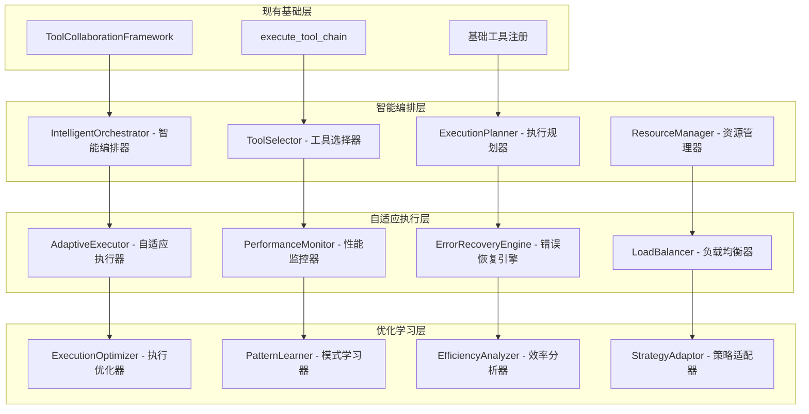

# 工具编排和协作框架

## 🎯 设计目标

基于现有的工具协作框架，进行深度增强以支持复杂的多工具协作场景、智能工具选择、自适应执行策略和高效的资源管理。

## 🏗️ 协作框架架构进化

### 现有框架分析
当前实现：
- `ToolCollaborationFramework` - 基础协作框架
- `execute_tool_chain` 工具 - 工具链执行器
- 支持链式调用、并行执行、条件执行
- 基础的数据流传递和变量管理

### 增强架构设计


## 🧠 智能编排系统

### 1. IntelligentOrchestrator - 智能编排器

#### 功能特性
- **任务智能分解**：将复杂任务智能分解为最优的工具序列
- **依赖关系分析**：分析工具间的依赖关系和执行约束
- **执行策略优化**：选择最优的执行策略（串行、并行、混合）
- **动态调度**：根据实时情况动态调整执行计划

#### 核心算法
```python
class IntelligentOrchestrator:
    def __init__(self, tool_registry, performance_history):
        self.tool_registry = tool_registry
        self.performance_history = performance_history
        self.dependency_graph = DependencyGraph()
        self.optimization_engine = OptimizationEngine()

    def orchestrate_task(self, task_description: str, constraints: Dict[str, Any]) -> Dict[str, Any]:
        """智能编排任务执行"""
        # 1. 任务分析和分解
        subtasks = self._decompose_task(task_description)

        # 2. 工具匹配和选择
        tool_assignments = self._assign_tools_to_subtasks(subtasks)

        # 3. 依赖关系分析
        dependencies = self._analyze_dependencies(tool_assignments)

        # 4. 执行策略优化
        execution_plan = self._optimize_execution_strategy(tool_assignments, dependencies, constraints)

        # 5. 资源分配
        resource_allocation = self._allocate_resources(execution_plan)

        return {
            "execution_plan": execution_plan,
            "resource_allocation": resource_allocation,
            "estimated_duration": self._estimate_duration(execution_plan),
            "success_probability": self._estimate_success_probability(execution_plan)
        }
```

### 2. ToolSelector - 工具选择器

#### 选择策略
- **能力匹配**：基于工具能力和任务需求的匹配度
- **性能历史**：考虑工具的历史性能表现
- **资源消耗**：评估工具的资源消耗和可用性
- **成功率预测**：预测工具在特定上下文下的成功率

#### 选择算法
```python
class ToolSelector:
    def __init__(self):
        self.capability_matcher = CapabilityMatcher()
        self.performance_predictor = PerformancePredictor()
        self.resource_estimator = ResourceEstimator()

    def select_best_tool(self, task_requirements: Dict[str, Any],
                        available_tools: List[str],
                        context: Dict[str, Any]) -> Dict[str, Any]:
        """选择最适合的工具"""
        candidates = []

        for tool_name in available_tools:
            tool_info = self.tool_registry.get_tool_info(tool_name)

            # 计算匹配度
            capability_score = self.capability_matcher.calculate_match_score(
                task_requirements, tool_info.capabilities
            )

            # 预测性能
            performance_score = self.performance_predictor.predict_performance(
                tool_name, context
            )

            # 估算资源消耗
            resource_cost = self.resource_estimator.estimate_cost(
                tool_name, task_requirements
            )

            # 综合评分
            overall_score = self._calculate_overall_score(
                capability_score, performance_score, resource_cost
            )

            candidates.append({
                "tool_name": tool_name,
                "overall_score": overall_score,
                "capability_score": capability_score,
                "performance_score": performance_score,
                "resource_cost": resource_cost
            })

        # 选择最佳工具
        best_tool = max(candidates, key=lambda x: x["overall_score"])

        return {
            "selected_tool": best_tool["tool_name"],
            "selection_rationale": self._generate_rationale(best_tool),
            "alternatives": sorted(candidates, key=lambda x: x["overall_score"], reverse=True)[1:3]
        }
```

### 3. ExecutionPlanner - 执行规划器

#### 规划策略
- **并行度优化**：最大化可并行执行的工具数量
- **关键路径识别**：识别影响总执行时间的关键路径
- **资源约束考虑**：在资源约束下优化执行计划
- **风险最小化**：降低执行失败的风险

#### 规划算法
```python
class ExecutionPlanner:
    def __init__(self):
        self.graph_analyzer = GraphAnalyzer()
        self.scheduler = TaskScheduler()
        self.risk_assessor = RiskAssessor()

    def create_execution_plan(self, tool_assignments: List[Dict],
                            dependencies: Dict[str, List[str]],
                            constraints: Dict[str, Any]) -> Dict[str, Any]:
        """创建优化的执行计划"""
        # 1. 构建执行图
        execution_graph = self._build_execution_graph(tool_assignments, dependencies)

        # 2. 识别关键路径
        critical_path = self.graph_analyzer.find_critical_path(execution_graph)

        # 3. 计算并行度
        parallelism_levels = self._calculate_parallelism_levels(execution_graph)

        # 4. 优化调度
        optimized_schedule = self.scheduler.optimize_schedule(
            execution_graph, constraints, critical_path
        )

        # 5. 风险评估
        risk_assessment = self.risk_assessor.assess_execution_risks(optimized_schedule)

        return {
            "execution_stages": optimized_schedule,
            "critical_path": critical_path,
            "max_parallelism": max(parallelism_levels),
            "estimated_duration": self._calculate_total_duration(optimized_schedule),
            "risk_factors": risk_assessment
        }
```

## 🔄 自适应执行系统

### 1. AdaptiveExecutor - 自适应执行器

#### 自适应特性
- **动态重规划**：根据执行情况动态调整计划
- **故障转移**：工具失败时自动切换到备选方案
- **性能调优**：根据实时性能调整执行参数
- **资源弹性**：根据资源可用性动态调整并发度

#### 执行引擎
```python
class AdaptiveExecutor:
    def __init__(self, orchestrator, monitor):
        self.orchestrator = orchestrator
        self.monitor = monitor
        self.execution_state = ExecutionState()
        self.adaptation_engine = AdaptationEngine()

    async def execute_plan(self, execution_plan: Dict[str, Any]) -> Dict[str, Any]:
        """自适应执行计划"""
        results = []

        for stage in execution_plan["execution_stages"]:
            # 监控执行前状态
            pre_execution_state = self.monitor.capture_state()

            # 并行执行当前阶段的工具
            stage_results = await self._execute_stage_adaptive(stage)

            # 监控执行后状态
            post_execution_state = self.monitor.capture_state()

            # 分析执行效果
            execution_analysis = self._analyze_execution(
                pre_execution_state, post_execution_state, stage_results
            )

            # 自适应调整
            if execution_analysis["needs_adaptation"]:
                adaptation = self.adaptation_engine.generate_adaptation(
                    execution_analysis, remaining_stages
                )
                execution_plan = self._apply_adaptation(execution_plan, adaptation)

            results.extend(stage_results)

        return {
            "execution_results": results,
            "performance_metrics": self.monitor.get_performance_metrics(),
            "adaptations_applied": self.adaptation_engine.get_adaptation_history()
        }
```

### 2. ErrorRecoveryEngine - 错误恢复引擎

#### 恢复策略
- **重试机制**：智能重试失败的工具执行
- **降级执行**：使用功能相近但要求较低的替代工具
- **部分恢复**：从最近的成功检查点恢复执行
- **人工干预**：无法自动恢复时请求人工干预

#### 恢复算法
```python
class ErrorRecoveryEngine:
    def __init__(self):
        self.recovery_strategies = {
            "transient_error": self._handle_transient_error,
            "resource_exhaustion": self._handle_resource_exhaustion,
            "tool_failure": self._handle_tool_failure,
            "data_corruption": self._handle_data_corruption
        }

    def recover_from_error(self, error_info: Dict[str, Any],
                          execution_context: Dict[str, Any]) -> Dict[str, Any]:
        """从错误中恢复"""
        # 1. 错误分类
        error_type = self._classify_error(error_info)

        # 2. 选择恢复策略
        recovery_strategy = self.recovery_strategies.get(
            error_type, self._handle_unknown_error
        )

        # 3. 执行恢复
        recovery_result = recovery_strategy(error_info, execution_context)

        # 4. 验证恢复效果
        if recovery_result["success"]:
            return {
                "recovery_successful": True,
                "recovery_action": recovery_result["action"],
                "continuation_plan": recovery_result["continuation_plan"]
            }
        else:
            return {
                "recovery_successful": False,
                "escalation_required": True,
                "escalation_info": recovery_result["escalation_info"]
            }
```

## 📊 性能监控和优化

### 1. PerformanceMonitor - 性能监控器

#### 监控指标
- **执行时间**：工具和工具链的执行时间
- **资源使用**：CPU、内存、网络等资源使用情况
- **成功率**：工具执行的成功率和失败模式
- **并发效率**：并行执行的效率和瓶颈

#### 监控实现
```python
class PerformanceMonitor:
    def __init__(self):
        self.metrics_collector = MetricsCollector()
        self.performance_analyzer = PerformanceAnalyzer()
        self.alerting_system = AlertingSystem()

    def monitor_execution(self, execution_id: str, tool_name: str,
                         start_time: float, end_time: float,
                         result: Dict[str, Any]) -> None:
        """监控工具执行性能"""
        metrics = {
            "execution_id": execution_id,
            "tool_name": tool_name,
            "duration": end_time - start_time,
            "success": result.get("success", False),
            "resource_usage": self._capture_resource_usage(),
            "timestamp": time.time()
        }

        # 收集指标
        self.metrics_collector.collect(metrics)

        # 分析性能
        analysis = self.performance_analyzer.analyze(metrics)

        # 检查告警条件
        if analysis["performance_degradation"]:
            self.alerting_system.send_alert(
                "Performance degradation detected",
                analysis["details"]
            )
```

### 2. ExecutionOptimizer - 执行优化器

#### 优化策略
- **缓存优化**：缓存常用工具的执行结果
- **预加载**：预加载可能需要的工具和资源
- **批处理**：将相似的操作批量处理
- **管道优化**：优化工具间的数据传递管道

## 🔧 增强工具接口

### 1. 智能工具编排工具
```python
{
    "name": "orchestrate_intelligent_workflow",
    "description": "智能编排复杂工作流",
    "parameters": {
        "task_description": {
            "type": "string",
            "description": "任务描述"
        },
        "optimization_goals": {
            "type": "array",
            "items": {
                "type": "string",
                "enum": ["speed", "reliability", "resource_efficiency", "quality"]
            },
            "description": "优化目标"
        },
        "constraints": {
            "type": "object",
            "description": "执行约束条件"
        },
        "adaptation_enabled": {
            "type": "boolean",
            "description": "是否启用自适应执行",
            "default": true
        }
    }
}
```

### 2. 性能分析工具
```python
{
    "name": "analyze_execution_performance",
    "description": "分析工具执行性能",
    "parameters": {
        "time_range": {
            "type": "object",
            "properties": {
                "start": {"type": "string"},
                "end": {"type": "string"}
            },
            "description": "分析时间范围"
        },
        "tool_filter": {
            "type": "array",
            "items": {"type": "string"},
            "description": "要分析的工具列表"
        },
        "metrics": {
            "type": "array",
            "items": {
                "type": "string",
                "enum": ["duration", "success_rate", "resource_usage", "concurrency"]
            },
            "description": "要分析的指标"
        }
    }
}
```

## 💾 ChromaDB 存储扩展

### 执行历史存储
```python
{
    "data_type": "execution_history",
    "content": "execution details and performance metrics",
    "metadata": {
        "execution_id": "exec_12345",
        "workflow_type": "intelligent_orchestration",
        "tools_used": ["git_diff_analysis", "git_apply_patch", "run_tests"],
        "execution_duration": 45.2,
        "success_rate": 1.0,
        "resource_usage": {
            "cpu_peak": 0.75,
            "memory_peak": 512,
            "network_io": 1024
        },
        "optimization_applied": ["parallel_execution", "result_caching"],
        "user_satisfaction": 0.9
    }
}
```

### 优化模式存储
```python
{
    "data_type": "optimization_pattern",
    "content": "successful optimization strategy description",
    "metadata": {
        "pattern_id": "opt_pattern_123",
        "pattern_type": "parallel_optimization",
        "applicable_scenarios": ["multi_file_analysis", "batch_processing"],
        "performance_improvement": 0.65,
        "success_rate": 0.92,
        "usage_count": 45,
        "last_used": 1234567890
    }
}
```

## 🧪 测试和验证

### 性能测试
- **并发执行测试**：测试高并发场景下的执行性能
- **资源使用测试**：验证资源使用的效率和限制
- **故障恢复测试**：测试各种故障场景的恢复能力
- **扩展性测试**：测试系统的扩展性和负载能力

### 智能化测试
- **工具选择准确性**：验证工具选择的准确性和效率
- **自适应效果测试**：测试自适应调整的效果
- **优化效果验证**：验证各种优化策略的效果
- **学习能力测试**：测试系统的学习和改进能力

## 🚀 实施计划

### 第一阶段：智能编排核心 (1周)
- 实现智能编排器和工具选择器
- 开发执行规划算法
- 基础的性能监控

### 第二阶段：自适应执行 (1周)
- 实现自适应执行器
- 开发错误恢复引擎
- 动态调整和优化机制

### 第三阶段：优化和学习 (1周)
- 实现执行优化器
- 开发学习和适应算法
- 完整的测试和性能调优

这个工具编排和协作框架的增强设计将现有的基础协作能力提升为智能化、自适应的高级编排系统，为复杂任务的自动化执行提供强大支持。
