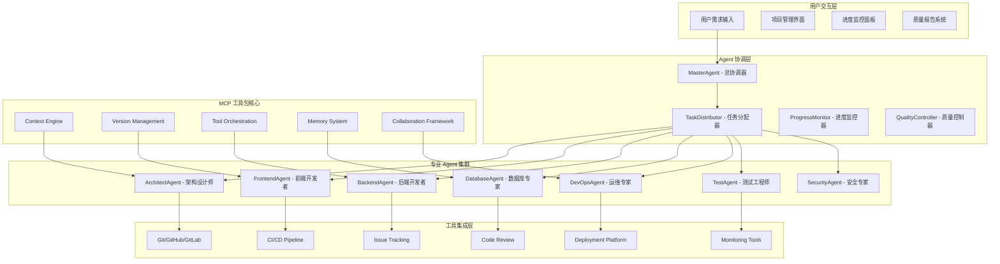
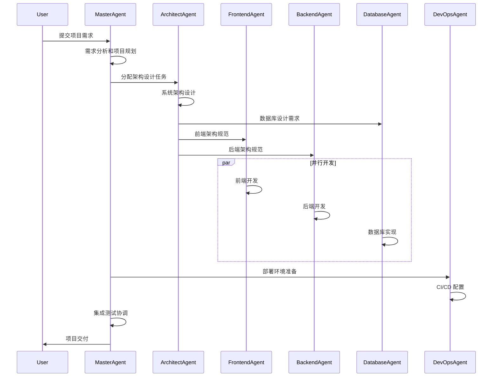
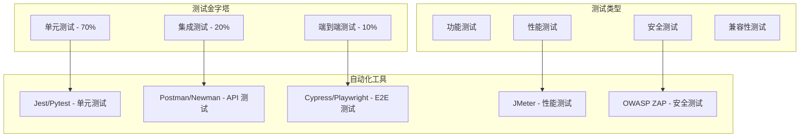

# 第二阶段全栈开发架构设计

## 🎯 第二阶段目标

将 MCP 工具包发展为全自动全栈开发工具，用户只需给出初始任务目标，就可以由多个 Agent 配合 GitLab/GitHub 和其他工具完成项目的全栈开发。

## 🏗️ 多 Agent 协作架构

### 整体系统架构


## 🤖 专业 Agent 设计

### 1. MasterAgent - 总协调器

#### 核心职责
- **需求分析**：理解用户需求，制定项目总体规划
- **任务分解**：将复杂项目分解为可分配的子任务
- **资源协调**：协调各专业 Agent 的工作和资源分配
- **进度管控**：监控整体项目进度，处理异常情况
- **质量把关**：确保最终交付物符合质量标准

#### Agent 配置
```yaml
master_agent:
  role: "Project Coordinator"
  capabilities:
    - project_planning
    - task_decomposition
    - resource_allocation
    - progress_monitoring
    - quality_assurance
  tools:
    - project_analyzer
    - task_distributor
    - progress_tracker
    - quality_checker
  decision_authority: "high"
  escalation_threshold: "critical_issues"
```

### 2. ArchitectAgent - 架构设计师

#### 核心职责
- **系统架构设计**：设计整体系统架构和技术选型
- **数据库设计**：设计数据模型和数据库结构
- **API 设计**：定义系统接口和通信协议
- **技术规范制定**：制定开发规范和最佳实践
- **架构评审**：评审其他 Agent 的技术方案

#### 专业工具集
```python
architect_tools = [
    "system_design_analyzer",
    "technology_selector",
    "database_designer",
    "api_specification_generator",
    "architecture_validator",
    "performance_estimator",
    "scalability_analyzer"
]
```

### 3. FrontendAgent - 前端开发者

#### 核心职责
- **UI/UX 实现**：根据设计稿实现用户界面
- **前端架构**：构建前端项目结构和组件体系
- **交互逻辑**：实现用户交互和状态管理
- **性能优化**：优化前端性能和用户体验
- **跨平台适配**：确保多设备和浏览器兼容性

#### 技术栈支持
- **框架**：React, Vue, Angular, Svelte
- **构建工具**：Webpack, Vite, Rollup
- **样式**：CSS, Sass, Tailwind CSS
- **状态管理**：Redux, Vuex, Pinia
- **测试**：Jest, Cypress, Playwright

### 4. BackendAgent - 后端开发者

#### 核心职责
- **API 开发**：实现 RESTful API 和 GraphQL 接口
- **业务逻辑**：实现核心业务逻辑和数据处理
- **数据库操作**：实现数据访问层和 ORM 操作
- **中间件开发**：实现认证、授权、缓存等中间件
- **性能优化**：优化查询性能和系统响应速度

#### 技术栈支持
- **语言**：Python, Node.js, Java, Go, C#
- **框架**：Django, FastAPI, Express, Spring Boot
- **数据库**：PostgreSQL, MySQL, MongoDB, Redis
- **消息队列**：RabbitMQ, Apache Kafka
- **缓存**：Redis, Memcached

## 🔄 协作工作流设计

### 项目启动流程


### 任务分配策略
```python
class TaskDistributionStrategy:
    def __init__(self):
        self.agent_capabilities = {
            "ArchitectAgent": ["system_design", "api_design", "database_design"],
            "FrontendAgent": ["ui_implementation", "frontend_logic", "styling"],
            "BackendAgent": ["api_development", "business_logic", "data_processing"],
            "DatabaseAgent": ["schema_design", "query_optimization", "data_migration"],
            "DevOpsAgent": ["deployment", "ci_cd", "monitoring", "scaling"],
            "TestAgent": ["unit_testing", "integration_testing", "e2e_testing"],
            "SecurityAgent": ["security_audit", "vulnerability_scan", "auth_implementation"]
        }

    def assign_task(self, task):
        # 基于任务类型和 Agent 能力匹配
        suitable_agents = self.find_suitable_agents(task)

        # 考虑 Agent 当前工作负载
        available_agents = self.filter_by_availability(suitable_agents)

        # 选择最佳 Agent
        selected_agent = self.select_best_agent(available_agents, task)

        return selected_agent
```

## 🛠️ 工具集成设计

### Git/GitHub/GitLab 集成
```python
class GitIntegration:
    def __init__(self):
        self.supported_platforms = ["github", "gitlab", "bitbucket"]
        self.operations = [
            "create_repository",
            "create_branch",
            "commit_changes",
            "create_pull_request",
            "merge_request",
            "code_review",
            "issue_management"
        ]

    def create_project_structure(self, project_config):
        """创建项目仓库和基础结构"""
        repo = self.create_repository(project_config.name)

        # 创建分支策略
        branches = ["main", "develop", "feature/*", "hotfix/*"]
        for branch in branches:
            self.create_branch_protection(repo, branch)

        # 设置 CI/CD
        self.setup_cicd_pipeline(repo, project_config.tech_stack)

        return repo
```

### Issue 和项目管理集成
```python
class ProjectManagement:
    def __init__(self):
        self.issue_types = ["epic", "story", "task", "bug", "improvement"]
        self.workflow_states = ["todo", "in_progress", "review", "testing", "done"]

    def create_project_board(self, project_requirements):
        """基于需求创建项目看板"""
        epics = self.decompose_to_epics(project_requirements)

        for epic in epics:
            stories = self.decompose_to_stories(epic)
            for story in stories:
                tasks = self.decompose_to_tasks(story)
                self.create_issue_hierarchy(epic, story, tasks)

        return self.create_kanban_board(epics)
```

### CI/CD 自动化
```yaml
# 自动生成的 CI/CD 配置示例
name: Full Stack Application CI/CD

on:
  push:
    branches: [main, develop]
  pull_request:
    branches: [main]

jobs:
  frontend-test:
    runs-on: ubuntu-latest
    steps:
      - uses: actions/checkout@v2
      - name: Setup Node.js
        uses: actions/setup-node@v2
        with:
          node-version: '18'
      - name: Install dependencies
        run: npm ci
      - name: Run tests
        run: npm test
      - name: Build
        run: npm run build

  backend-test:
    runs-on: ubuntu-latest
    steps:
      - uses: actions/checkout@v2
      - name: Setup Python
        uses: actions/setup-python@v2
        with:
          python-version: '3.9'
      - name: Install dependencies
        run: pip install -r requirements.txt
      - name: Run tests
        run: pytest
      - name: Security scan
        run: bandit -r src/

  deploy:
    needs: [frontend-test, backend-test]
    runs-on: ubuntu-latest
    if: github.ref == 'refs/heads/main'
    steps:
      - name: Deploy to production
        run: |
          # 自动部署脚本
          echo "Deploying to production..."
```

## 📊 质量保证体系

### 代码质量监控
```python
class QualityAssurance:
    def __init__(self):
        self.quality_metrics = {
            "code_coverage": {"threshold": 80, "critical": 60},
            "complexity": {"threshold": 10, "critical": 15},
            "duplication": {"threshold": 5, "critical": 10},
            "security_score": {"threshold": 8, "critical": 6}
        }

    def evaluate_code_quality(self, codebase):
        """评估代码质量"""
        results = {}

        # 代码覆盖率检查
        results["coverage"] = self.check_test_coverage(codebase)

        # 复杂度分析
        results["complexity"] = self.analyze_complexity(codebase)

        # 重复代码检测
        results["duplication"] = self.detect_duplication(codebase)

        # 安全漏洞扫描
        results["security"] = self.security_scan(codebase)

        return self.generate_quality_report(results)
```

### 自动化测试策略


## 🚀 实施路线图

### 第一阶段：多 Agent 基础框架 (2-3周)
- **MasterAgent 开发**：实现总协调器的核心功能
- **Agent 通信协议**：设计 Agent 间的通信和协作机制
- **任务分配系统**：实现智能任务分配和负载均衡
- **基础工具集成**：集成 Git、Issue 管理等基础工具

### 第二阶段：专业 Agent 开发 (4-6周)
- **ArchitectAgent**：系统架构设计和技术选型能力
- **FrontendAgent**：前端开发和 UI 实现能力
- **BackendAgent**：后端 API 和业务逻辑开发能力
- **DatabaseAgent**：数据库设计和优化能力
- **DevOpsAgent**：部署和运维自动化能力

### 第三阶段：质量保证和优化 (2-3周)
- **TestAgent**：自动化测试生成和执行
- **SecurityAgent**：安全审计和漏洞检测
- **质量监控系统**：代码质量和性能监控
- **持续优化机制**：基于反馈的系统优化

### 第四阶段：企业级功能 (3-4周)
- **权限管理**：多用户和团队协作支持
- **审计日志**：完整的操作审计和追踪
- **扩展性优化**：大型项目和高并发支持
- **企业集成**：与企业现有工具链的集成

## 📈 成功指标

### 技术指标
- **项目交付速度**：相比传统开发提升 3-5 倍
- **代码质量**：自动生成代码的质量评分 > 8/10
- **测试覆盖率**：自动生成测试的覆盖率 > 80%
- **部署成功率**：自动化部署的成功率 > 95%

### 业务指标
- **用户满意度**：用户对自动生成项目的满意度 > 85%
- **成本节约**：开发成本相比传统方式节约 60-80%
- **上线时间**：从需求到上线的时间缩短 70-80%
- **维护效率**：自动化维护和更新效率提升 5 倍

这个第二阶段架构设计为实现全自动全栈开发提供了完整的技术路线图，是 MCP 工具包发展的重要里程碑。
