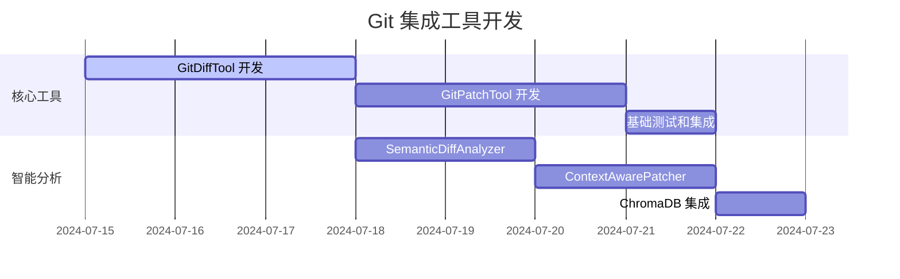
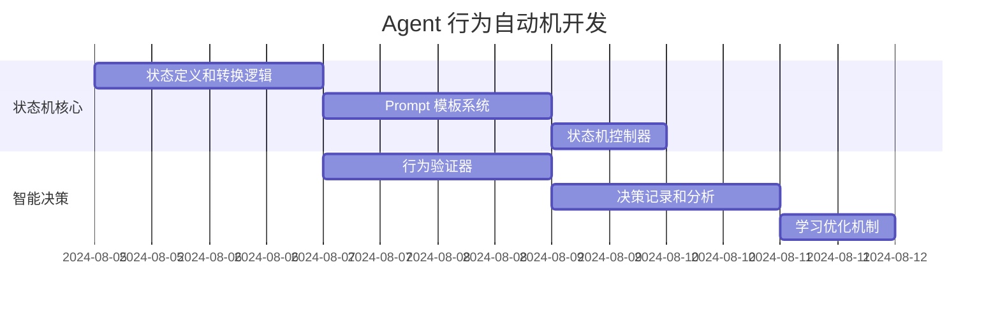
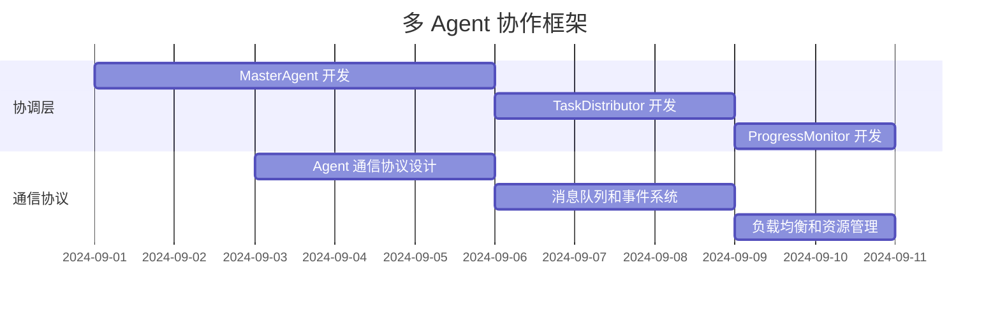

# 实施路线图和里程碑

## 🎯 总体规划

基于当前 MCP 工具包的实现状态，制定从当前基础工具集发展到 Augment Code 级别能力，再到全栈开发自动化的完整路线图。

## 📊 当前状态评估

### ✅ 已完成的基础设施
- **ChromaDB 统一存储**：32个工具的数据统一管理
- **工具协作框架**：链式调用、并行执行、条件执行
- **基础上下文引擎**：代码分析、语义搜索、项目概览
- **任务和记忆管理**：基础的任务跟踪和知识存储
- **可视化能力**：Mermaid 图表和数据可视化

### 🔄 需要增强的核心能力
- **精确文件操作**：当前只能整文件替换
- **版本控制集成**：缺乏 Git 工作流支持
- **Agent 行为一致性**：缺乏可预测的决策机制
- **深度代码理解**：跨文件依赖分析有限
- **长期记忆学习**：跨会话的知识积累不足

## 🚀 第一阶段：达到 Augment Code 能力水平

### 里程碑 1.1：Git 集成和精确文件操作 (2-3周)

#### 第1周：核心 Git 工具开发
**目标**：实现基础的 Git 集成和精确文件修改能力

**具体任务**：


**交付物**：
- `GitDiffTool` - 智能差异分析工具
- `GitPatchTool` - 精确补丁应用工具
- `SemanticDiffAnalyzer` - 语义差异分析器
- `ContextAwarePatcher` - 上下文感知补丁器
- 基础的 n8n 集成测试验证

**成功标准**：
- 能够精确修改文件的指定行，而非整文件替换
- diff 分析准确率 > 95%
- patch 应用成功率 > 90%
- 通过 n8n 集成测试验证

#### 第2周：历史管理和冲突处理
**目标**：完善 Git 工具集，支持历史分析和冲突解决

**具体任务**：
- `GitHistoryTool` - 变更历史管理工具
- `GitConflictTool` - 冲突解决助手
- 智能冲突检测和解决建议
- 与现有工具协作框架的深度集成

**交付物**：
- 完整的 Git 工具集（4个核心工具）
- 智能冲突处理机制
- 历史变更追踪和分析能力
- 工具链协作示例和文档

#### 第3周：轻量化版本管理系统
**目标**：为 Agent 提供撤销和回滚能力

**具体任务**：
- `UndoTool` - 撤销工具
- `RollbackTool` - 回滚工具  
- `CheckpointTool` - 检查点管理工具
- 操作历史追踪和快照管理
- 智能检查点创建策略

**交付物**：
- 轻量化版本管理系统（3个核心工具）
- 操作历史和快照存储机制
- 自动检查点创建策略
- Agent 安全操作保障机制

### 里程碑 1.2：Agent 行为自动机系统 (1-2周)

#### 第4周：状态机和行为控制
**目标**：实现 Agent 行为的可预测性和一致性

**具体任务**：


**交付物**：
- 完整的 Agent 状态机定义
- 各状态的 Prompt 模板系统
- `StateMachineController` - 状态机控制器
- `BehaviorValidator` - 行为验证器
- 决策记录和学习机制

**成功标准**：
- Agent 行为一致性 > 90%
- 状态转换准确率 > 95%
- 异常恢复成功率 > 85%
- 通过复杂任务场景测试

#### 第5周：集成优化和测试
**目标**：完善系统集成，优化性能和用户体验

**具体任务**：
- 所有新工具与现有系统的深度集成
- 性能优化和内存使用优化
- 全面的 n8n 集成测试
- 用户体验优化和文档完善

### 里程碑 1.3：增强上下文引擎 (2-3周)

#### 第6-7周：深度代码理解
**目标**：提升代码理解和上下文感知能力

**具体任务**：
- 跨文件依赖分析增强
- 函数调用关系图构建
- 代码重构建议系统
- 智能代码补全和推荐
- 项目级别的代码结构理解

**交付物**：
- 增强的 `CodeAnalyzer`
- 跨文件依赖分析器
- 代码重构建议引擎
- 智能推荐系统

#### 第8周：记忆系统进化
**目标**：增强长期记忆和学习能力

**具体任务**：
- 跨会话的项目理解持久化
- 经验积累和最佳实践学习
- 个性化适应和用户习惯学习
- 智能上下文感知和建议

## 🚀 第二阶段：全栈开发自动化 (8-12周)

### 里程碑 2.1：多 Agent 协作框架 (3-4周)

#### 第9-10周：MasterAgent 和协调机制
**目标**：实现多 Agent 的协调和任务分配

**具体任务**：


**交付物**：
- `MasterAgent` - 总协调器
- `TaskDistributor` - 智能任务分配器
- `ProgressMonitor` - 进度监控器
- Agent 间通信协议和消息系统
- 负载均衡和资源管理机制

#### 第11-12周：专业 Agent 原型
**目标**：开发核心专业 Agent 的原型

**具体任务**：
- `ArchitectAgent` - 架构设计师原型
- `FrontendAgent` - 前端开发者原型
- `BackendAgent` - 后端开发者原型
- 基础的 Agent 协作测试
- 简单项目的端到端测试

### 里程碑 2.2：工具集成和自动化 (2-3周)

#### 第13-14周：Git/GitHub/GitLab 深度集成
**目标**：实现与版本控制平台的深度集成

**具体任务**：
- GitHub/GitLab API 集成
- 自动化仓库创建和配置
- Pull Request/Merge Request 自动化
- Issue 管理和项目看板集成
- CI/CD 管道自动配置

#### 第15周：质量保证体系
**目标**：建立自动化质量保证机制

**具体任务**：
- `TestAgent` - 测试工程师 Agent
- `SecurityAgent` - 安全专家 Agent
- 自动化测试生成和执行
- 代码质量监控和报告
- 安全漏洞扫描和修复建议

### 里程碑 2.3：完整系统集成 (2-3周)

#### 第16-17周：端到端项目生成
**目标**：实现完整项目的自动化生成

**具体任务**：
- 需求分析和项目规划自动化
- 多 Agent 协作的完整工作流
- 前后端代码自动生成
- 数据库设计和实现自动化
- 部署和运维自动化

#### 第18周：优化和完善
**目标**：系统优化和用户体验完善

**具体任务**：
- 性能优化和扩展性改进
- 用户界面和交互优化
- 文档和教程完善
- 企业级功能和安全增强

## 📊 关键里程碑和验收标准

### 第一阶段验收标准
```yaml
phase1_acceptance:
  git_integration:
    - diff_accuracy: ">95%"
    - patch_success_rate: ">90%"
    - conflict_resolution: ">80%"

  version_management:
    - undo_success_rate: ">95%"
    - rollback_accuracy: ">90%"
    - checkpoint_reliability: ">95%"

  agent_behavior:
    - behavior_consistency: ">90%"
    - state_transition_accuracy: ">95%"
    - error_recovery_rate: ">85%"

  enhanced_context:
    - code_understanding_accuracy: ">90%"
    - cross_file_analysis: ">85%"
    - recommendation_relevance: ">80%"
```

### 第二阶段验收标准
```yaml
phase2_acceptance:
  multi_agent:
    - task_distribution_efficiency: ">90%"
    - agent_collaboration_success: ">85%"
    - resource_utilization: ">80%"

  project_generation:
    - end_to_end_success_rate: ">80%"
    - code_quality_score: ">8/10"
    - deployment_success_rate: ">95%"

  quality_assurance:
    - test_coverage: ">80%"
    - security_score: ">8/10"
    - performance_benchmark: "acceptable"
```

## 🎯 风险管理和应对策略

### 技术风险
- **复杂度管理**：采用渐进式开发，每个里程碑都有明确的验收标准
- **性能瓶颈**：持续的性能监控和优化，设置性能基准
- **集成问题**：充分的集成测试，模块化设计降低耦合

### 资源风险
- **开发时间**：预留 20% 的缓冲时间，优先级管理
- **技术债务**：定期重构和代码审查，质量优先
- **测试覆盖**：自动化测试优先，n8n 集成测试验证

### 用户体验风险
- **学习曲线**：详细的文档和教程，渐进式功能发布
- **稳定性**：充分的测试和错误处理，优雅降级
- **性能体验**：响应时间监控，用户反馈收集

## 📈 成功指标和监控

### 开发进度指标
- **里程碑完成率**：按时完成率 > 90%
- **功能交付质量**：验收通过率 > 95%
- **技术债务控制**：代码质量评分 > 8/10

### 用户体验指标
- **功能可用性**：核心功能可用率 > 99%
- **响应性能**：平均响应时间 < 2 秒
- **错误恢复**：自动错误恢复率 > 90%

这个实施路线图为 MCP 工具包的发展提供了清晰的时间表和具体的执行计划，确保项目能够按计划达到预期目标。
