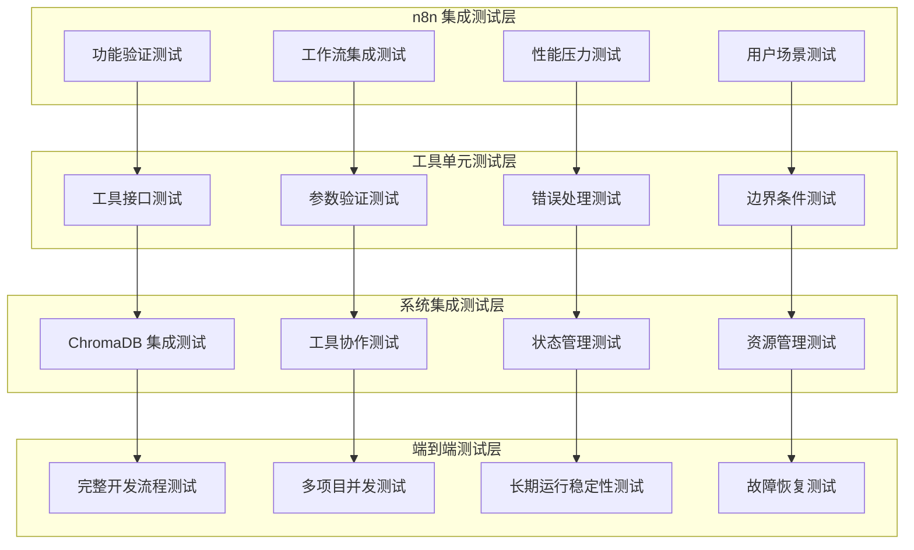

# 测试策略和验证方案

## 🎯 测试目标

基于你偏好使用 n8n 进行集成测试的方式，制定全面的测试策略，确保 MCP 工具包的各项功能在实际使用场景中的可靠性和性能表现。

## 🏗️ 测试架构设计

### 测试层次结构


## 🔧 n8n 集成测试策略

### 1. Git 集成工具测试

#### 测试场景设计
```json
{
    "test_name": "Git 精确文件修改测试",
    "description": "验证 Git 工具的精确文件修改能力",
    "n8n_workflow": {
        "nodes": [
            {
                "name": "创建测试文件",
                "type": "MCP Tool",
                "tool": "write_file",
                "parameters": {
                    "file_path": "test_project/src/main.py",
                    "content": "def hello_world():\n    print('Hello, World!')\n\nif __name__ == '__main__':\n    hello_world()"
                }
            },
            {
                "name": "分析文件差异",
                "type": "MCP Tool",
                "tool": "git_diff_analysis",
                "parameters": {
                    "target": "test_project/src/main.py",
                    "analysis_level": "semantic"
                }
            },
            {
                "name": "应用精确补丁",
                "type": "MCP Tool",
                "tool": "git_apply_patch",
                "parameters": {
                    "file_path": "test_project/src/main.py",
                    "patch_operations": [
                        {
                            "operation": "replace",
                            "line_number": 2,
                            "content": "    print('Hello, Enhanced World!')"
                        }
                    ]
                }
            },
            {
                "name": "验证修改结果",
                "type": "MCP Tool",
                "tool": "read_file",
                "parameters": {
                    "file_path": "test_project/src/main.py"
                }
            }
        ]
    },
    "expected_results": {
        "diff_analysis": {
            "files_changed": 1,
            "semantic_impact": "function_content_change"
        },
        "patch_application": {
            "success": true,
            "lines_modified": 1
        },
        "final_content": "def hello_world():\n    print('Hello, Enhanced World!')\n\nif __name__ == '__main__':\n    hello_world()"
    }
}
```

#### n8n 测试指令
```markdown
# Git 集成工具测试指令

## 测试 1：基础 diff 分析
请在 n8n 中创建工作流，测试以下场景：
1. 创建一个包含多个函数的 Python 文件
2. 使用 `git_diff_analysis` 工具分析文件结构
3. 验证工具能够正确识别函数、类和导入语句

## 测试 2：精确补丁应用
1. 使用 `git_apply_patch` 工具修改特定行的内容
2. 验证只有指定行被修改，其他内容保持不变
3. 测试多个补丁操作的批量应用

## 测试 3：冲突检测和处理
1. 创建可能产生冲突的修改场景
2. 使用 `git_conflict_check` 工具检测潜在冲突
3. 验证冲突解决建议的准确性
```

### 2. 版本管理系统测试

#### 测试工作流设计
```json
{
    "test_name": "版本管理撤销回滚测试",
    "n8n_workflow": {
        "nodes": [
            {
                "name": "创建检查点",
                "type": "MCP Tool",
                "tool": "manage_checkpoint",
                "parameters": {
                    "action": "create",
                    "checkpoint_name": "before_modifications",
                    "description": "测试修改前的检查点"
                }
            },
            {
                "name": "执行多个修改",
                "type": "Loop",
                "items": [
                    {"tool": "write_file", "params": {"file_path": "test1.py", "content": "# Test 1"}},
                    {"tool": "write_file", "params": {"file_path": "test2.py", "content": "# Test 2"}},
                    {"tool": "write_file", "params": {"file_path": "test3.py", "content": "# Test 3"}}
                ]
            },
            {
                "name": "撤销最后两个操作",
                "type": "MCP Tool",
                "tool": "undo_operation",
                "parameters": {
                    "steps": 2,
                    "operation_type": "file_create"
                }
            },
            {
                "name": "验证撤销结果",
                "type": "MCP Tool",
                "tool": "list_files",
                "parameters": {
                    "directory": "."
                }
            },
            {
                "name": "回滚到检查点",
                "type": "MCP Tool",
                "tool": "rollback_to_checkpoint",
                "parameters": {
                    "target": {"checkpoint_id": "before_modifications"}
                }
            }
        ]
    }
}
```

### 3. Agent 行为自动机测试

#### 状态转换测试
```markdown
# Agent 行为自动机测试指令

## 测试场景：复杂任务处理流程
1. 给 Agent 一个复杂的代码重构任务
2. 观察 Agent 的状态转换过程：
   - TaskAnalysis → Planning → Execution → Validation
3. 验证每个状态的行为是否符合预期
4. 测试异常情况下的错误处理和恢复

## 验证点：
- 状态转换的逻辑正确性
- 每个状态下的决策一致性
- 错误恢复的有效性
- 学习和适应的效果
```

## 📊 性能测试策略

### 1. 大型项目处理测试

#### 测试配置
```json
{
    "test_name": "大型项目性能测试",
    "test_data": {
        "project_size": {
            "files_count": 1000,
            "total_lines": 50000,
            "languages": ["Python", "JavaScript", "TypeScript"]
        },
        "operations": [
            "项目全量分析",
            "跨文件依赖分析",
            "语义搜索查询",
            "批量文件修改"
        ]
    },
    "performance_targets": {
        "analysis_time": "< 30 seconds",
        "search_response": "< 2 seconds",
        "memory_usage": "< 1GB",
        "concurrent_operations": "> 10"
    }
}
```

### 2. 并发压力测试

#### n8n 并发测试工作流
```markdown
# 并发压力测试指令

## 测试设置：
1. 在 n8n 中创建 10 个并行分支
2. 每个分支同时执行不同的 MCP 工具操作
3. 监控系统资源使用和响应时间

## 测试操作：
- 并发文件分析
- 并发代码搜索
- 并发 Git 操作
- 并发记忆查询

## 监控指标：
- 响应时间分布
- 错误率统计
- 资源使用峰值
- 系统稳定性
```

## 🔍 功能验证测试

### 1. 上下文引擎增强功能测试

#### 测试用例设计
```json
{
    "test_cases": [
        {
            "name": "跨文件依赖分析",
            "steps": [
                "创建多个相互依赖的 Python 模块",
                "使用 analyze_call_graph 分析调用关系",
                "验证依赖图的准确性和完整性"
            ],
            "validation": {
                "dependency_accuracy": "> 95%",
                "circular_dependency_detection": "100%",
                "performance": "< 5 seconds for 100 files"
            }
        },
        {
            "name": "智能重构建议",
            "steps": [
                "提供包含代码异味的示例代码",
                "使用 suggest_refactoring 获取建议",
                "验证建议的准确性和实用性"
            ],
            "validation": {
                "suggestion_relevance": "> 80%",
                "safety_assessment": "准确识别高风险重构",
                "improvement_estimation": "合理的效果预估"
            }
        }
    ]
}
```

### 2. 记忆系统进化功能测试

#### 学习效果验证
```markdown
# 记忆系统学习效果测试

## 测试流程：
1. 初始化空白记忆系统
2. 执行一系列开发任务，让系统学习
3. 重复相似任务，观察系统的改进

## 验证指标：
- 任务完成效率的提升
- 错误率的降低
- 个性化建议的准确性
- 跨会话记忆的保持

## n8n 测试工作流：
1. 创建学习任务序列
2. 监控每次执行的性能指标
3. 分析学习曲线和改进效果
```

## 🛡️ 稳定性和可靠性测试

### 1. 长期运行稳定性测试

#### 测试设计
```json
{
    "test_name": "7天连续运行测试",
    "test_configuration": {
        "duration": "7 days",
        "operations_per_hour": 100,
        "concurrent_sessions": 5,
        "test_scenarios": [
            "代码分析和修改",
            "项目搜索和查询",
            "记忆存储和检索",
            "工具协作执行"
        ]
    },
    "monitoring_metrics": {
        "memory_leaks": "内存使用趋势",
        "performance_degradation": "响应时间变化",
        "error_accumulation": "错误率统计",
        "data_consistency": "数据完整性检查"
    }
}
```

### 2. 故障恢复测试

#### 故障注入测试
```markdown
# 故障恢复能力测试

## 故障类型：
1. 网络中断
2. 磁盘空间不足
3. 内存耗尽
4. ChromaDB 连接失败
5. 工具执行超时

## 测试方法：
1. 在 n8n 工作流执行过程中注入故障
2. 观察系统的错误检测和恢复行为
3. 验证数据的一致性和完整性

## 验证标准：
- 故障检测时间 < 5 秒
- 自动恢复成功率 > 90%
- 数据丢失率 = 0%
- 用户体验影响最小化
```

## 📈 测试自动化和持续集成

### 1. 自动化测试框架

#### n8n 测试自动化
```json
{
    "automation_framework": {
        "test_scheduler": "定时执行测试套件",
        "result_collection": "自动收集测试结果",
        "performance_monitoring": "持续性能监控",
        "alert_system": "异常情况告警"
    },
    "test_categories": {
        "smoke_tests": "每次部署后的基础功能验证",
        "regression_tests": "功能回归测试",
        "performance_tests": "性能基准测试",
        "integration_tests": "端到端集成测试"
    }
}
```

### 2. 测试结果分析和报告

#### 测试报告模板
```markdown
# MCP 工具包测试报告

## 测试概览
- 测试时间：{test_date}
- 测试版本：{version}
- 测试环境：{environment}
- 总测试用例：{total_cases}
- 通过率：{pass_rate}%

## 功能测试结果
### Git 集成工具
- diff 分析准确率：{diff_accuracy}%
- patch 应用成功率：{patch_success}%
- 冲突检测准确率：{conflict_detection}%

### 版本管理系统
- 撤销操作成功率：{undo_success}%
- 回滚操作成功率：{rollback_success}%
- 检查点管理可靠性：{checkpoint_reliability}%

## 性能测试结果
- 平均响应时间：{avg_response_time}ms
- 并发处理能力：{concurrent_capacity}
- 内存使用峰值：{memory_peak}MB
- CPU 使用率：{cpu_usage}%

## 问题和建议
{issues_and_recommendations}
```

## 🚀 测试实施计划

### 第一阶段：基础功能测试 (1周)
- Git 集成工具的 n8n 测试验证
- 版本管理系统的功能测试
- 基础性能基准测试

### 第二阶段：高级功能测试 (1周)
- Agent 行为自动机测试
- 上下文引擎增强功能测试
- 记忆系统学习效果验证

### 第三阶段：系统集成测试 (1周)
- 端到端工作流测试
- 长期稳定性测试
- 故障恢复能力测试

### 第四阶段：性能优化测试 (1周)
- 大规模项目处理测试
- 并发压力测试
- 资源使用优化验证

这个测试策略充分利用了你偏好的 n8n 测试方式，确保所有新功能都能在实际使用场景中得到充分验证。
