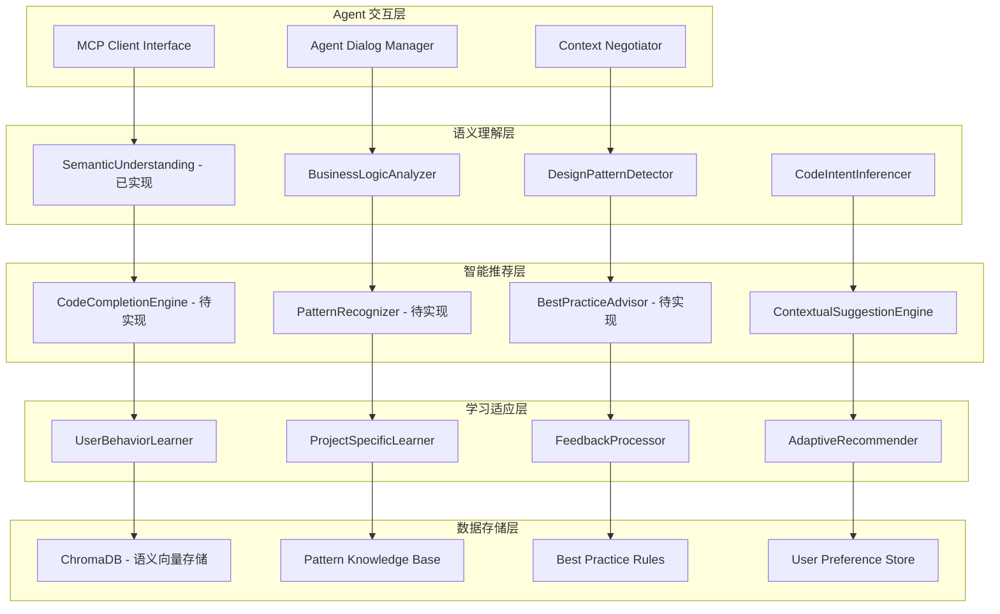

# 语义理解和智能推荐系统设计

## 🎯 设计目标

基于现有的语义理解基础，完善和扩展智能推荐系统，实现与 Agent 的深度协作，提供上下文感知的代码补全、模式识别和最佳实践建议。

## 🏗️ 系统架构

### 整体架构图


## 🧠 核心组件设计

### 1. CodeCompletionEngine - 代码补全引擎

#### 功能特性
- **上下文感知补全**：基于当前代码上下文和项目结构
- **语义相似性匹配**：利用 ChromaDB 的向量搜索能力
- **Agent 协作补全**：复杂场景下请求 Agent 协助
- **个性化排序**：基于用户历史行为调整建议顺序

#### 实现设计
```python
class CodeCompletionEngine(BaseSemanticTool):
    """智能代码补全引擎"""

    def __init__(self, config: Optional[ConfigDict] = None):
        super().__init__(config)
        self.pattern_matcher = PatternMatcher()
        self.context_analyzer = ContextAnalyzer()
        self.agent_collaborator = AgentCollaborator()

    async def get_completions(self, file_path: str, position: Dict,
                             context: str, completion_types: List[str]) -> List[Dict]:
        """获取代码补全建议"""
        # 1. 分析当前上下文
        current_context = await self._analyze_current_context(
            file_path, position, context
        )

        # 2. 基础补全生成
        base_completions = await self._generate_base_completions(
            current_context, completion_types
        )

        # 3. 语义增强
        semantic_completions = await self._enhance_with_semantics(
            base_completions, current_context
        )

        # 4. Agent 协作（复杂场景）
        if self._needs_agent_assistance(semantic_completions, current_context):
            agent_completions = await self._request_agent_completions(
                semantic_completions, current_context
            )
            semantic_completions = self._merge_completions(
                semantic_completions, agent_completions
            )

        # 5. 个性化排序
        personalized_completions = await self._personalize_completions(
            semantic_completions, file_path
        )

        return personalized_completions
```

### 2. PatternRecognizer - 模式识别器

#### 识别模式类型
- **设计模式**：GoF 23种设计模式 + 现代模式
- **架构模式**：MVC、MVP、MVVM、微服务等
- **编程习惯**：命名约定、代码组织、错误处理
- **反模式识别**：代码异味、性能反模式、安全反模式

#### 实现设计
```python
class PatternRecognizer(BaseSemanticTool):
    """智能模式识别器"""

    def __init__(self, config: Optional[ConfigDict] = None):
        super().__init__(config)
        self.pattern_templates = self._load_pattern_templates()
        self.ml_classifier = PatternMLClassifier()

    async def recognize_patterns(self, target: Dict, pattern_types: List[str],
                               confidence_threshold: float) -> Dict:
        """识别代码模式"""
        # 1. 收集分析目标
        analysis_targets = await self._collect_analysis_targets(target)

        # 2. 多层次模式识别
        pattern_results = {}

        for pattern_type in pattern_types:
            if pattern_type == "design_patterns":
                pattern_results[pattern_type] = await self._recognize_design_patterns(
                    analysis_targets, confidence_threshold
                )
            elif pattern_type == "coding_patterns":
                pattern_results[pattern_type] = await self._recognize_coding_patterns(
                    analysis_targets, confidence_threshold
                )
            elif pattern_type == "anti_patterns":
                pattern_results[pattern_type] = await self._recognize_anti_patterns(
                    analysis_targets, confidence_threshold
                )

        # 3. Agent 协作验证（不确定的模式）
        uncertain_patterns = self._filter_uncertain_patterns(
            pattern_results, confidence_threshold
        )

        if uncertain_patterns:
            agent_verification = await self._request_agent_pattern_verification(
                uncertain_patterns, analysis_targets
            )
            pattern_results = self._merge_pattern_results(
                pattern_results, agent_verification
            )

        return {
            "target": target,
            "pattern_types": pattern_types,
            "confidence_threshold": confidence_threshold,
            "patterns_found": pattern_results,
            "summary": self._generate_pattern_summary(pattern_results),
            "recommendations": self._generate_pattern_recommendations(pattern_results)
        }
```

### 3. BestPracticeAdvisor - 最佳实践建议器

#### 建议类别
- **代码质量**：可读性、可维护性、可测试性
- **性能优化**：算法效率、资源使用、缓存策略
- **安全实践**：输入验证、权限控制、数据保护
- **架构设计**：模块化、解耦、扩展性

#### 实现设计
```python
class BestPracticeAdvisor(BaseSemanticTool):
    """最佳实践建议器"""

    def __init__(self, config: Optional[ConfigDict] = None):
        super().__init__(config)
        self.practice_rules = self._load_practice_rules()
        self.language_specifics = self._load_language_specifics()

    async def get_best_practices(self, target: Dict, advice_categories: List[str],
                               language: str, priority_level: str) -> Dict:
        """获取最佳实践建议"""
        # 1. 分析目标代码
        code_analysis = await self._analyze_target_code(target, language)

        # 2. 生成分类建议
        practice_advice = {}

        for category in advice_categories:
            if category == "code_quality":
                practice_advice[category] = await self._analyze_code_quality(
                    code_analysis, language, priority_level
                )
            elif category == "performance":
                practice_advice[category] = await self._analyze_performance(
                    code_analysis, language, priority_level
                )
            elif category == "security":
                practice_advice[category] = await self._analyze_security(
                    code_analysis, language, priority_level
                )
            elif category == "maintainability":
                practice_advice[category] = await self._analyze_maintainability(
                    code_analysis, language, priority_level
                )

        # 3. Agent 协作深度分析
        complex_issues = self._identify_complex_issues(practice_advice)
        if complex_issues:
            agent_analysis = await self._request_agent_deep_analysis(
                complex_issues, code_analysis
            )
            practice_advice = self._enhance_with_agent_insights(
                practice_advice, agent_analysis
            )

        # 4. 生成行动计划
        action_plan = self._generate_action_plan(practice_advice, priority_level)

        return {
            "target": target,
            "advice_categories": advice_categories,
            "language": language,
            "priority_level": priority_level,
            "practice_advice": practice_advice,
            "action_plan": action_plan,
            "estimated_effort": self._estimate_implementation_effort(action_plan),
            "expected_benefits": self._calculate_expected_benefits(practice_advice)
        }
```

## 🤖 Agent 协作机制

### 1. 智能对话管理
```python
class AgentDialogManager:
    """Agent 对话管理器"""

    async def clarify_ambiguous_context(self, code_snippet: str,
                                      ambiguity_type: str) -> Dict:
        """澄清模糊的代码上下文"""
        dialog_prompt = self._create_clarification_prompt(
            code_snippet, ambiguity_type
        )

        response = await self.mcp_client.call_tool("agent_dialog", {
            "prompt": dialog_prompt,
            "context_type": "code_clarification",
            "expected_response_format": "structured_analysis"
        })

        return self._parse_clarification_response(response)

    async def validate_complex_patterns(self, patterns: List[Dict],
                                      code_context: Dict) -> Dict:
        """验证复杂设计模式"""
        validation_prompt = self._create_pattern_validation_prompt(
            patterns, code_context
        )

        response = await self.mcp_client.call_tool("agent_dialog", {
            "prompt": validation_prompt,
            "context_type": "pattern_validation",
            "confidence_threshold": 0.8
        })

        return self._parse_validation_response(response)
```

### 2. 上下文协商机制
```python
class ContextNegotiator:
    """上下文协商器"""

    async def negotiate_understanding(self, initial_analysis: Dict,
                                    uncertainty_areas: List[str]) -> Dict:
        """协商代码理解"""
        negotiation_rounds = []
        current_understanding = initial_analysis

        for area in uncertainty_areas:
            # 请求 Agent 对特定区域的见解
            agent_insight = await self._request_area_insight(area, current_understanding)

            # 整合见解并更新理解
            updated_understanding = self._integrate_insight(
                current_understanding, agent_insight, area
            )

            negotiation_rounds.append({
                "area": area,
                "agent_insight": agent_insight,
                "understanding_update": updated_understanding
            })

            current_understanding = updated_understanding

        return {
            "final_understanding": current_understanding,
            "negotiation_process": negotiation_rounds,
            "confidence_improvement": self._calculate_confidence_improvement(
                initial_analysis, current_understanding
            )
        }
```

## 📊 学习和适应系统

### 1. 用户行为学习
- **操作模式识别**：分析用户的编码习惯和偏好
- **反馈学习**：从用户对建议的接受/拒绝中学习
- **个性化调整**：根据用户特点调整推荐策略

### 2. 项目特定适应
- **项目模式学习**：识别项目特有的编码规范和模式
- **团队习惯适应**：学习团队的编码风格和最佳实践
- **技术栈优化**：针对特定技术栈提供专门建议

## 🔧 MCP 工具接口

### 工具注册和集成
```python
class SemanticIntelligenceTools:
    """语义智能工具集"""

    def __init__(self, config: Optional[ConfigDict] = None):
        self.config = config or {}

    def create_tools(self) -> List[BaseTool]:
        """创建所有语义智能工具"""
        return [
            SemanticUnderstanding(self.config),  # 已实现
            CodeCompletionEngine(self.config),   # 待实现
            PatternRecognizer(self.config),      # 待实现
            BestPracticeAdvisor(self.config),    # 待实现
        ]
```

## 🎯 实现策略

### 1. 渐进式实现方案

#### 阶段一：基础智能推荐 (3-4天)
- **CodeCompletionEngine 基础实现**
  - 基于现有 SemanticUnderstanding 的上下文分析
  - 简单的变量、函数、类名补全
  - ChromaDB 语义搜索集成

- **PatternRecognizer 核心功能**
  - 常见设计模式识别（单例、工厂、观察者等）
  - 基于 AST 的模式匹配算法
  - 置信度评分机制

#### 阶段二：Agent 协作增强 (2-3天)
- **Agent 对话接口**
  - MCP 客户端集成
  - 结构化对话协议
  - 上下文传递机制

- **协作式分析**
  - 复杂模式的 Agent 验证
  - 业务逻辑的协作理解
  - 不确定性处理机制

#### 阶段三：学习适应系统 (2-3天)
- **BestPracticeAdvisor 完整实现**
  - 多维度代码质量分析
  - 语言特定的最佳实践规则
  - 个性化建议排序

- **用户行为学习**
  - 操作历史分析
  - 偏好模式识别
  - 自适应推荐调整

### 2. 技术实现细节

#### ChromaDB 数据模型扩展
```python
# 代码补全向量存储
{
    "data_type": "code_completion",
    "content": "function_name(parameters) -> return_type",
    "metadata": {
        "completion_type": "function",
        "language": "python",
        "context_similarity": 0.85,
        "usage_frequency": 15,
        "user_preference_score": 0.9,
        "project_relevance": 0.8
    }
}

# 模式识别结果存储
{
    "data_type": "pattern_recognition",
    "content": "Singleton pattern implementation in UserManager class",
    "metadata": {
        "pattern_type": "design_pattern",
        "pattern_name": "singleton",
        "confidence_score": 0.92,
        "file_path": "src/managers/user_manager.py",
        "validation_status": "agent_confirmed"
    }
}

# 最佳实践建议存储
{
    "data_type": "best_practice_advice",
    "content": "Extract method to reduce function complexity",
    "metadata": {
        "advice_category": "code_quality",
        "priority_level": "high",
        "estimated_effort": "medium",
        "expected_benefit": "improved_maintainability",
        "implementation_status": "pending"
    }
}
```

#### Agent 协作协议设计
```python
class AgentCollaborationProtocol:
    """Agent 协作协议"""

    # 标准化的请求格式
    REQUEST_TEMPLATES = {
        "code_clarification": {
            "type": "clarification_request",
            "context": {
                "code_snippet": "string",
                "file_path": "string",
                "surrounding_context": "string",
                "ambiguity_type": "enum[business_logic, design_intent, naming_convention]"
            },
            "expected_response": {
                "clarification": "string",
                "confidence": "float",
                "additional_context": "object"
            }
        },

        "pattern_validation": {
            "type": "pattern_validation_request",
            "context": {
                "detected_patterns": "array",
                "code_structure": "object",
                "confidence_scores": "array"
            },
            "expected_response": {
                "validated_patterns": "array",
                "corrections": "array",
                "additional_patterns": "array"
            }
        },

        "best_practice_consultation": {
            "type": "best_practice_request",
            "context": {
                "code_analysis": "object",
                "current_issues": "array",
                "project_context": "object"
            },
            "expected_response": {
                "prioritized_recommendations": "array",
                "implementation_guidance": "array",
                "trade_off_analysis": "object"
            }
        }
    }
```

### 3. 性能优化策略

#### 缓存机制
```python
class IntelligentCaching:
    """智能缓存系统"""

    def __init__(self, data_manager):
        self.data_manager = data_manager
        self.completion_cache = {}
        self.pattern_cache = {}
        self.advice_cache = {}

    async def get_cached_completions(self, context_hash: str) -> Optional[List[Dict]]:
        """获取缓存的补全建议"""
        if context_hash in self.completion_cache:
            cached_result = self.completion_cache[context_hash]
            if self._is_cache_valid(cached_result):
                return cached_result["completions"]
        return None

    async def cache_completions(self, context_hash: str, completions: List[Dict]):
        """缓存补全建议"""
        self.completion_cache[context_hash] = {
            "completions": completions,
            "timestamp": time.time(),
            "access_count": 1
        }

        # 异步存储到 ChromaDB
        await self._store_to_persistent_cache(context_hash, completions)
```

#### 并发处理
```python
class ConcurrentAnalysis:
    """并发分析处理"""

    async def parallel_semantic_analysis(self, targets: List[str]) -> Dict:
        """并行语义分析"""
        tasks = []

        # 创建并发任务
        for target in targets:
            task = asyncio.create_task(self._analyze_single_target(target))
            tasks.append(task)

        # 等待所有任务完成
        results = await asyncio.gather(*tasks, return_exceptions=True)

        # 合并结果
        return self._merge_analysis_results(results)

    async def _analyze_single_target(self, target: str) -> Dict:
        """分析单个目标"""
        # 实现单个文件的语义分析
        pass
```

## 🧪 测试和验证策略

### 1. 功能测试
- **补全准确性测试**：验证代码补全的相关性和准确性
- **模式识别测试**：测试各种设计模式的识别准确率
- **最佳实践测试**：验证建议的实用性和正确性
- **Agent 协作测试**：测试与 Agent 的交互效果

### 2. 性能测试
- **响应时间测试**：确保实时补全的响应速度
- **并发处理测试**：测试多用户同时使用的性能
- **内存使用测试**：监控系统资源消耗
- **缓存效果测试**：验证缓存机制的效果

### 3. 用户体验测试
- **建议质量评估**：用户对建议质量的满意度
- **学习效果测试**：系统学习用户偏好的效果
- **个性化程度测试**：个性化建议的准确性

## 📈 成功指标

### 技术指标
- **补全准确率**：> 85% 的补全建议被用户接受
- **模式识别准确率**：> 90% 的设计模式识别正确
- **响应时间**：< 500ms 的补全响应时间
- **Agent 协作效率**：> 80% 的复杂问题通过协作解决

### 用户体验指标
- **用户满意度**：> 4.0/5.0 的用户评分
- **使用频率**：日均使用次数 > 50 次/用户
- **学习效果**：个性化建议接受率 > 70%
- **问题解决率**：> 85% 的代码质量问题得到有效建议

这个设计充分利用了 MCP 服务的特性，通过与 Agent 的智能协作来解决复杂的语义理解和推荐问题，同时提供了完整的学习适应机制和详细的实现策略。
