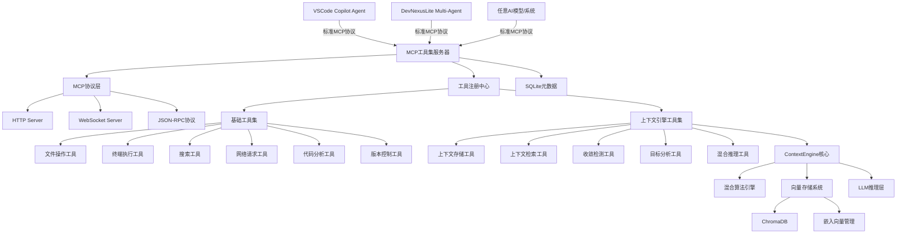
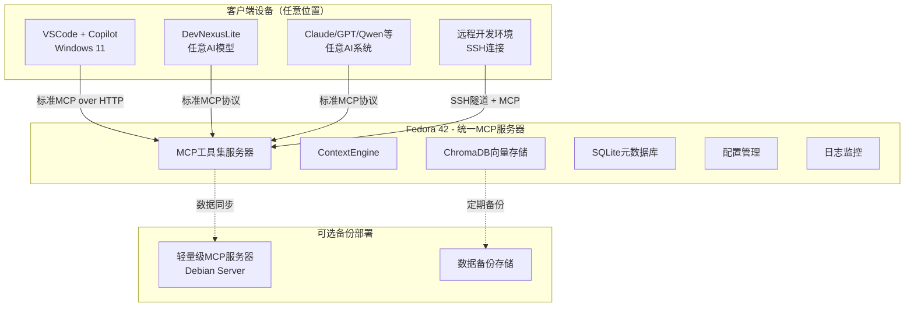
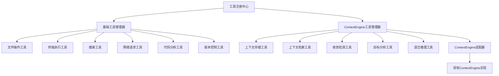
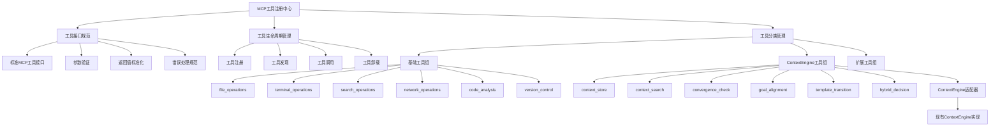
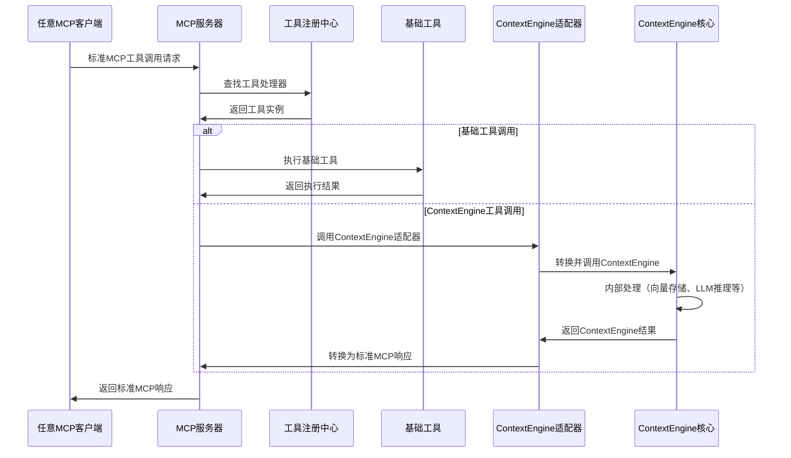

# MCP 工具集顶层设计

## 1. 项目概述

### 1.1 项目目标
构建一个统一的MCP (Model Context Protocol) 工具集，为VSCode GitHub Copilot Agent、DevNexusLite多智能体编程项目以及其他AI系统提供强大的上下文感知和工具调用能力。该工具集设计为模型无关，支持任何符合MCP协议的AI模型和应用。

### 1.2 核心需求
- 为VSCode通过HTTP提供MCP服务，支持丰富的基础工具集
- 为DevNexusLite项目及其他AI系统提供模型无关的MCP集成
- 将现有ContextEngine封装为MCP工具，提供智能上下文记忆
- 提供VSCode Agent常用的基础工具：文件操作、终端执行、搜索、网络请求等

## 2. 系统架构

### 2.1 整体架构


### 2.2 部署架构


## 3. 核心组件设计

### 3.1 MCP服务器核心
**职责**：提供标准MCP协议实现，统一管理所有工具
- MCP协议层：支持HTTP、WebSocket、JSON-RPC多种传输方式
- 工具注册中心：统一管理基础工具和ContextEngine工具
- 请求路由：根据工具类型分发到对应处理器
- 会话管理：维护客户端连接和状态

### 3.2 工具注册中心
**架构设计**：统一管理所有MCP工具，包括基础工具和ContextEngine工具



**设计原理**：
- **统一接口**：所有工具都实现相同的MCP工具接口
- **分类管理**：按功能分类，便于维护和扩展
- **适配器模式**：ContextEngine通过适配器封装为标准MCP工具
- **热插拔**：支持工具的动态注册和卸载
### 3.3 基础工具集
基于VSCode Agent和通用AI开发需求，提供完整的开发辅助工具，支持任何AI模型：

#### 3.3.1 文件操作工具
- 文件读取、写入、编辑
- 目录列表、创建、删除
- 文件搜索、内容检索
- 代码语法高亮和格式化

#### 3.3.2 终端执行工具
- 命令执行和输出获取
- 后台进程管理
- 终端会话保持
- 命令历史和状态查询

#### 3.3.3 搜索工具
- 文本搜索（grep/ripgrep）
- 语义搜索（基于向量）
- 代码符号搜索
- 项目范围搜索

#### 3.3.4 网络请求工具
- HTTP/HTTPS请求
- API调用和响应处理
- 网页内容获取
- 文件下载和上传

#### 3.3.5 代码分析工具
- 语法分析和错误检测
- 代码补全建议
- 重构和优化建议
- 测试用例生成

#### 3.3.6 版本控制工具
- Git操作（提交、推送、拉取）
- 分支管理
- 冲突解决辅助
- 变更历史查询

### 3.4 ContextEngine工具集
**设计思路**：将现有ContextEngine能力封装为标准MCP工具，通过工具注册中心统一管理

#### 3.4.1 上下文存储工具
- 对话历史存储
- 代码上下文记录
- 项目信息维护
- 错误日志管理

#### 3.4.2 上下文检索工具
- 相似上下文搜索
- 历史对话查询
- 智能关联分析
- 上下文摘要生成

#### 3.4.3 深度控制工具
- 模板执行跟踪
- 收敛性检测
- 目标一致性分析
- 转换决策建议

#### 3.4.4 混合推理工具
- 数学计算层调用
- LLM推理层调用
- 融合决策分析
- 算法选择建议

**关键设计**：
- **适配器模式**：不修改现有ContextEngine代码，通过适配器层转换
- **统一注册**：ContextEngine工具与基础工具使用相同的注册机制
- **资源共享**：多个ContextEngine工具共享同一个ContextEngine实例
- **配置隔离**：ContextEngine配置独立管理，不影响其他工具

## 4. 工具集设计

### 4.1 基础工具分类

```mermaid
graph TD
    A[MCP工具集] --> B[文件操作类]
    A --> C[终端执行类]
    A --> D[搜索检索类]
    A --> E[网络请求类]
    A --> F[代码分析类]
    A --> G[版本控制类]
    A --> H[上下文管理类]

    B --> B1[读取文件]
    B --> B2[写入文件]
    B --> B3[目录操作]
    B --> B4[文件搜索]

    C --> C1[执行命令]
    C --> C2[后台进程]
    C --> C3[终端状态]
    C --> C4[命令历史]

    D --> D1[文本搜索]
    D --> D2[语义搜索]
    D --> D3[代码搜索]
    D --> D4[项目搜索]

    E --> E1[HTTP请求]
    E --> E2[API调用]
    E --> E3[内容获取]
    E --> E4[文件传输]

    F --> F1[语法分析]
    F --> F2[错误检测]
    F --> F3[代码补全]
    F --> F4[重构建议]

    G --> G1[Git操作]
    G --> G2[分支管理]
    G --> G3[冲突解决]
    G --> G4[历史查询]

    H --> H1[上下文存储]
    H --> H2[相似检索]
    H --> H3[智能分析]
    H --> H4[摘要生成]
```



### 4.2 统一工具注册设计



**核心设计原则**：
1. **统一管理**：所有工具（包括ContextEngine工具）都通过工具注册中心管理
2. **标准接口**：所有工具实现相同的MCP工具接口规范
3. **分组管理**：按功能分组，便于配置和权限控制
4. **适配器集成**：ContextEngine通过适配器模式无缝集成

### 4.3 数据流设计



**关键设计点**：
1. **统一入口**：所有客户端都通过标准MCP协议连接
2. **透明路由**：客户端无需知道工具的具体实现方式
3. **适配器转换**：ContextEngine适配器负责协议转换
4. **资源复用**：多个ContextEngine工具共享同一个实例

## 5. 接口设计

### 5.1 MCP标准协议接口
完全符合MCP规范的标准接口，支持工具、资源、提示三大类型：

- **工具接口**：tools/list, tools/call
- **资源接口**：resources/list, resources/read  
- **提示接口**：prompts/list, prompts/get

### 5.2 标准MCP连接方式
所有客户端（不论在哪个设备）都使用标准MCP协议连接：

- **本地连接**：HTTP/WebSocket (localhost:8080)
- **远程连接**：SSH隧道 + MCP协议
- **开发环境**：VSCode Remote Development + MCP
- **API集成**：标准JSON-RPC over HTTP

### 5.3 客户端连接示例

**VSCode Copilot配置**：
```json
{
  "mcp": {
    "servers": {
      "dnkit-toolkit": {
        "command": "curl",
        "args": ["-X", "POST", "http://fedora42:8080/mcp"],
        "transport": "http"
      }
    }
  }
}
```

**DevNexusLite集成**：
```python
from mcp_client import MCPClient

# 支持任何AI模型的MCP集成
client = MCPClient("http://fedora42:8080/mcp")
result = await client.call_tool("context_store", {
    "content": "项目上下文信息",
    "type": "project_info"
})
```

**其他AI系统集成**：
```bash
# 任何支持MCP的AI系统都可以连接
curl -X POST http://fedora42:8080/mcp \
  -H "Content-Type: application/json" \
  -d '{"method": "tools/call", "params": {"name": "read_file", "arguments": {"path": "/path/to/file"}}}'
```

## 6. 配置管理

### 6.1 服务器配置
```yaml
# config/server.yaml
server:
  host: "0.0.0.0"
  port: 8080
  max_connections: 100
  timeout: 30000
  enable_cors: true

mcp:
  protocol_version: "2024-11-05"
  server_name: "dnkit-mcp-toolkit"
  server_version: "1.0.0"

storage:
  vector_db:
    type: "chroma"
    persist_directory: "./chroma_data"
    collection_prefix: "mcp_"

  metadata_db:
    type: "sqlite"
    path: "./data/mcp.db"

logloom:
  language: "zh"
  log:
    level: "INFO"
    file: "./logs/mcp-toolkit.log"
    max_size: 104857600  # 100MB in bytes
    console: true
```

### 6.2 工具配置
```yaml
# config/tools.yaml
basic_tools:
  file_operations:
    - id: "read_file"
      name: "读取文件"
      description: "读取指定文件的内容"
      enabled: true
    - id: "write_file"
      name: "写入文件"
      description: "向文件写入内容"
      enabled: true
    - id: "list_directory"
      name: "列举目录"
      description: "列出目录下的文件和文件夹"
      enabled: true

  terminal_operations:
    - id: "run_command"
      name: "执行命令"
      description: "在终端中执行命令"
      enabled: true
      timeout: 30
    - id: "get_terminal_output"
      name: "获取终端输出"
      description: "获取之前执行命令的输出"
      enabled: true

context_tools:
  - id: "store_context"
    name: "存储上下文"
    description: "将对话或代码上下文存储到向量数据库"
    enabled: true
  - id: "search_context"
    name: "搜索上下文"
    description: "基于语义相似性搜索历史上下文"
    enabled: true
  - id: "analyze_convergence"
    name: "收敛性分析"
    description: "分析内容是否达到收敛状态"
    enabled: true
```

### 6.3 ContextEngine配置
```yaml
# config/contextengine.yaml
hybrid_engine:
  enable_math_layer: true
  enable_llm_layer: true
  enable_fusion: true
  fallback_to_math_only: true

embedding:
  model_name: "all-MiniLM-L6-v2"
  device: "cpu"
  enable_cache: true
  cache_dir: "./embedding_cache"
  max_cache_size: 10000

chroma:
  persist_directory: "./chroma_data"
  collection_name: "mcp_contexts"
  distance_function: "cosine"

llm_integration:
  provider: "deepseek"
  model: "deepseek-reasoner"
  api_base: "https://api.deepseek.com"
  timeout: 30
```

## 7. 部署策略

### 7.1 统一部署（Fedora 42）
**核心理念**：单一部署点，标准化访问

**服务组件**：
- **MCP服务器**：端口8080，支持HTTP/WebSocket/JSON-RPC
- **工具注册中心**：管理所有MCP工具
- **ContextEngine集成**：现有实现无缝集成
- **存储系统**：ChromaDB + SQLite
- **监控日志**：Prometheus + Logloom结构化日志

**资源配置**：
- CPU：4核心+ (支持并发MCP连接)
- 内存：8GB+ (ContextEngine + 向量模型)
- 存储：50GB+ (ChromaDB + 缓存 + 日志)
- 网络：千兆网络（支持远程连接）

### 7.2 客户端连接策略
**设计原则**：所有客户端都通过标准MCP协议连接

**连接方式**：
1. **本地客户端**：直接HTTP连接 (localhost:8080)
2. **局域网客户端**：HTTP连接 (fedora42:8080)
3. **远程客户端**：SSH隧道 + MCP协议
4. **开发环境**：VSCode Remote + MCP转发

**安全机制**：
- 本地连接：无需认证
- 远程连接：SSH密钥认证
- API密钥：可选的工具级别权限控制

### 7.3 备份与容灾
**备份策略**：
- **数据备份**：定期备份ChromaDB和配置
- **服务备份**：可选的轻量级备用服务器
- **配置版本控制**：Git管理配置文件
- **恢复流程**：自动化恢复脚本

## 8. 技术选型

### 8.1 后端技术栈
- **运行时**：Node.js 18+ / Python 3.11+
- **MCP实现**：基于官方MCP SDK
- **Web框架**：Fastify（Node.js）/ FastAPI（Python）
- **ContextEngine**：现有Python实现
- **数据库**：
  - 向量数据库：ChromaDB（已实现）
  - 元数据：SQLite
  - 缓存：内存 + 文件持久化

### 8.2 集成技术
- **VSCode集成**：MCP over HTTP
- **DevNexusLite集成**：Python原生调用
- **进程间通信**：JSON-RPC / MessagePack
- **监控**：Prometheus + Grafana（可选）

### 8.3 部署工具
- **容器化**：Docker + Docker Compose
- **进程管理**：Systemd / PM2
- **反向代理**：Nginx（生产环境）
- **SSL/TLS**：Let's Encrypt（远程访问）

## 9. 实现计划

### 9.1 Phase 1：MCP服务器框架（2周）
**目标**：建立基础MCP服务器和核心工具
- [ ] MCP协议实现（tools/list, tools/call）
- [ ] HTTP API服务器
- [ ] 基础工具注册系统
- [ ] 文件操作工具集
- [ ] 终端执行工具集
- [ ] 配置管理系统
- [ ] 基础测试框架

### 9.2 Phase 2：ContextEngine集成（2周）
**目标**：将现有ContextEngine封装为MCP工具
- [ ] ContextEngine适配器设计
- [ ] 上下文存储/检索工具
- [ ] 向量搜索工具
- [ ] 混合推理工具集
- [ ] 收敛检测和目标分析工具
- [ ] 数据迁移和配置对接

### 9.3 Phase 3：高级工具集（2周）
**目标**：完善开发辅助工具
- [ ] 网络请求工具集
- [ ] 代码分析工具集
- [ ] 版本控制工具集
- [ ] 搜索工具集（文本+语义）
- [ ] 项目管理工具
- [ ] 错误处理和重试机制

### 9.4 Phase 4：集成测试和优化（1周）
**目标**：端到端测试和性能优化
- [ ] VSCode Copilot集成测试
- [ ] DevNexusLite集成测试
- [ ] 性能基准测试
- [ ] 负载均衡和容错
- [ ] 监控和日志系统
- [ ] 部署文档和运维指南

## 10. 风险评估与缓解

### 10.1 技术风险
**MCP协议兼容性**
- 风险：VSCode Copilot MCP支持变化
- 缓解：严格按照MCP规范实现，保持版本兼容

**ContextEngine集成复杂性**
- 风险：现有Python实现与MCP服务器集成困难
- 缓解：采用适配器模式，进程间通信，逐步迁移

**性能瓶颈**
- 风险：向量搜索和LLM推理响应时间过长
- 缓解：异步处理，缓存优化，批量操作

### 10.2 部署风险
**网络依赖**
- 风险：跨设备通信网络不稳定
- 缓解：本地优先，备用连接，离线模式

**资源竞争**
- 风险：ContextEngine和MCP服务器资源冲突
- 缓解：资源隔离，优先级管理，监控预警

**数据一致性**
- 风险：多实例部署数据同步问题
- 缓解：主从模式，增量同步，冲突检测

### 10.3 运维风险
**服务可用性**
- 风险：单点故障影响开发效率
- 缓解：健康检查，自动重启，备用实例

**配置管理**
- 风险：配置文件管理复杂，容易出错
- 缓解：配置验证，版本控制，模板化管理

## 11. 监控与运维

### 11.1 性能监控
**关键指标**
- 工具调用延迟（P50, P95, P99）
- ContextEngine响应时间
- 向量搜索性能
- 内存和CPU使用率
- 错误率和成功率

**监控工具**
- 内置Prometheus metrics
- Logloom日志系统集成
- 健康检查端点
- 性能基准测试

### 11.2 日志管理（基于Logloom）
**日志分级**
- DEBUG：详细执行信息和调试数据
- INFO：正常操作记录和业务流程
- WARN：潜在问题警告和异常情况
- ERROR：错误和异常，操作失败
- FATAL：致命错误，系统无法继续

**日志特性**
- 国际化支持（中文/英文）
- 自动文件轮转
- 模块化配置
- 高性能异步写入
- 统一格式化输出

### 11.3 运维自动化
**服务管理**
- Systemd服务配置
- 自动重启机制
- 优雅停机处理
- 版本回滚支持

**数据备份**
- ContextEngine数据定期备份
- 配置文件版本控制
- 增量备份策略
- 恢复验证流程

## 12. 总结与后续

### 12.1 设计优势
1. **现有资产利用**：充分利用已实现的ContextEngine
2. **标准化接口**：严格遵循MCP协议规范
3. **模块化架构**：工具独立，易于扩展和维护
4. **多环境支持**：适应不同部署场景和资源约束
5. **渐进式实现**：分阶段实施，降低风险

### 12.2 预期效果
- **VSCode集成**：提供丰富的AI辅助开发工具
- **多模型支持**：支持任何AI模型（Claude、GPT、Qwen、DeepSeek等）接入
- **开发效率提升**：统一工具接口，减少重复工作
- **知识复用**：基于向量搜索的智能推荐

### 12.3 扩展方向
- **更多工具类型**：数据库操作、API测试、文档生成
- **多模型支持**：图像分析、代码理解、自然语言处理
- **云端集成**：支持云服务API、远程资源访问
- **社区生态**：插件机制、第三方工具集成

本设计提供了一个完整、可行的MCP工具集解决方案，能够有效整合现有技术资产，为VSCode、DevNexusLite以及任何支持MCP协议的AI系统提供强大的AI辅助能力。通过模型无关的设计，确保了工具集的通用性和可扩展性。建议按照实施计划逐步推进，先验证核心功能，再扩展高级特性。
