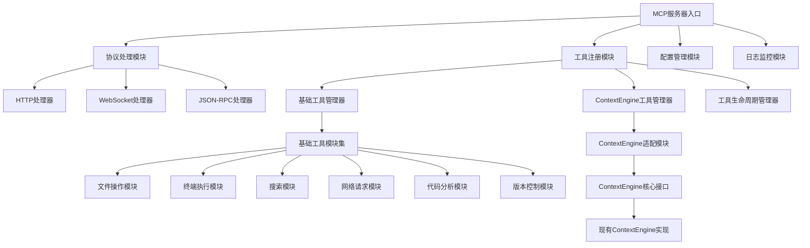
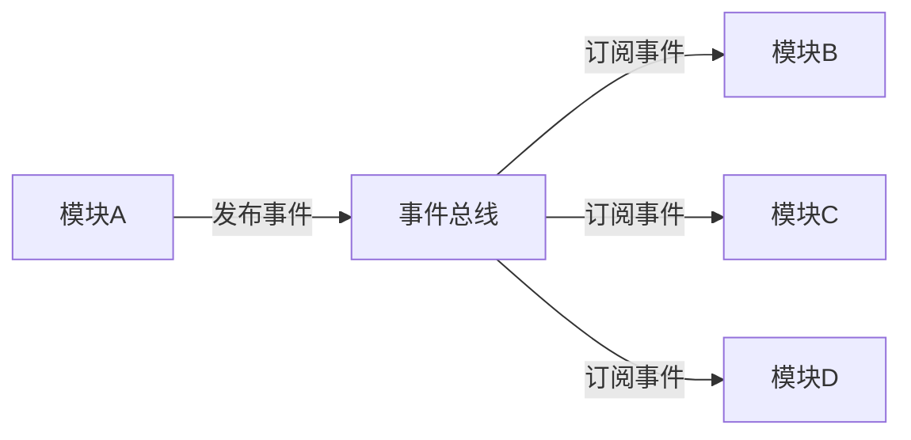
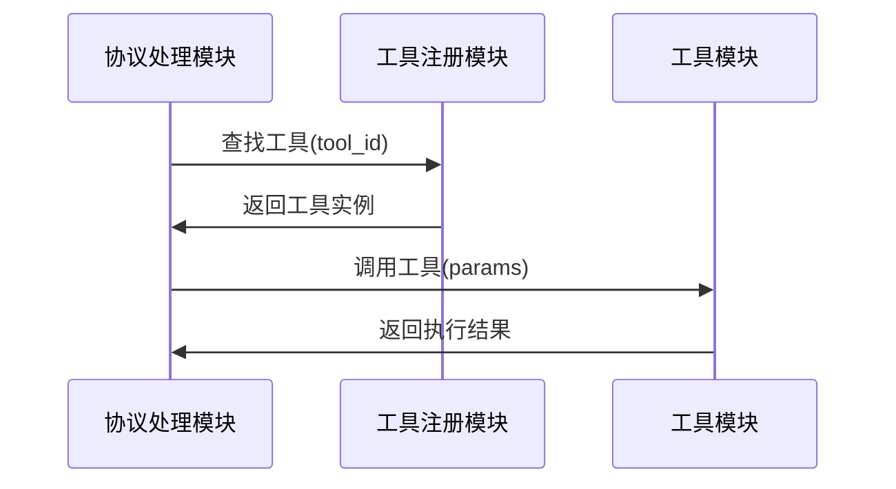

# 00_模块总览设计

## 1. 设计迭代说明

### 1.1 迭代目标
第一次迭代：建立核心模块架构和接口规范，为后续详细设计奠定基础。

### 1.2 设计原则
- **模块化**：每个模块职责单一，边界清晰
- **标准化**：所有模块都遵循统一的接口规范
- **可扩展**：支持新模块的热插拔和动态注册
- **容错性**：模块间松耦合，单模块故障不影响整体服务

## 2. 核心模块架构



## 3. 模块分层设计

### 3.1 服务层 (Service Layer)
**职责**：对外提供MCP协议服务
- **MCP服务器入口**：统一服务入口和生命周期管理
- **协议处理模块**：处理不同传输协议的MCP请求

### 3.2 管理层 (Management Layer)  
**职责**：内部资源和组件管理
- **工具注册模块**：工具的注册、发现、调用管理
- **配置管理模块**：统一配置加载、验证、热更新
- **日志监控模块**：基于Logloom的日志收集、性能监控、健康检查

### 3.3 工具层 (Tool Layer)
**职责**：具体工具功能实现
- **基础工具模块集**：文件、终端、网络等基础功能
- **ContextEngine适配模块**：现有ContextEngine的MCP适配

### 3.4 核心层 (Core Layer)
**职责**：底层核心能力支撑
- **ContextEngine核心接口**：统一的ContextEngine访问接口
- **存储接口**：ChromaDB、SQLite等存储抽象

## 4. 模块接口标准

### 4.1 统一模块接口
所有模块都实现以下标准接口：

```
ModuleInterface:
  - initialize(config): 模块初始化
  - start(): 启动模块服务
  - stop(): 停止模块服务
  - health_check(): 健康状态检查
  - get_metrics(): 获取模块指标
  - reload_config(config): 重载配置
```

### 4.2 工具模块接口
所有工具模块额外实现：

```
ToolModuleInterface extends ModuleInterface:
  - get_tool_definitions(): 获取工具定义列表
  - call_tool(tool_id, params): 调用具体工具
  - validate_params(tool_id, params): 参数验证
  - get_tool_status(tool_id): 获取工具状态
```

### 4.3 协议处理接口
所有协议处理器实现：

```
ProtocolHandlerInterface extends ModuleInterface:
  - handle_request(request): 处理MCP请求
  - format_response(result): 格式化响应
  - validate_request(request): 请求验证
  - get_protocol_info(): 获取协议信息
```

## 5. 模块间通信设计

### 5.1 事件驱动通信
模块间通过事件总线进行异步通信：



### 5.2 直接接口调用
关键路径使用直接接口调用确保性能：



## 6. 配置管理设计

### 6.1 分层配置结构
```
config/
├── server.yaml          # 服务器基础配置
├── modules/              # 模块配置目录
│   ├── protocol.yaml     # 协议处理配置
│   ├── tools.yaml        # 工具配置
│   └── contextengine.yaml # ContextEngine配置
└── runtime/              # 运行时配置
    ├── logloom.yaml      # Logloom日志配置
    └── monitoring.yaml   # 监控配置
```

### 6.2 配置继承和覆盖
- **基础配置**：server.yaml提供默认配置
- **模块配置**：各模块可覆盖基础配置
- **环境变量**：可覆盖任何配置项
- **运行时更新**：支持热更新非关键配置

## 7. 错误处理和容错设计

### 7.1 分级错误处理
- **模块级错误**：模块内部处理，不影响其他模块
- **工具级错误**：工具执行失败，返回标准错误响应
- **系统级错误**：关键组件故障，触发降级服务

### 7.2 故障隔离机制
- **独立进程**：ContextEngine运行在独立进程
- **超时保护**：所有工具调用都有超时限制
- **熔断机制**：故障工具自动禁用，定期重试

## 8. 下一步迭代计划

### 第二次迭代：协议处理模块详细设计
- MCP协议标准实现
- HTTP/WebSocket/JSON-RPC处理器设计
- 请求路由和响应格式化

### 第三次迭代：工具注册模块详细设计
- 工具发现和注册机制
- 工具生命周期管理
- 工具权限和访问控制

### 第四次迭代：基础工具模块设计
- 各类基础工具的接口设计
- 工具参数验证和错误处理
- 工具性能优化策略

### 第五次迭代：ContextEngine适配模块设计
- 现有ContextEngine的接口分析
- MCP工具适配器设计
- 数据转换和协议映射

## 设计文档索引

### 核心设计文档
- `01_core_interfaces.md` - 核心接口规范
- `02_protocol_handler.md` - 协议处理模块设计
- `03_tool_registry.md` - 工具注册管理模块设计
- `04_logloom_config.md` - Logloom日志系统配置规范

### 后续设计文档（待创建）
- `05_basic_tools.md` - 基础工具模块设计
- `06_contextengine_adapter.md` - ContextEngine适配器设计
- `07_security_framework.md` - 安全框架设计
- `08_monitoring_system.md` - 监控系统设计