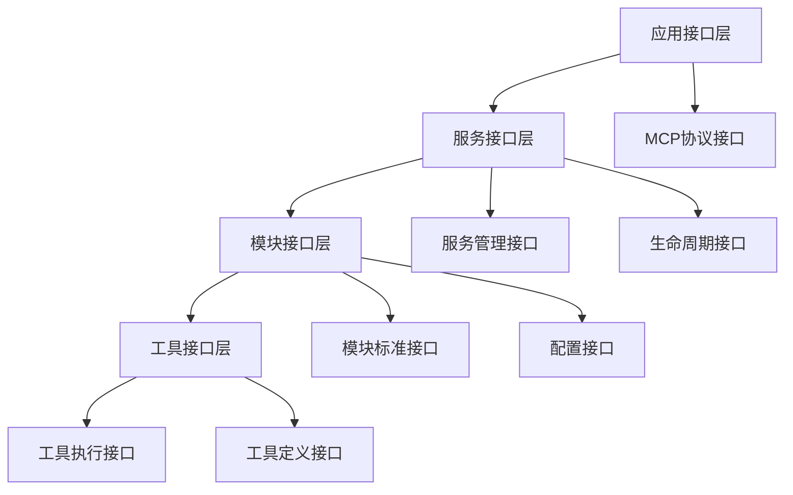

# 01_核心接口规范设计

## 1. 接口设计原则

### 1.1 设计目标
- **一致性**：所有模块遵循统一的接口约定
- **可测试性**：接口设计便于单元测试和集成测试
- **可扩展性**：接口支持功能扩展而不破坏兼容性
- **类型安全**：明确的参数和返回值类型定义

### 1.2 接口分层


## 2. 核心数据类型定义

### 2.1 基础类型
```
# 标准响应结果
Result<T>:
  - success: boolean
  - data: T | null
  - error: Error | null
  - timestamp: ISO8601
  - request_id: string

# 错误信息
Error:
  - code: string
  - message: string
  - details: object | null
  - stack_trace: string | null

# 配置对象
Config:
  - module_name: string
  - version: string
  - parameters: Map<string, any>
  - metadata: Map<string, string>
```

### 2.2 MCP特定类型
```
# MCP工具定义
ToolDefinition:
  - name: string                    # 工具唯一名称
  - display_name: string            # 显示名称
  - description: string             # 工具描述
  - version: string                 # 工具版本
  - category: ToolCategory          # 工具分类
  - input_schema: JSONSchema        # 输入参数架构
  - output_schema: JSONSchema       # 输出结果架构
  - metadata: ToolMetadata          # 工具元数据
  - requirements: ToolRequirements  # 运行要求
  - capabilities: List<string>      # 工具能力标识
  - enabled: boolean                # 是否启用

ToolCategory:
  - PRIMARY: "file_operations" | "terminal" | "network" | "code_analysis" | "version_control" | "search"
  - SECONDARY: "context_management" | "ai_assistance" | "data_processing"
  - CUSTOM: string

ToolMetadata:
  - author: string
  - license: string
  - documentation_url: string | null
  - source_url: string | null
  - tags: List<string>
  - experimental: boolean

ToolRequirements:
  - min_permissions: List<string>
  - dependencies: List<string>
  - resources: ResourceRequirements

# MCP工具调用请求
ToolCallRequest:
  - tool_name: string
  - arguments: Map<string, any>
  - request_id: string
  - session_id: string | null
  - metadata: Map<string, string>

# MCP工具调用响应
ToolCallResponse:
  - content: any
  - is_error: boolean
  - metadata: Map<string, string>
```

### 2.3 模块状态类型
```
# 模块状态
ModuleStatus:
  - name: string
  - state: "initializing" | "running" | "stopping" | "stopped" | "error"
  - health: "healthy" | "degraded" | "unhealthy"
  - started_at: ISO8601
  - last_health_check: ISO8601
  - metrics: Map<string, number>

# 健康检查结果
HealthCheck:
  - status: "pass" | "warn" | "fail"
  - checks: Map<string, CheckResult>
  - timestamp: ISO8601
  - response_time: number

CheckResult:
  - status: "pass" | "warn" | "fail"
  - message: string
  - observed_value: any | null
  - observed_unit: string | null
```

## 3. 模块标准接口

### 3.1 基础模块接口
```
interface Module:
  # 生命周期管理
  initialize(config: Config) -> Result<void>
  start() -> Result<void>
  stop() -> Result<void>
  restart() -> Result<void>
  
  # 状态查询
  get_status() -> ModuleStatus
  health_check() -> HealthCheck
  get_metrics() -> Map<string, number>
  
  # 配置管理
  get_config() -> Config
  update_config(config: Config) -> Result<void>
  validate_config(config: Config) -> Result<void>
  
  # 元数据
  get_info() -> ModuleInfo

ModuleInfo:
  - name: string
  - version: string
  - description: string
  - dependencies: List<string>
  - capabilities: List<string>
```

### 3.2 工具模块接口
```
interface ToolModule extends Module:
  # 工具管理
  get_tools() -> List<ToolDefinition>
  get_tool(name: string) -> ToolDefinition | null
  register_tool(definition: ToolDefinition) -> Result<void>
  unregister_tool(name: string) -> Result<void>
  
  # 工具执行
  call_tool(request: ToolCallRequest) -> Result<ToolCallResponse>
  validate_tool_call(request: ToolCallRequest) -> Result<void>
  
  # 工具状态
  get_tool_status(name: string) -> ToolStatus
  enable_tool(name: string) -> Result<void>
  disable_tool(name: string) -> Result<void>

ToolStatus:
  - name: string
  - enabled: boolean
  - last_called: ISO8601 | null
  - call_count: number
  - error_count: number
  - average_response_time: number
```

### 3.3 协议处理接口
```
interface ProtocolHandler extends Module:
  # 请求处理
  handle_request(request: ProtocolRequest) -> Result<ProtocolResponse>
  validate_request(request: ProtocolRequest) -> Result<void>
  format_response(data: any) -> ProtocolResponse
  
  # 协议信息
  get_protocol_info() -> ProtocolInfo
  supports_method(method: string) -> boolean

ProtocolRequest:
  - method: string
  - params: Map<string, any>
  - id: string | number | null
  - version: string

ProtocolResponse:
  - result: any | null
  - error: Error | null
  - id: string | number | null

ProtocolInfo:
  - name: string
  - version: string
  - supported_methods: List<string>
  - transport: "http" | "websocket" | "stdio"
```

## 4. 服务接口设计

### 4.1 服务管理接口
```
interface ServiceManager:
  # 服务生命周期
  start_service() -> Result<void>
  stop_service() -> Result<void>
  restart_service() -> Result<void>
  
  # 模块管理
  register_module(module: Module) -> Result<void>
  unregister_module(name: string) -> Result<void>
  get_module(name: string) -> Module | null
  list_modules() -> List<ModuleInfo>
  
  # 健康检查
  health_check() -> ServiceHealth
  get_service_metrics() -> ServiceMetrics

ServiceHealth:
  - status: "healthy" | "degraded" | "unhealthy"
  - modules: Map<string, HealthCheck>
  - timestamp: ISO8601

ServiceMetrics:
  - uptime: number
  - request_count: number
  - error_count: number
  - active_connections: number
  - memory_usage: number
  - cpu_usage: number
```

### 4.2 工具注册接口
```
interface ToolRegistry:
  # 工具注册
  register_tool_module(module: ToolModule) -> Result<void>
  unregister_tool_module(name: string) -> Result<void>
  
  # 工具发现
  list_tools() -> List<ToolDefinition>
  find_tool(name: string) -> ToolDefinition | null
  search_tools(query: ToolQuery) -> List<ToolDefinition>
  
  # 工具调用
  call_tool(request: ToolCallRequest) -> Result<ToolCallResponse>
  batch_call_tools(requests: List<ToolCallRequest>) -> List<Result<ToolCallResponse>>
  
  # 工具状态
  get_tool_registry_status() -> ToolRegistryStatus

ToolQuery:
  - category: string | null
  - keywords: List<string>
  - enabled_only: boolean

ToolRegistryStatus:
  - total_tools: number
  - enabled_tools: number
  - tool_modules: List<string>
  - last_updated: ISO8601
```

## 5. 事件系统接口

### 5.1 事件定义
```
Event:
  - type: string
  - source: string
  - data: any
  - timestamp: ISO8601
  - correlation_id: string | null

# 系统事件类型
SystemEvents:
  - "module.started"
  - "module.stopped"
  - "module.error"
  - "tool.registered"
  - "tool.unregistered"
  - "tool.called"
  - "service.started"
  - "service.stopped"
  - "config.updated"
```

### 5.2 事件总线接口
```
interface EventBus:
  # 事件发布
  publish(event: Event) -> void
  publish_async(event: Event) -> Future<void>
  
  # 事件订阅
  subscribe(event_type: string, handler: EventHandler) -> SubscriptionId
  unsubscribe(subscription_id: SubscriptionId) -> void
  
  # 事件查询
  get_event_history(filter: EventFilter) -> List<Event>

EventHandler:
  handle(event: Event) -> void

EventFilter:
  - event_types: List<string>
  - sources: List<string>
  - since: ISO8601 | null
  - limit: number | null

SubscriptionId: string
```

## 6. 配置管理接口

### 6.1 配置提供者接口
```
interface ConfigProvider:
  # 配置加载
  load_config(path: string) -> Result<Config>
  save_config(path: string, config: Config) -> Result<void>
  
  # 配置监听
  watch_config(path: string, callback: ConfigChangeCallback) -> WatchId
  unwatch_config(watch_id: WatchId) -> void
  
  # 配置验证
  validate_config(config: Config, schema: JSONSchema) -> Result<void>

ConfigChangeCallback:
  on_change(old_config: Config, new_config: Config) -> void

WatchId: string
```

### 6.2 配置管理器接口
```
interface ConfigManager:
  # 配置获取
  get_config(module_name: string) -> Config | null
  get_global_config() -> Config
  
  # 配置更新
  update_config(module_name: string, config: Config) -> Result<void>
  reload_all_configs() -> Result<void>
  
  # 配置监听
  on_config_change(module_name: string, callback: ConfigChangeCallback) -> void
  
  # 配置验证
  validate_all_configs() -> Result<void>
```

## 7. 日志和监控接口

### 7.1 日志接口（基于Logloom）
```
# 全局日志管理接口
interface LogManager:
  # 系统初始化和清理
  initialize(config: LogConfig | string) -> boolean
  cleanup() -> boolean
  
  # 全局配置
  set_log_level(level: LogLevel | string) -> boolean
  set_log_file(filepath: string) -> boolean
  set_log_max_size(max_bytes: number) -> boolean
  set_output_console(enabled: boolean) -> boolean
  
  # 国际化支持
  set_language(lang_code: string) -> boolean
  get_current_language() -> string
  get_text(key: string, *args) -> string
  format_text(key: string, *args, **kwargs) -> string

# 日志记录器接口
interface Logger:
  # 构造器
  create(name: string | null) -> Logger
  
  # 日志记录方法
  debug(message: string, *args, **kwargs) -> void
  info(message: string, *args, **kwargs) -> void
  warn(message: string, *args, **kwargs) -> void
  warning(message: string, *args, **kwargs) -> void  # warn的别名
  error(message: string, *args, **kwargs) -> void
  fatal(message: string, *args, **kwargs) -> void
  critical(message: string, *args, **kwargs) -> void  # fatal的别名
  
  # 实例配置
  set_level(level: LogLevel | string) -> void
  set_file(file_path: string) -> void
  set_rotation_size(size: number) -> void
  get_level() -> string

# 全局日志记录函数
interface GlobalLogging:
  debug(module: string, message: string) -> void
  info(module: string, message: string) -> void
  warn(module: string, message: string) -> void
  error(module: string, message: string) -> void
  fatal(module: string, message: string) -> void

LogLevel: "DEBUG" | "INFO" | "WARN" | "ERROR" | "FATAL"

LogConfig:
  logloom:
    language: string  # 如 "zh", "en"
    log:
      level: LogLevel
      file: string
      max_size: number  # 字节数
      console: boolean
```

### 7.2 指标收集接口
```
interface MetricsCollector:
  # 计数器
  increment_counter(name: string, tags: Map<string, string>) -> void
  decrement_counter(name: string, tags: Map<string, string>) -> void
  
  # 计量器
  record_gauge(name: string, value: number, tags: Map<string, string>) -> void
  
  # 计时器
  start_timer(name: string, tags: Map<string, string>) -> TimerId
  stop_timer(timer_id: TimerId) -> void
  record_timing(name: string, duration: number, tags: Map<string, string>) -> void
  
  # 指标查询
  get_metrics(filter: MetricsFilter) -> MetricsResult

TimerId: string

MetricsFilter:
  - names: List<string> | null
  - tags: Map<string, string>
  - since: ISO8601 | null

MetricsResult:
  - metrics: List<Metric>
  - timestamp: ISO8601

Metric:
  - name: string
  - type: "counter" | "gauge" | "timer"
  - value: number
  - tags: Map<string, string>
  - timestamp: ISO8601
```

## 8. 接口版本管理

### 8.1 版本策略
- **语义化版本**：使用MAJOR.MINOR.PATCH格式
- **向后兼容**：MINOR版本更新保持向后兼容
- **废弃通知**：提前通知接口废弃计划

### 8.2 版本检查接口
```
interface VersionChecker:
  get_interface_version(interface_name: string) -> Version
  check_compatibility(required_version: Version, actual_version: Version) -> boolean
  get_supported_versions(interface_name: string) -> List<Version>

Version:
  - major: number
  - minor: number
  - patch: number
  - pre_release: string | null
```

## 9. 下一步设计方向

### 第二次迭代重点
- 基于这些接口规范，设计具体的协议处理模块
- 确定MCP协议的具体实现方式
- 设计请求路由和响应处理机制

### 接口演进计划
- 在实现过程中根据实际需求调整接口
- 建立接口变更的评审机制
- 制定接口文档的维护标准

## 附录：服务模块接口（第四次迭代扩展）

### 3.4 服务模块接口
```
interface ServiceModule extends ToolModule:
  # 服务标识
  get_module_info() -> ModuleInfo
  get_service_namespace() -> string
  get_supported_tools() -> List<ToolDefinition>
  
  # 服务生命周期（扩展自Module）
  initialize(config: ModuleConfig, context: ServiceContext) -> Result<void>
  shutdown() -> Result<void>
  
  # 服务能力
  handle_tool_call(request: ToolCallRequest) -> ToolCallResponse
  list_available_tools() -> List<ToolDefinition>
  get_tool_schema(tool_name: string) -> JSONSchema | null
  
  # 配置管理（扩展）
  reload_config(config: ModuleConfig) -> Result<void>
  validate_config(config: ModuleConfig) -> ValidationResult

# 扩展的模块信息
ServiceModuleInfo extends ModuleInfo:
  - module_id: string
  - namespace: string      # 工具命名空间前缀
  - capabilities: List<Capability>

ServiceContext:
  - platform_version: string
  - shared_services: SharedServices
  - event_bus: EventBus
  - logger: Logger
  - config_manager: ConfigManager
  - metrics_collector: MetricsCollector

Capability:
  - type: CapabilityType
  - version: string
  - metadata: Map<string, any>

CapabilityType:
  - FILE_OPERATIONS
  - TERMINAL_EXECUTION
  - NETWORK_ACCESS
  - CODE_ANALYSIS
  - VERSION_CONTROL
  - SEARCH_INDEXING
  - CONTEXT_ANALYSIS
  - AI_ASSISTANCE
  - IMAGE_PROCESSING
  - AUDIO_PROCESSING
  - DATA_TRANSFORMATION
  - CUSTOM
```
