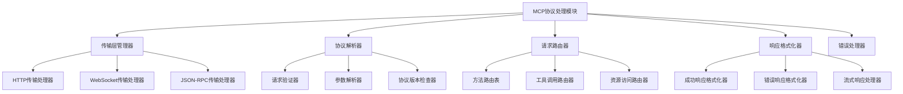

# 02_MCP协议处理模块设计

## 1. 模块概述

### 1.1 设计目标
设计一个标准化的MCP协议处理模块，支持多种传输方式，确保与MCP规范的完全兼容。

### 1.2 核心职责
- **协议解析**：解析来自不同传输层的MCP请求
- **请求路由**：将MCP请求路由到对应的工具处理器
- **响应格式化**：将工具执行结果格式化为标准MCP响应
- **错误处理**：统一处理协议级别的错误和异常

## 2. 模块架构设计



## 3. 传输层设计

### 3.1 传输层抽象接口
```
interface TransportHandler:
  # 生命周期
  start(config: TransportConfig) -> Result<void>
  stop() -> Result<void>

  # 请求处理
  handle_connection(connection: Connection) -> void
  send_response(connection: Connection, response: MCPResponse) -> Result<void>

  # 连接管理
  get_active_connections() -> List<Connection>
  close_connection(connection_id: string) -> void

  # 传输信息
  get_transport_info() -> TransportInfo

Connection:
  - id: string
  - remote_address: string
  - connected_at: ISO8601
  - last_activity: ISO8601
  - metadata: Map<string, string>

TransportInfo:
  - type: "http" | "websocket" | "stdio"
  - version: string
  - supported_features: List<string>
```

### 3.2 HTTP传输处理器
```
HTTPTransportHandler implements TransportHandler:

  配置参数:
  - host: string
  - port: number
  - max_connections: number
  - request_timeout: number
  - enable_cors: boolean
  - ssl_config: SSLConfig | null

  特殊功能:
  - 支持HTTP/1.1和HTTP/2
  - 处理CORS预检请求
  - 支持请求压缩
  - 连接池管理

  路由设计:
  - POST /mcp -> 标准MCP请求
  - GET /health -> 健康检查
  - GET /info -> 服务信息
  - GET /tools -> 工具列表（RESTful接口）
```

### 3.3 WebSocket传输处理器
```
WebSocketTransportHandler implements TransportHandler:

  配置参数:
  - host: string
  - port: number
  - max_connections: number
  - ping_interval: number
  - max_message_size: number

  特殊功能:
  - 支持双向通信
  - 心跳检测
  - 自动重连机制
  - 消息排队和重试

  消息类型:
  - request: 客户端请求
  - response: 服务器响应
  - notification: 单向通知
  - ping/pong: 心跳消息
```

### 3.4 JSON-RPC传输处理器
```
JSONRPCTransportHandler implements TransportHandler:

  配置参数:
  - transport: "http" | "websocket" | "stdio"
  - batch_support: boolean
  - notification_support: boolean

  特殊功能:
  - 严格遵循JSON-RPC 2.0规范
  - 支持批量请求处理
  - 支持通知消息
  - 请求ID追踪
```

## 4. 协议解析器设计

### 4.1 MCP请求解析
```
interface MCPRequestParser:
  parse_request(raw_data: bytes, transport_type: string) -> Result<MCPRequest>
  validate_request(request: MCPRequest) -> Result<void>
  extract_method(request: MCPRequest) -> string
  extract_params(request: MCPRequest) -> Map<string, any>

MCPRequest:
  - jsonrpc: "2.0"
  - method: string
  - params: Map<string, any> | null
  - id: string | number | null
  - meta: RequestMetadata

RequestMetadata:
  - transport_type: string
  - connection_id: string
  - received_at: ISO8601
  - client_info: ClientInfo | null

ClientInfo:
  - name: string
  - version: string
  - user_agent: string | null
```

### 4.2 协议版本管理
```
interface ProtocolVersionManager:
  get_supported_versions() -> List<string>
  get_current_version() -> string
  is_version_supported(version: string) -> boolean
  get_version_features(version: string) -> List<string>
  negotiate_version(client_versions: List<string>) -> string | null

# 支持的MCP协议版本
SupportedVersions:
  - "2024-11-05" (当前标准版本)
  - 向后兼容策略
```

### 4.3 参数验证器
```
interface ParameterValidator:
  validate_tool_call_params(params: Map<string, any>) -> Result<void>
  validate_resource_params(params: Map<string, any>) -> Result<void>
  validate_prompt_params(params: Map<string, any>) -> Result<void>

  # 通用验证方法
  validate_against_schema(params: any, schema: JSONSchema) -> Result<void>
  sanitize_params(params: Map<string, any>) -> Map<string, any>
```

## 5. 请求路由器设计

### 5.1 方法路由表
```
MethodRouter:
  # 标准MCP方法
  - "tools/list" -> list_tools()
  - "tools/call" -> call_tool()
  - "resources/list" -> list_resources()
  - "resources/read" -> read_resource()
  - "prompts/list" -> list_prompts()
  - "prompts/get" -> get_prompt()

  # 扩展方法
  - "health/check" -> health_check()
  - "info/server" -> get_server_info()
  - "metrics/get" -> get_metrics()

路由匹配策略:
  1. 精确匹配方法名
  2. 前缀匹配（支持命名空间）
  3. 正则表达式匹配
  4. 默认处理器（未知方法）
```

### 5.2 工具调用路由器
```
ToolCallRouter:
  # 路由逻辑
  route_tool_call(tool_name: string) -> ToolModule | null

  # 路由策略
  - 直接名称匹配
  - 分类匹配（如：file.*）
  - 优先级路由
  - 负载均衡路由

  # 路由缓存
  - 缓存工具到模块的映射
  - 定期刷新路由表
  - 支持热更新
```

### 5.3 中间件链设计
```
interface Middleware:
  process(request: MCPRequest, context: RequestContext) -> Result<MCPRequest>

MiddlewareChain:
  - AuthenticationMiddleware: 身份验证
  - AuthorizationMiddleware: 权限检查
  - RateLimitingMiddleware: 频率限制
  - LoggingMiddleware: 请求日志（基于Logloom）
  - MetricsMiddleware: 指标收集
  - CachingMiddleware: 响应缓存
  - ValidationMiddleware: 参数验证

RequestContext:
  - request_id: string
  - session_id: string | null
  - user_info: UserInfo | null
  - start_time: ISO8601
  - metadata: Map<string, any>
```

## 6. 响应格式化器设计

### 6.1 响应格式化接口
```
interface ResponseFormatter:
  format_success_response(result: any, request_id: string | number | null) -> MCPResponse
  format_error_response(error: MCPError, request_id: string | number | null) -> MCPResponse
  format_notification(method: string, params: any) -> MCPNotification

MCPResponse:
  - jsonrpc: "2.0"
  - result: any | null
  - error: MCPError | null
  - id: string | number | null

MCPError:
  - code: number
  - message: string
  - data: any | null

MCPNotification:
  - jsonrpc: "2.0"
  - method: string
  - params: any | null
```

### 6.2 标准错误码定义
```
MCPErrorCodes:
  # JSON-RPC标准错误码
  - PARSE_ERROR: -32700
  - INVALID_REQUEST: -32600
  - METHOD_NOT_FOUND: -32601
  - INVALID_PARAMS: -32602
  - INTERNAL_ERROR: -32603

  # MCP特定错误码
  - TOOL_NOT_FOUND: -32001
  - TOOL_EXECUTION_ERROR: -32002
  - RESOURCE_NOT_FOUND: -32003
  - RESOURCE_ACCESS_DENIED: -32004
  - PROMPT_NOT_FOUND: -32005

  # 自定义错误码范围
  - CUSTOM_ERROR_BASE: -31000
```

### 6.3 流式响应处理
```
interface StreamingResponseHandler:
  start_stream(connection: Connection, request_id: string) -> StreamHandle
  write_chunk(handle: StreamHandle, data: any) -> Result<void>
  end_stream(handle: StreamHandle) -> Result<void>

  # 流式数据格式
  StreamChunk:
    - type: "data" | "error" | "end"
    - content: any
    - sequence: number
    - timestamp: ISO8601
```

## 7. 错误处理器设计

### 7.1 分层错误处理
```
ErrorHandler:
  # 传输层错误
  handle_transport_error(error: TransportError) -> MCPResponse

  # 协议层错误
  handle_protocol_error(error: ProtocolError) -> MCPResponse

  # 应用层错误
  handle_application_error(error: ApplicationError) -> MCPResponse

  # 系统错误
  handle_system_error(error: SystemError) -> MCPResponse

错误处理策略:
  1. 错误分类和标准化
  2. 敏感信息过滤
  3. 错误日志记录（使用Logloom标准格式）
  4. 错误指标统计
  5. 降级响应机制
```

### 7.2 错误恢复机制
```
ErrorRecoveryManager:
  # 重试机制
  should_retry(error: Error, attempt_count: number) -> boolean
  get_retry_delay(attempt_count: number) -> number

  # 熔断机制
  should_circuit_break(error_rate: number, threshold: number) -> boolean
  get_circuit_state(service: string) -> CircuitState

  # 降级机制
  get_fallback_response(request: MCPRequest) -> MCPResponse | null

CircuitState: "closed" | "open" | "half_open"
```

## 8. 性能优化设计

### 8.1 连接池管理
```
ConnectionPoolManager:
  # 连接复用
  get_connection(client_id: string) -> Connection | null
  return_connection(connection: Connection) -> void

  # 连接清理
  cleanup_idle_connections(idle_timeout: number) -> void
  close_all_connections() -> void

  # 连接监控
  get_pool_stats() -> PoolStats

PoolStats:
  - active_connections: number
  - idle_connections: number
  - total_connections: number
  - max_connections: number
  - connection_requests: number
  - connection_timeouts: number
```

### 8.2 请求缓存策略
```
RequestCacheManager:
  # 缓存策略
  should_cache_request(request: MCPRequest) -> boolean
  should_cache_response(response: MCPResponse) -> boolean

  # 缓存操作
  get_cached_response(cache_key: string) -> MCPResponse | null
  cache_response(cache_key: string, response: MCPResponse, ttl: number) -> void

  # 缓存键生成
  generate_cache_key(request: MCPRequest) -> string

  # 缓存失效
  invalidate_cache(pattern: string) -> void
```

### 8.3 批量处理优化
```
BatchProcessor:
  # 批量请求处理
  process_batch(requests: List<MCPRequest>) -> List<MCPResponse>

  # 并发控制
  max_concurrent_requests: number
  request_queue_size: number

  # 批量优化
  group_similar_requests(requests: List<MCPRequest>) -> Map<string, List<MCPRequest>>
  optimize_execution_order(groups: Map<string, List<MCPRequest>>) -> List<ExecutionPlan>
```

## 9. 配置和监控

### 9.1 模块配置
```yaml
# protocol_config.yaml
protocol_handler:
  version: "2024-11-05"

  transports:
    http:
      enabled: true
      host: "0.0.0.0"
      port: 8080
      max_connections: 1000
      request_timeout: 30
      enable_cors: true

    websocket:
      enabled: true
      host: "0.0.0.0"
      port: 8081
      max_connections: 500
      ping_interval: 30

  routing:
    enable_caching: true
    cache_ttl: 300
    max_middleware_chain_length: 10

  error_handling:
    max_retry_attempts: 3
    circuit_breaker_threshold: 0.5
    enable_fallback: true
```

### 9.2 监控指标
```
协议处理指标:
  - request_count: 总请求数
  - request_duration: 请求处理时间
  - error_rate: 错误率
  - active_connections: 活跃连接数
  - queue_length: 请求队列长度
  - cache_hit_rate: 缓存命中率
  - circuit_breaker_state: 熔断器状态
```

## 10. 下一步设计方向

### 第三次迭代重点
- 基于协议处理模块，设计工具注册和管理模块
- 确定工具发现、注册、调用的具体机制
- 设计工具生命周期管理策略

### 协议处理模块完善
- 安全机制设计（认证、授权、加密）
- 性能基准测试和优化
- 与现有系统的集成测试
