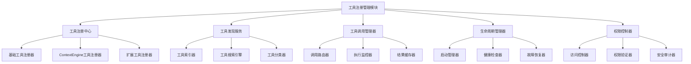

# 03_工具注册管理模块设计

## 1. 模块概述

### 1.1 设计目标
设计一个灵活、可扩展的工具注册管理模块，支持动态工具注册、发现、调用和生命周期管理。

### 1.2 核心职责
- **工具注册**：支持工具模块的动态注册和注销
- **工具发现**：提供多种工具发现和查询机制
- **工具调用**：统一的工具调用接口和执行管理
- **生命周期管理**：工具的启动、停止、健康检查和故障恢复
- **权限控制**：工具访问权限和安全策略管理

## 2. 模块架构设计



## 3. 工具注册中心设计

### 3.1 工具注册接口
```
interface ToolRegistry:
  # 工具模块注册
  register_tool_module(module: ToolModule, config: RegistrationConfig) -> Result<RegistrationId>
  unregister_tool_module(registration_id: RegistrationId) -> Result<void>
  update_tool_module(registration_id: RegistrationId, module: ToolModule) -> Result<void>

  # 单个工具注册
  register_tool(definition: ToolDefinition, handler: ToolHandler) -> Result<ToolId>
  unregister_tool(tool_id: ToolId) -> Result<void>
  update_tool(tool_id: ToolId, definition: ToolDefinition) -> Result<void>

  # 注册状态查询
  get_registration_info(registration_id: RegistrationId) -> RegistrationInfo | null
  list_registered_modules() -> List<RegistrationInfo>
  is_tool_registered(tool_name: string) -> boolean

RegistrationConfig:
  - priority: number
  - auto_start: boolean
  - health_check_interval: number
  - max_concurrent_calls: number
  - timeout: number
  - retry_policy: RetryPolicy

RegistrationInfo:
  - registration_id: RegistrationId
  - module_name: string
  - tool_count: number
  - status: "registered" | "active" | "inactive" | "error"
  - registered_at: ISO8601
  - last_health_check: ISO8601
```

### 3.2 工具定义标准
```
ToolDefinition:
  - name: string                    # 工具唯一名称
  - display_name: string            # 显示名称
  - description: string             # 工具描述
  - version: string                 # 工具版本
  - category: ToolCategory          # 工具分类
  - input_schema: JSONSchema        # 输入参数架构
  - output_schema: JSONSchema       # 输出结果架构
  - metadata: ToolMetadata          # 工具元数据
  - requirements: ToolRequirements  # 运行要求
  - capabilities: List<string>      # 工具能力标识

ToolCategory:
  - PRIMARY: "file_operations" | "terminal" | "network" | "code_analysis" | "version_control" | "search"
  - SECONDARY: "context_management" | "ai_assistance" | "data_processing"
  - CUSTOM: string

ToolMetadata:
  - author: string
  - license: string
  - documentation_url: string | null
  - source_url: string | null
  - tags: List<string>
  - experimental: boolean

ToolRequirements:
  - min_memory: number | null       # MB
  - max_execution_time: number      # 秒
  - required_permissions: List<Permission>
  - dependencies: List<Dependency>
```

### 3.3 工具处理器接口
```
interface ToolHandler:
  # 工具执行
  execute(params: ToolParameters, context: ExecutionContext) -> Result<ToolResult>

  # 参数验证
  validate_parameters(params: ToolParameters) -> Result<void>

  # 工具状态
  get_status() -> ToolHandlerStatus
  is_ready() -> boolean

  # 生命周期
  initialize(config: ToolConfig) -> Result<void>
  cleanup() -> Result<void>

ExecutionContext:
  - request_id: string
  - session_id: string | null
  - user_info: UserInfo | null
  - timeout: number
  - metadata: Map<string, any>

ToolResult:
  - content: any
  - metadata: Map<string, string>
  - execution_time: number
  - memory_usage: number | null
  - warnings: List<string>

ToolHandlerStatus:
  - ready: boolean
  - last_execution: ISO8601 | null
  - execution_count: number
  - error_count: number
  - average_execution_time: number
```

## 4. 工具发现服务设计

### 4.1 工具索引器
```
interface ToolIndexer:
  # 索引管理
  build_index() -> Result<void>
  rebuild_index() -> Result<void>
  update_index(tool: ToolDefinition) -> Result<void>
  remove_from_index(tool_name: string) -> Result<void>

  # 索引查询
  search_tools(query: ToolSearchQuery) -> List<ToolDefinition>
  get_tool_by_name(name: string) -> ToolDefinition | null
  list_tools_by_category(category: ToolCategory) -> List<ToolDefinition>

  # 索引统计
  get_index_stats() -> IndexStats

ToolSearchQuery:
  - keywords: List<string>          # 关键词搜索
  - categories: List<ToolCategory>  # 分类过滤
  - tags: List<string>              # 标签过滤
  - capabilities: List<string>      # 能力过滤
  - enabled_only: boolean           # 仅启用的工具
  - sort_by: "name" | "category" | "popularity" | "last_used"
  - limit: number | null
  - offset: number | null

IndexStats:
  - total_tools: number
  - tools_by_category: Map<ToolCategory, number>
  - index_size: number
  - last_updated: ISO8601
```

### 4.2 智能推荐引擎
```
interface ToolRecommendationEngine:
  # 基于上下文推荐
  recommend_by_context(context: RecommendationContext) -> List<ToolRecommendation>

  # 基于历史推荐
  recommend_by_history(user_id: string, limit: number) -> List<ToolRecommendation>

  # 基于相似性推荐
  recommend_similar_tools(tool_name: string, limit: number) -> List<ToolRecommendation>

  # 推荐反馈
  record_tool_usage(tool_name: string, context: RecommendationContext, satisfaction: number) -> void

RecommendationContext:
  - current_task: string | null
  - file_types: List<string>
  - project_language: string | null
  - recent_tools: List<string>
  - user_preferences: Map<string, any>

ToolRecommendation:
  - tool_name: string
  - confidence: number              # 0.0 - 1.0
  - reason: string
  - usage_examples: List<string>
```

### 4.3 工具分类器
```
interface ToolCategorizer:
  # 自动分类
  categorize_tool(definition: ToolDefinition) -> ToolCategory
  suggest_categories(definition: ToolDefinition) -> List<ToolCategory>

  # 分类管理
  create_custom_category(name: string, description: string) -> Result<ToolCategory>
  update_category(category: ToolCategory, metadata: CategoryMetadata) -> Result<void>

  # 分类统计
  get_category_stats() -> Map<ToolCategory, CategoryStats>

CategoryMetadata:
  - description: string
  - icon: string | null
  - color: string | null
  - parent_category: ToolCategory | null

CategoryStats:
  - tool_count: number
  - usage_count: number
  - last_used: ISO8601 | null
```

## 5. 工具调用管理器设计

### 5.1 调用路由器
```
interface ToolCallRouter:
  # 路由决策
  route_call(tool_name: string, context: ExecutionContext) -> ToolHandler | null

  # 负载均衡
  select_handler_instance(tool_name: string, instances: List<ToolHandler>) -> ToolHandler

  # 路由策略
  set_routing_strategy(tool_name: string, strategy: RoutingStrategy) -> void
  get_routing_stats(tool_name: string) -> RoutingStats

RoutingStrategy: "round_robin" | "least_connections" | "response_time" | "random" | "weighted"

RoutingStats:
  - total_calls: number
  - successful_calls: number
  - failed_calls: number
  - average_response_time: number
  - current_load: number
```

### 5.2 执行监控器
```
interface ExecutionMonitor:
  # 执行跟踪
  start_execution(tool_name: string, params: ToolParameters, context: ExecutionContext) -> ExecutionId
  update_execution_status(execution_id: ExecutionId, status: ExecutionStatus) -> void
  complete_execution(execution_id: ExecutionId, result: ToolResult) -> void
  fail_execution(execution_id: ExecutionId, error: Error) -> void

  # 监控查询
  get_active_executions() -> List<ExecutionInfo>
  get_execution_history(filter: ExecutionFilter) -> List<ExecutionInfo>
  get_execution_metrics(tool_name: string) -> ExecutionMetrics

ExecutionStatus: "pending" | "running" | "completed" | "failed" | "timeout" | "cancelled"

ExecutionInfo:
  - execution_id: ExecutionId
  - tool_name: string
  - status: ExecutionStatus
  - started_at: ISO8601
  - completed_at: ISO8601 | null
  - execution_time: number | null
  - memory_usage: number | null
  - user_info: UserInfo | null

ExecutionMetrics:
  - total_executions: number
  - success_rate: number
  - average_execution_time: number
  - peak_memory_usage: number
  - error_distribution: Map<string, number>
```

### 5.3 并发控制器
```
interface ConcurrencyController:
  # 并发限制
  acquire_execution_slot(tool_name: string) -> Result<ExecutionSlot>
  release_execution_slot(slot: ExecutionSlot) -> void

  # 队列管理
  enqueue_execution(request: ExecutionRequest) -> QueuePosition
  dequeue_execution() -> ExecutionRequest | null
  get_queue_status() -> QueueStatus

  # 限流控制
  check_rate_limit(user_id: string, tool_name: string) -> boolean
  update_rate_limit_config(config: RateLimitConfig) -> void

ExecutionSlot:
  - slot_id: string
  - tool_name: string
  - acquired_at: ISO8601
  - max_duration: number

QueueStatus:
  - queue_length: number
  - estimated_wait_time: number
  - processing_count: number
  - max_queue_size: number

RateLimitConfig:
  - requests_per_minute: number
  - requests_per_hour: number
  - burst_size: number
  - per_user_limits: Map<string, UserRateLimit>
```

## 6. 生命周期管理器设计

### 6.1 启动管理器
```
interface StartupManager:
  # 启动流程
  start_all_tools() -> Result<void>
  start_tool_module(module_name: string) -> Result<void>
  start_tool(tool_name: string) -> Result<void>

  # 启动策略
  set_startup_order(order: List<string>) -> void
  set_startup_dependencies(dependencies: Map<string, List<string>>) -> void

  # 启动状态
  get_startup_status() -> StartupStatus
  is_startup_complete() -> boolean

StartupStatus:
  - phase: "initializing" | "starting_modules" | "starting_tools" | "complete" | "failed"
  - completed_modules: List<string>
  - failed_modules: Map<string, Error>
  - total_time: number
  - estimated_remaining_time: number
```

### 6.2 健康检查器
```
interface HealthChecker:
  # 健康检查
  check_tool_health(tool_name: string) -> ToolHealthStatus
  check_all_tools_health() -> Map<string, ToolHealthStatus>

  # 自动检查
  start_periodic_health_checks(interval: number) -> void
  stop_periodic_health_checks() -> void

  # 健康事件
  on_health_change(callback: HealthChangeCallback) -> SubscriptionId

  # 健康策略
  set_health_check_config(tool_name: string, config: HealthCheckConfig) -> void

ToolHealthStatus:
  - status: "healthy" | "degraded" | "unhealthy" | "unknown"
  - last_check: ISO8601
  - response_time: number
  - error_message: string | null
  - consecutive_failures: number

HealthCheckConfig:
  - interval: number
  - timeout: number
  - failure_threshold: number
  - recovery_threshold: number
  - custom_check: HealthCheckFunction | null

HealthChangeCallback:
  on_change(tool_name: string, old_status: ToolHealthStatus, new_status: ToolHealthStatus) -> void
```

### 6.3 故障恢复器
```
interface FailureRecoveryManager:
  # 故障检测
  detect_failure(tool_name: string, error: Error) -> FailureType
  classify_failure(error: Error) -> FailureClassification

  # 恢复策略
  attempt_recovery(tool_name: string, failure_type: FailureType) -> Result<void>
  set_recovery_strategy(tool_name: string, strategy: RecoveryStrategy) -> void

  # 故障历史
  get_failure_history(tool_name: string) -> List<FailureRecord>
  get_recovery_stats() -> RecoveryStats

FailureType: "timeout" | "crash" | "memory_leak" | "dependency_failure" | "configuration_error" | "unknown"

FailureClassification:
  - severity: "low" | "medium" | "high" | "critical"
  - category: string
  - recoverable: boolean
  - estimated_recovery_time: number

RecoveryStrategy:
  - max_retry_attempts: number
  - retry_delay: number
  - escalation_policy: EscalationPolicy
  - fallback_tools: List<string>

FailureRecord:
  - failure_time: ISO8601
  - failure_type: FailureType
  - error_message: string
  - recovery_attempted: boolean
  - recovery_successful: boolean
  - recovery_time: number | null
```

## 7. 权限控制器设计

### 7.1 访问控制接口
```
interface AccessController:
  # 权限检查
  check_tool_access(user_info: UserInfo, tool_name: string) -> boolean
  check_operation_permission(user_info: UserInfo, operation: Operation) -> boolean

  # 权限管理
  grant_permission(user_id: string, permission: Permission) -> Result<void>
  revoke_permission(user_id: string, permission: Permission) -> Result<void>
  list_user_permissions(user_id: string) -> List<Permission>

  # 角色管理
  assign_role(user_id: string, role: Role) -> Result<void>
  create_role(role: Role) -> Result<void>
  list_roles() -> List<Role>

Permission:
  - resource: string        # tool:*, tool:file_operations, etc.
  - action: string         # execute, view, configure
  - conditions: Map<string, any> | null

Role:
  - name: string
  - description: string
  - permissions: List<Permission>
  - inherits_from: List<string>

Operation:
  - type: "tool_call" | "tool_register" | "tool_configure" | "system_admin"
  - target: string
  - parameters: Map<string, any>
```

### 7.2 安全审计器
```
interface SecurityAuditor:
  # 审计日志（基于Logloom）
  log_access_attempt(user_info: UserInfo, operation: Operation, result: AccessResult) -> void
  log_permission_change(admin_user: UserInfo, target_user: string, change: PermissionChange) -> void

  # 审计查询
  get_audit_logs(filter: AuditFilter) -> List<AuditRecord>
  get_security_report(time_range: TimeRange) -> SecurityReport

  # 异常检测
  detect_suspicious_activity(user_id: string) -> List<SecurityAlert>
  set_anomaly_detection_config(config: AnomalyDetectionConfig) -> void

AccessResult: "granted" | "denied" | "error"

AuditRecord:
  - timestamp: ISO8601
  - user_info: UserInfo
  - operation: Operation
  - result: AccessResult
  - source_ip: string
  - user_agent: string

SecurityAlert:
  - alert_type: "unusual_access_pattern" | "permission_escalation" | "repeated_failures"
  - severity: "low" | "medium" | "high"
  - description: string
  - evidence: Map<string, any>
  - timestamp: ISO8601
```

## 8. 配置管理

### 8.1 工具注册配置
```yaml
# tool_registry_config.yaml
tool_registry:
  # 注册策略
  auto_discovery:
    enabled: true
    scan_paths: ["/tools", "/plugins"]
    scan_interval: 300

  # 工具分类
  categories:
    file_operations:
      description: "文件和目录操作工具"
      max_concurrent_calls: 50
    terminal:
      description: "终端和命令执行工具"
      max_concurrent_calls: 20
    context_management:
      description: "上下文管理和AI辅助工具"
      max_concurrent_calls: 10

  # 并发控制
  concurrency:
    global_max_concurrent: 100
    per_tool_max_concurrent: 10
    queue_size: 1000
    execution_timeout: 300

  # 健康检查
  health_check:
    enabled: true
    interval: 60
    timeout: 10
    failure_threshold: 3
    recovery_threshold: 2
```

### 8.2 权限配置
```yaml
# access_control_config.yaml
access_control:
  # 默认权限
  default_permissions:
    - resource: "tool:file_operations:read_file"
      action: "execute"
    - resource: "tool:search:*"
      action: "execute"

  # 角色定义
  roles:
    developer:
      permissions:
        - resource: "tool:*"
          action: "execute"
        - resource: "tool:file_operations:*"
          action: "execute"

    admin:
      inherits_from: ["developer"]
      permissions:
        - resource: "system:*"
          action: "*"

  # 安全设置
  security:
    enable_audit: true
    session_timeout: 3600
    max_failed_attempts: 5
    lockout_duration: 300
```

## 9. 监控和指标

### 9.1 工具注册指标
```
工具注册管理指标:
  - registered_tools_count: 已注册工具数量
  - active_tools_count: 活跃工具数量
  - tool_registration_rate: 工具注册速率
  - tool_discovery_time: 工具发现时间
  - health_check_success_rate: 健康检查成功率
  - tool_execution_rate: 工具执行速率
  - concurrent_executions: 并发执行数
  - queue_wait_time: 队列等待时间
  - permission_check_time: 权限检查时间
  - failure_recovery_rate: 故障恢复率
```

### 9.2 告警规则
```
告警配置:
  - tool_registration_failure: 工具注册失败
  - health_check_failure: 健康检查失败
  - high_execution_queue: 执行队列过长
  - permission_denied_spike: 权限拒绝激增
  - tool_performance_degradation: 工具性能下降
  - security_anomaly: 安全异常
```

## 10. 下一步设计方向

### 第四次迭代重点
- 设计具体的基础工具模块（文件操作、终端执行等）
- 定义每个工具的详细接口和参数规范
- 设计工具间的协作和数据共享机制

### 工具注册模块完善
- 插件系统设计（支持第三方工具）
- 工具版本管理和升级策略
- 分布式工具注册（多节点支持）
