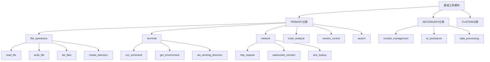

# 基础工具模块设计

## 1. 概述

基础工具模块为MCP工具集提供核心功能实现，覆盖文件操作、终端执行、网络访问、代码分析、版本控制和搜索等主要分类。所有工具都遵循统一的MCP协议接口规范，支持标准化的参数验证、错误处理和性能监控。

### 1.1 设计原则
- **MCP标准兼容**：所有工具完全符合MCP协议规范
- **模块化架构**：按功能分类组织，支持独立部署
- **统一接口**：所有工具使用相同的执行接口和错误处理机制
- **性能优化**：支持并发执行、结果缓存和资源管理
- **安全第一**：严格的权限控制和参数验证

### 1.2 工具分类体系


## 2. 工具执行框架

### 2.1 统一执行接口
```
interface BaseTool:
  # 工具标识
  get_definition() -> ToolDefinition
  get_name() -> string
  get_version() -> string

  # 执行控制
  execute(request: ToolExecutionRequest) -> ToolExecutionResult
  validate_parameters(params: Map<string, any>) -> ValidationResult

  # 状态管理
  get_status() -> ToolStatus
  is_available() -> boolean

  # 资源管理
  estimate_resources(params: Map<string, any>) -> ResourceEstimate
  cleanup() -> Result<void>

ToolExecutionRequest:
  - tool_name: string
  - parameters: Map<string, any>
  - execution_context: ExecutionContext
  - timeout: number | null
  - priority: Priority

ToolExecutionResult:
  - success: boolean
  - content: any | null
  - error: ToolError | null
  - metadata: ExecutionMetadata
  - resources_used: ResourceUsage

ExecutionContext:
  - request_id: string
  - session_id: string | null
  - user_info: UserInfo | null
  - working_directory: string
  - environment_variables: Map<string, string>
  - permissions: List<string>

ExecutionMetadata:
  - execution_time: number  # milliseconds
  - memory_used: number     # bytes
  - cpu_time: number       # milliseconds
  - io_operations: number
  - cache_hit: boolean
```

### 2.2 参数验证框架
```
interface ParameterValidator:
  # 验证方法
  validate(params: Map<string, any>, schema: JSONSchema) -> ValidationResult
  validate_type(value: any, expected_type: string) -> boolean
  validate_range(value: number, min: number, max: number) -> boolean
  validate_pattern(value: string, pattern: string) -> boolean

  # 安全验证
  validate_path(path: string, allowed_paths: List<string>) -> boolean
  validate_command(command: string, allowed_commands: List<string>) -> boolean
  validate_url(url: string, allowed_domains: List<string>) -> boolean

  # 自定义验证
  register_validator(name: string, validator: CustomValidator) -> void
  remove_validator(name: string) -> void

ValidationResult:
  - is_valid: boolean
  - errors: List<ValidationError>
  - warnings: List<ValidationWarning>
  - sanitized_params: Map<string, any>

ValidationError:
  - field: string
  - message: string
  - code: string
  - details: Map<string, any>

CustomValidator:
  validate(value: any, options: Map<string, any>) -> ValidationResult
```

## 3. PRIMARY分类工具详细设计

### 3.1 file_operations（文件操作）

#### 3.1.1 read_file工具
```
ToolDefinition:
  name: "read_file"
  display_name: "读取文件"
  description: "读取指定文件的内容，支持文本和二进制文件"
  category: "file_operations"
  version: "1.0.0"

  input_schema:
    type: "object"
    properties:
      path:
        type: "string"
        description: "文件路径（绝对或相对路径）"
        pattern: "^[^<>:\"|?*]+$"
      encoding:
        type: "string"
        enum: ["utf-8", "gbk", "ascii", "binary"]
        default: "utf-8"
        description: "文件编码格式"
      max_size:
        type: "integer"
        minimum: 1
        maximum: 104857600  # 100MB
        default: 10485760   # 10MB
        description: "最大读取字节数"
      start_line:
        type: "integer"
        minimum: 1
        description: "起始行号（可选）"
      end_line:
        type: "integer"
        minimum: 1
        description: "结束行号（可选）"
    required: ["path"]

  output_schema:
    type: "object"
    properties:
      content:
        type: "string"
        description: "文件内容"
      metadata:
        type: "object"
        properties:
          size: { type: "integer" }
          modified_time: { type: "string", format: "date-time" }
          encoding: { type: "string" }
          lines_count: { type: "integer" }
          is_binary: { type: "boolean" }

ReadFileImplementation:
  execute(request: ToolExecutionRequest) -> ToolExecutionResult:
    1. 验证文件路径安全性
    2. 检查文件存在性和可读性
    3. 验证文件大小限制
    4. 根据编码读取内容
    5. 处理行号范围（如果指定）
    6. 返回内容和元数据
```

#### 3.1.2 write_file工具
```
ToolDefinition:
  name: "write_file"
  display_name: "写入文件"
  description: "写入内容到指定文件，支持创建新文件和覆盖现有文件"

  input_schema:
    type: "object"
    properties:
      path:
        type: "string"
        description: "文件路径"
      content:
        type: "string"
        description: "要写入的内容"
      encoding:
        type: "string"
        enum: ["utf-8", "gbk", "ascii"]
        default: "utf-8"
      mode:
        type: "string"
        enum: ["create", "overwrite", "append"]
        default: "create"
        description: "写入模式"
      backup:
        type: "boolean"
        default: false
        description: "是否创建备份"
      permissions:
        type: "string"
        pattern: "^[0-7]{3}$"
        default: "644"
        description: "文件权限（Unix格式）"
    required: ["path", "content"]

  output_schema:
    type: "object"
    properties:
      bytes_written: { type: "integer" }
      backup_path: { type: "string" }
      created_directories: { type: "array", items: { type: "string" } }
```

#### 3.1.3 list_files工具
```
ToolDefinition:
  name: "list_files"
  display_name: "列出文件"
  description: "列出目录中的文件和子目录"

  input_schema:
    type: "object"
    properties:
      path:
        type: "string"
        default: "."
        description: "目录路径"
      recursive:
        type: "boolean"
        default: false
        description: "是否递归列出子目录"
      include_hidden:
        type: "boolean"
        default: false
        description: "是否包含隐藏文件"
      pattern:
        type: "string"
        description: "文件名匹配模式（glob）"
      file_types:
        type: "array"
        items:
          type: "string"
          enum: ["file", "directory", "symlink"]
        default: ["file", "directory"]
      max_depth:
        type: "integer"
        minimum: 1
        maximum: 10
        default: 5
        description: "最大递归深度"
      sort_by:
        type: "string"
        enum: ["name", "size", "modified_time", "created_time"]
        default: "name"
      sort_order:
        type: "string"
        enum: ["asc", "desc"]
        default: "asc"
    required: ["path"]

  output_schema:
    type: "object"
    properties:
      files:
        type: "array"
        items:
          type: "object"
          properties:
            name: { type: "string" }
            path: { type: "string" }
            type: { type: "string", enum: ["file", "directory", "symlink"] }
            size: { type: "integer" }
            modified_time: { type: "string", format: "date-time" }
            permissions: { type: "string" }
            is_hidden: { type: "boolean" }
      total_count: { type: "integer" }
      directory_count: { type: "integer" }
      file_count: { type: "integer" }
```

### 3.2 terminal（终端操作）

#### 3.2.1 run_command工具
```
ToolDefinition:
  name: "run_command"
  display_name: "执行命令"
  description: "在终端中执行命令并返回结果"

  input_schema:
    type: "object"
    properties:
      command:
        type: "string"
        description: "要执行的命令"
        maxLength: 4096
      args:
        type: "array"
        items: { type: "string" }
        description: "命令参数"
      working_directory:
        type: "string"
        description: "工作目录"
      environment:
        type: "object"
        additionalProperties: { type: "string" }
        description: "环境变量"
      timeout:
        type: "integer"
        minimum: 1
        maximum: 3600  # 1小时
        default: 30
        description: "超时时间（秒）"
      capture_output:
        type: "boolean"
        default: true
        description: "是否捕获输出"
      shell:
        type: "boolean"
        default: false
        description: "是否使用shell执行"
      input:
        type: "string"
        description: "标准输入内容"
    required: ["command"]

  output_schema:
    type: "object"
    properties:
      exit_code: { type: "integer" }
      stdout: { type: "string" }
      stderr: { type: "string" }
      execution_time: { type: "number" }
      pid: { type: "integer" }
      signal: { type: "string" }

RunCommandImplementation:
  execute(request: ToolExecutionRequest) -> ToolExecutionResult:
    1. 验证命令安全性（命令白名单检查）
    2. 设置执行环境（工作目录、环境变量）
    3. 启动子进程
    4. 监控执行状态和超时
    5. 收集输出和错误信息
    6. 返回执行结果
```

### 3.3 network（网络操作）

#### 3.3.1 http_request工具
```
ToolDefinition:
  name: "http_request"
  display_name: "HTTP请求"
  description: "发送HTTP/HTTPS请求并返回响应"

  input_schema:
    type: "object"
    properties:
      url:
        type: "string"
        format: "uri"
        description: "请求URL"
      method:
        type: "string"
        enum: ["GET", "POST", "PUT", "DELETE", "PATCH", "HEAD", "OPTIONS"]
        default: "GET"
      headers:
        type: "object"
        additionalProperties: { type: "string" }
        description: "请求头"
      body:
        type: "string"
        description: "请求体（JSON字符串或普通文本）"
      timeout:
        type: "integer"
        minimum: 1
        maximum: 300  # 5分钟
        default: 30
      follow_redirects:
        type: "boolean"
        default: true
      max_redirects:
        type: "integer"
        minimum: 0
        maximum: 10
        default: 5
      verify_ssl:
        type: "boolean"
        default: true
      proxy:
        type: "string"
        description: "代理服务器地址"
      auth:
        type: "object"
        properties:
          type: { type: "string", enum: ["basic", "bearer", "custom"] }
          username: { type: "string" }
          password: { type: "string" }
          token: { type: "string" }
    required: ["url"]

  output_schema:
    type: "object"
    properties:
      status_code: { type: "integer" }
      headers: { type: "object" }
      body: { type: "string" }
      content_type: { type: "string" }
      content_length: { type: "integer" }
      response_time: { type: "number" }
      redirects: { type: "array", items: { type: "string" } }
```

### 3.4 code_analysis（代码分析）

#### 3.4.1 analyze_code工具
```
ToolDefinition:
  name: "analyze_code"
  display_name: "代码分析"
  description: "分析代码文件的结构、语法和质量"

  input_schema:
    type: "object"
    properties:
      file_path:
        type: "string"
        description: "代码文件路径"
      language:
        type: "string"
        enum: ["python", "javascript", "typescript", "java", "cpp", "go", "rust", "auto"]
        default: "auto"
        description: "编程语言（auto为自动检测）"
      analysis_types:
        type: "array"
        items:
          type: "string"
          enum: ["syntax", "structure", "complexity", "dependencies", "security", "performance"]
        default: ["syntax", "structure"]
        description: "分析类型"
      depth:
        type: "string"
        enum: ["basic", "detailed", "comprehensive"]
        default: "basic"
        description: "分析深度"
    required: ["file_path"]

  output_schema:
    type: "object"
    properties:
      language: { type: "string" }
      syntax_errors: { type: "array" }
      structure:
        type: "object"
        properties:
          functions: { type: "array" }
          classes: { type: "array" }
          imports: { type: "array" }
          exports: { type: "array" }
      metrics:
        type: "object"
        properties:
          lines_of_code: { type: "integer" }
          complexity: { type: "number" }
          maintainability_index: { type: "number" }
      issues:
        type: "array"
        items:
          type: "object"
          properties:
            type: { type: "string" }
            severity: { type: "string" }
            line: { type: "integer" }
            message: { type: "string" }
```

### 3.5 version_control（版本控制）

#### 3.5.1 git_status工具
```
ToolDefinition:
  name: "git_status"
  display_name: "Git状态查询"
  description: "获取Git仓库的当前状态信息"

  input_schema:
    type: "object"
    properties:
      repository_path:
        type: "string"
        default: "."
        description: "Git仓库路径"
      include_untracked:
        type: "boolean"
        default: true
        description: "是否包含未跟踪文件"
      porcelain:
        type: "boolean"
        default: false
        description: "是否使用机器可读格式"
    required: []

  output_schema:
    type: "object"
    properties:
      branch: { type: "string" }
      commit_hash: { type: "string" }
      is_clean: { type: "boolean" }
      staged_files: { type: "array", items: { type: "string" } }
      modified_files: { type: "array", items: { type: "string" } }
      untracked_files: { type: "array", items: { type: "string" } }
      ahead_behind:
        type: "object"
        properties:
          ahead: { type: "integer" }
          behind: { type: "integer" }
          remote: { type: "string" }
```

#### 3.5.2 git_log工具
```
ToolDefinition:
  name: "git_log"
  display_name: "Git提交历史"
  description: "获取Git仓库的提交历史记录"

  input_schema:
    type: "object"
    properties:
      repository_path:
        type: "string"
        default: "."
      max_count:
        type: "integer"
        minimum: 1
        maximum: 1000
        default: 10
        description: "最大提交数量"
      since:
        type: "string"
        format: "date"
        description: "起始日期（YYYY-MM-DD）"
      until:
        type: "string"
        format: "date"
        description: "结束日期（YYYY-MM-DD）"
      author:
        type: "string"
        description: "作者过滤"
      file_path:
        type: "string"
        description: "特定文件的历史"
      format:
        type: "string"
        enum: ["full", "oneline", "short", "medium"]
        default: "medium"
    required: []

  output_schema:
    type: "object"
    properties:
      commits:
        type: "array"
        items:
          type: "object"
          properties:
            hash: { type: "string" }
            short_hash: { type: "string" }
            author: { type: "string" }
            author_email: { type: "string" }
            date: { type: "string", format: "date-time" }
            message: { type: "string" }
            changed_files: { type: "array", items: { type: "string" } }
      total_count: { type: "integer" }
```

### 3.6 search（搜索工具）

#### 3.6.1 file_search工具
```
ToolDefinition:
  name: "file_search"
  display_name: "文件搜索"
  description: "在指定目录中搜索文件"

  input_schema:
    type: "object"
    properties:
      search_path:
        type: "string"
        default: "."
        description: "搜索根目录"
      pattern:
        type: "string"
        description: "文件名匹配模式（支持glob和正则）"
      pattern_type:
        type: "string"
        enum: ["glob", "regex", "exact"]
        default: "glob"
      recursive:
        type: "boolean"
        default: true
      max_depth:
        type: "integer"
        minimum: 1
        maximum: 20
        default: 10
      file_types:
        type: "array"
        items: { type: "string", enum: ["file", "directory", "symlink"] }
        default: ["file"]
      size_filter:
        type: "object"
        properties:
          min_size: { type: "integer", minimum: 0 }
          max_size: { type: "integer", minimum: 0 }
      date_filter:
        type: "object"
        properties:
          modified_after: { type: "string", format: "date-time" }
          modified_before: { type: "string", format: "date-time" }
      max_results:
        type: "integer"
        minimum: 1
        maximum: 10000
        default: 1000
    required: ["pattern"]

  output_schema:
    type: "object"
    properties:
      results:
        type: "array"
        items:
          type: "object"
          properties:
            path: { type: "string" }
            name: { type: "string" }
            type: { type: "string" }
            size: { type: "integer" }
            modified_time: { type: "string", format: "date-time" }
            relative_path: { type: "string" }
      total_found: { type: "integer" }
      search_time: { type: "number" }
      truncated: { type: "boolean" }
```

#### 3.6.2 content_search工具
```
ToolDefinition:
  name: "content_search"
  display_name: "内容搜索"
  description: "在文件内容中搜索指定文本"

  input_schema:
    type: "object"
    properties:
      search_path:
        type: "string"
        default: "."
      query:
        type: "string"
        description: "搜索查询文本"
      query_type:
        type: "string"
        enum: ["text", "regex"]
        default: "text"
      case_sensitive:
        type: "boolean"
        default: false
      whole_word:
        type: "boolean"
        default: false
      file_patterns:
        type: "array"
        items: { type: "string" }
        description: "文件名模式（包含）"
      exclude_patterns:
        type: "array"
        items: { type: "string" }
        description: "文件名模式（排除）"
      max_file_size:
        type: "integer"
        default: 10485760  # 10MB
        description: "最大搜索文件大小"
      context_lines:
        type: "integer"
        minimum: 0
        maximum: 10
        default: 2
        description: "上下文行数"
      max_results:
        type: "integer"
        minimum: 1
        maximum: 10000
        default: 1000
    required: ["query"]

  output_schema:
    type: "object"
    properties:
      matches:
        type: "array"
        items:
          type: "object"
          properties:
            file_path: { type: "string" }
            line_number: { type: "integer" }
            line_content: { type: "string" }
            match_start: { type: "integer" }
            match_end: { type: "integer" }
            context_before: { type: "array", items: { type: "string" } }
            context_after: { type: "array", items: { type: "string" } }
      files_searched: { type: "integer" }
      total_matches: { type: "integer" }
      search_time: { type: "number" }
```

## 4. 工具性能优化

### 4.1 缓存策略
```
interface ToolCache:
  # 缓存管理
  get(key: string) -> CacheEntry | null
  set(key: string, value: any, ttl: number) -> void
  invalidate(key: string) -> void
  clear(pattern: string) -> void

  # 缓存策略
  should_cache(tool_name: string, params: Map<string, any>) -> boolean
  generate_cache_key(tool_name: string, params: Map<string, any>) -> string
  get_ttl(tool_name: string, result_size: number) -> number

  # 缓存统计
  get_hit_rate() -> number
  get_size() -> number
  get_stats() -> CacheStats

CacheEntry:
  - value: any
  - created_at: ISO8601
  - expires_at: ISO8601
  - access_count: number
  - last_accessed: ISO8601

CacheStats:
  - hit_count: number
  - miss_count: number
  - eviction_count: number
  - size_bytes: number
  - oldest_entry: ISO8601
```

### 4.2 并发控制
```
interface ConcurrencyManager:
  # 并发限制
  acquire_slot(tool_name: string, priority: Priority) -> SlotToken | null
  release_slot(token: SlotToken) -> void

  # 队列管理
  enqueue_request(request: ToolExecutionRequest) -> QueuePosition
  get_queue_status() -> QueueStatus

  # 资源监控
  get_active_executions() -> List<ExecutionInfo>
  get_resource_usage() -> ResourceUsage

  # 优先级调度
  set_priority_weights(weights: Map<Priority, number>) -> void
  reschedule_queue() -> void

Priority: "low" | "normal" | "high" | "critical"

SlotToken:
  - id: string
  - tool_name: string
  - acquired_at: ISO8601
  - priority: Priority

QueueStatus:
  - total_queued: number
  - by_priority: Map<Priority, number>
  - estimated_wait_time: number
  - average_execution_time: number
```

### 4.3 资源管理
```
interface ResourceManager:
  # 资源限制
  set_limits(tool_name: string, limits: ResourceLimits) -> void
  get_limits(tool_name: string) -> ResourceLimits

  # 资源监控
  monitor_execution(execution_id: string) -> ResourceMonitor
  get_current_usage() -> ResourceUsage

  # 资源清理
  cleanup_expired_resources() -> void
  force_cleanup(execution_id: string) -> void

  # 预估和预留
  estimate_resources(tool_name: string, params: Map<string, any>) -> ResourceEstimate
  reserve_resources(estimate: ResourceEstimate) -> ReservationToken

ResourceLimits:
  - max_memory: number      # bytes
  - max_cpu_time: number    # milliseconds
  - max_io_operations: number
  - max_network_bandwidth: number  # bytes/second
  - max_file_handles: number

ResourceUsage:
  - memory_used: number
  - cpu_time_used: number
  - io_operations: number
  - network_bytes: number
  - file_handles: number
```

## 5. 错误处理和恢复

### 5.1 错误分类体系
```
ToolError:
  - code: ErrorCode
  - message: string
  - details: Map<string, any>
  - recoverable: boolean
  - retry_after: number | null
  - caused_by: Error | null

ErrorCode:
  # 参数错误
  - INVALID_PARAMETER: "TOOL_E001"
  - MISSING_PARAMETER: "TOOL_E002"
  - PARAMETER_TYPE_ERROR: "TOOL_E003"

  # 权限错误
  - PERMISSION_DENIED: "TOOL_E101"
  - INSUFFICIENT_PRIVILEGES: "TOOL_E102"
  - ACCESS_FORBIDDEN: "TOOL_E103"

  # 资源错误
  - RESOURCE_NOT_FOUND: "TOOL_E201"
  - RESOURCE_BUSY: "TOOL_E202"
  - RESOURCE_EXHAUSTED: "TOOL_E203"
  - DISK_FULL: "TOOL_E204"

  # 执行错误
  - EXECUTION_TIMEOUT: "TOOL_E301"
  - EXECUTION_FAILED: "TOOL_E302"
  - COMMAND_NOT_FOUND: "TOOL_E303"

  # 网络错误
  - NETWORK_UNREACHABLE: "TOOL_E401"
  - CONNECTION_TIMEOUT: "TOOL_E402"
  - DNS_RESOLUTION_FAILED: "TOOL_E403"

  # 系统错误
  - SYSTEM_ERROR: "TOOL_E501"
  - OUT_OF_MEMORY: "TOOL_E502"
  - INTERNAL_ERROR: "TOOL_E503"
```

### 5.2 错误恢复策略
```
interface ErrorRecoveryHandler:
  # 错误处理
  handle_error(error: ToolError, context: ExecutionContext) -> RecoveryAction

  # 重试策略
  should_retry(error: ToolError, attempt_count: number) -> boolean
  get_retry_delay(attempt_count: number) -> number
  get_max_retries(tool_name: string) -> number

  # 降级处理
  get_fallback_result(tool_name: string, params: Map<string, any>) -> ToolExecutionResult | null

  # 错误上报
  report_error(error: ToolError, context: ExecutionContext) -> void

RecoveryAction:
  - action: "retry" | "fallback" | "fail" | "escalate"
  - delay: number | null
  - modified_params: Map<string, any> | null
  - fallback_result: ToolExecutionResult | null
```

## 6. 工具模块组织结构

### 6.1 模块划分
```
tools/
├── __init__.py
├── base/                    # 基础框架
│   ├── tool_interface.py    # 工具接口定义
│   ├── parameter_validator.py
│   ├── execution_context.py
│   ├── error_handler.py
│   └── cache_manager.py
├── file_operations/         # 文件操作工具
│   ├── __init__.py
│   ├── read_file.py
│   ├── write_file.py
│   ├── list_files.py
│   ├── create_directory.py
│   └── file_utils.py
├── terminal/                # 终端工具
│   ├── __init__.py
│   ├── run_command.py
│   ├── environment.py
│   └── process_manager.py
├── network/                 # 网络工具
│   ├── __init__.py
│   ├── http_client.py
│   ├── websocket_client.py
│   └── dns_resolver.py
├── code_analysis/           # 代码分析工具
│   ├── __init__.py
│   ├── syntax_analyzer.py
│   ├── structure_analyzer.py
│   └── metrics_calculator.py
├── version_control/         # 版本控制工具
│   ├── __init__.py
│   ├── git_operations.py
│   └── svn_operations.py
└── search/                  # 搜索工具
    ├── __init__.py
    ├── file_search.py
    ├── content_search.py
    └── semantic_search.py
```

### 6.2 注册和发现机制
```
interface ToolModuleLoader:
  # 模块加载
  load_module(module_path: string) -> ToolModule
  unload_module(module_name: string) -> Result<void>
  reload_module(module_name: string) -> Result<void>

  # 工具发现
  discover_tools(module: ToolModule) -> List<ToolDefinition>
  validate_tools(tools: List<ToolDefinition>) -> ValidationResult

  # 依赖管理
  resolve_dependencies(module: ToolModule) -> List<string>
  check_compatibility(module: ToolModule) -> CompatibilityReport

ToolModule:
  - name: string
  - version: string
  - description: string
  - dependencies: List<string>
  - tools: List<BaseTool>
  - configuration: ModuleConfig

  # 生命周期
  initialize(config: ModuleConfig) -> Result<void>
  shutdown() -> Result<void>
  health_check() -> HealthStatus
```

## 7. 配置和部署

### 7.1 工具配置结构
```yaml
# config/modules/tools.yaml
tools:
  # 全局配置
  global:
    max_concurrent_executions: 50
    default_timeout: 30
    cache_enabled: true
    cache_size_mb: 256

  # 分类配置
  categories:
    file_operations:
      enabled: true
      max_file_size: 104857600  # 100MB
      allowed_paths:
        - "/workspace"
        - "/tmp"
        - "/home/user/projects"
      forbidden_paths:
        - "/etc"
        - "/bin"
        - "/usr/bin"

    terminal:
      enabled: true
      allowed_commands:
        - "ls"
        - "cat"
        - "grep"
        - "find"
        - "git"
      shell_enabled: false
      max_execution_time: 300

    network:
      enabled: true
      allowed_domains:
        - "*.github.com"
        - "api.openai.com"
        - "localhost"
      max_request_size: 10485760  # 10MB
      timeout: 30

  # 具体工具配置
  specific_tools:
    read_file:
      cache_ttl: 300  # 5分钟
      max_cache_size: 10485760  # 10MB

    run_command:
      enable_shell: false
      log_commands: true
      sandbox_enabled: true
```

### 7.2 安全配置
```yaml
# config/modules/tool_security.yaml
security:
  # 全局安全设置
  sandbox_enabled: true
  audit_all_executions: true

  # 权限控制
  permissions:
    file_operations:
      read_file:
        required_permissions: ["file:read"]
        path_restrictions: true
      write_file:
        required_permissions: ["file:write"]
        backup_required: true

    terminal:
      run_command:
        required_permissions: ["system:execute"]
        command_whitelist: true

  # 访问限制
  rate_limits:
    per_user:
      requests_per_minute: 60
      concurrent_executions: 5
    per_tool:
      file_operations: 30
      terminal: 10
      network: 20

  # 监控告警
  alerts:
    failed_executions_threshold: 10
    permission_denied_threshold: 5
    resource_usage_threshold: 80
```

这个基础工具模块设计提供了完整的框架，包括：
- 统一的工具执行接口
- 详细的工具分类和实现规范
- 完整的性能优化策略
- robust的错误处理机制
- 清晰的模块组织结构
- 全面的配置和安全方案

下一步可以继续细化具体工具的实现细节，或者开始设计ContextEngine适配模块。
