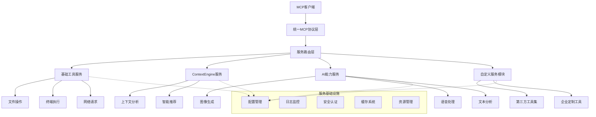

# MCP工具集核心架构设计

## 1. 概述

第四次迭代专注于MCP工具集项目本身的架构完善，建立一个可扩展的、模块化的MCP服务提供平台。本次设计将MCP工具集定位为一个通用的工具服务平台，不仅包含基础工具和ContextEngine适配，还能轻松集成任何新的MCP服务模块。

### 1.1 项目重新定位
- **从工具集到平台**：MCP工具集不仅是工具的集合，更是一个MCP服务提供平台
- **模块化服务架构**：每个功能模块都可以独立提供MCP服务
- **统一服务入口**：所有MCP服务通过统一的协议处理层对外提供
- **动态服务发现**：支持运行时动态加载和卸载服务模块

### 1.2 平台架构愿景


## 2. 服务模块架构设计

### 2.1 服务模块接口规范
```
interface ServiceModule:
  # 模块标识
  get_module_info() -> ModuleInfo
  get_service_namespace() -> string
  get_supported_tools() -> List<ToolDefinition>
  
  # 生命周期管理
  initialize(config: ModuleConfig, context: ServiceContext) -> Result<void>
  start() -> Result<void>
  stop() -> Result<void>
  shutdown() -> Result<void>
  
  # 服务能力
  handle_tool_call(request: ToolCallRequest) -> ToolCallResponse
  list_available_tools() -> List<ToolDefinition>
  get_tool_schema(tool_name: string) -> JSONSchema | null
  
  # 健康检查
  health_check() -> HealthStatus
  get_metrics() -> ModuleMetrics
  
  # 配置管理
  reload_config(config: ModuleConfig) -> Result<void>
  validate_config(config: ModuleConfig) -> ValidationResult

ModuleInfo:
  - module_id: string
  - name: string
  - version: string
  - description: string
  - author: string
  - dependencies: List<string>
  - capabilities: List<Capability>
  - namespace: string  # 工具命名空间前缀

ServiceContext:
  - platform_version: string
  - shared_services: SharedServices
  - event_bus: EventBus
  - logger: Logger
  - config_manager: ConfigManager
  - metrics_collector: MetricsCollector

Capability:
  - type: CapabilityType
  - version: string
  - metadata: Map<string, any>

CapabilityType:
  - FILE_OPERATIONS
  - TERMINAL_EXECUTION
  - NETWORK_ACCESS
  - CODE_ANALYSIS
  - VERSION_CONTROL
  - SEARCH_INDEXING
  - CONTEXT_ANALYSIS
  - AI_ASSISTANCE
  - IMAGE_PROCESSING
  - AUDIO_PROCESSING
  - DATA_TRANSFORMATION
  - CUSTOM
```

### 2.2 服务注册和发现机制
```
interface ServiceRegistry:
  # 服务注册
  register_service(module: ServiceModule) -> Result<ServiceId>
  unregister_service(service_id: ServiceId) -> Result<void>
  
  # 服务发现
  discover_services() -> List<ServiceInfo>
  find_service_by_capability(capability: CapabilityType) -> List<ServiceInfo>
  find_service_by_namespace(namespace: string) -> ServiceInfo | null
  
  # 工具管理
  list_all_tools() -> List<ToolDefinition>
  find_tool(tool_name: string) -> ToolLocation | null
  resolve_tool_conflicts() -> ConflictResolution
  
  # 服务监控
  get_service_status(service_id: ServiceId) -> ServiceStatus
  get_all_services_health() -> Map<ServiceId, HealthStatus>

ServiceInfo:
  - service_id: ServiceId
  - module_info: ModuleInfo
  - status: ServiceStatus
  - load_time: ISO8601
  - last_health_check: ISO8601
  - provided_tools: List<string>

ToolLocation:
  - service_id: ServiceId
  - namespace: string
  - tool_name: string
  - full_name: string  # namespace.tool_name

ServiceStatus: "loading" | "running" | "stopped" | "error" | "unregistered"
```

### 2.3 服务路由层设计
```
interface ServiceRouter:
  # 路由决策
  route_tool_call(request: ToolCallRequest) -> RoutingDecision
  
  # 负载均衡
  select_service_instance(tool_name: string, instances: List<ServiceId>) -> ServiceId
  
  # 故障转移
  handle_service_failure(failed_service: ServiceId, request: ToolCallRequest) -> RoutingDecision
  
  # 路由策略
  set_routing_strategy(strategy: RoutingStrategy) -> void
  get_routing_rules() -> List<RoutingRule>

RoutingDecision:
  - target_service: ServiceId
  - strategy: RoutingStrategy
  - fallback_services: List<ServiceId>
  - timeout: number
  - retry_config: RetryConfig

RoutingStrategy:
  - type: "round_robin" | "least_connections" | "weighted" | "capability_based"
  - weights: Map<ServiceId, number>
  - preferences: List<ServicePreference>

RoutingRule:
  - pattern: string  # 工具名称匹配模式
  - target_namespace: string
  - priority: number
  - conditions: List<RoutingCondition>

RoutingCondition:
  - type: "user_role" | "request_size" | "time_of_day" | "service_load"
  - operator: "equals" | "greater_than" | "matches"
  - value: any
```

## 3. 平台核心服务设计

### 3.1 配置管理服务
```
interface PlatformConfigManager:
  # 全局配置
  get_platform_config() -> PlatformConfig
  update_platform_config(config: PlatformConfig) -> Result<void>
  
  # 模块配置
  get_module_config(module_id: string) -> ModuleConfig | null
  update_module_config(module_id: string, config: ModuleConfig) -> Result<void>
  
  # 配置热更新
  enable_hot_reload(module_id: string) -> void
  disable_hot_reload(module_id: string) -> void
  
  # 配置版本管理
  get_config_version(module_id: string) -> string
  rollback_config(module_id: string, version: string) -> Result<void>
  
  # 配置验证
  validate_platform_config(config: PlatformConfig) -> ValidationResult
  validate_module_config(module_id: string, config: ModuleConfig) -> ValidationResult

PlatformConfig:
  - version: string
  - server:
      host: string
      port: number
      max_connections: number
  - routing:
      strategy: RoutingStrategy
      timeout: number
      retry_attempts: number
  - security:
      authentication_enabled: boolean
      authorization_enabled: boolean
      audit_enabled: boolean
  - monitoring:
      metrics_enabled: boolean
      health_check_interval: number
      log_level: string
  - services:
      auto_discovery: boolean
      load_on_startup: List<string>
      service_directories: List<string>
```

### 3.2 事件总线服务
```
interface PlatformEventBus:
  # 事件发布
  publish_platform_event(event: PlatformEvent) -> void
  publish_service_event(service_id: ServiceId, event: ServiceEvent) -> void
  
  # 事件订阅
  subscribe_platform_events(handler: PlatformEventHandler) -> SubscriptionId
  subscribe_service_events(service_id: ServiceId, handler: ServiceEventHandler) -> SubscriptionId
  
  # 事件过滤
  subscribe_filtered_events(filter: EventFilter, handler: EventHandler) -> SubscriptionId
  
  # 事件历史
  get_event_history(filter: EventFilter, limit: number) -> List<Event>
  
  # 事件统计
  get_event_statistics(time_range: TimeRange) -> EventStatistics

PlatformEvent:
  - event_type: PlatformEventType
  - timestamp: ISO8601
  - source: string
  - data: Map<string, any>

PlatformEventType:
  - PLATFORM_STARTING
  - PLATFORM_READY
  - PLATFORM_STOPPING
  - PLATFORM_SHUTDOWN
  - SERVICE_REGISTERED
  - SERVICE_UNREGISTERED
  - SERVICE_HEALTH_CHANGED
  - CONFIGURATION_UPDATED
  - SECURITY_ALERT

ServiceEvent:
  - service_id: ServiceId
  - event_type: ServiceEventType
  - timestamp: ISO8601
  - data: Map<string, any>

ServiceEventType:
  - SERVICE_INITIALIZING
  - SERVICE_STARTED
  - SERVICE_STOPPED
  - SERVICE_ERROR
  - TOOL_CALLED
  - TOOL_COMPLETED
  - TOOL_FAILED
  - CONFIGURATION_RELOADED
```

### 3.3 安全认证服务
```
interface PlatformSecurityManager:
  # 认证管理
  authenticate_client(credentials: ClientCredentials) -> AuthenticationResult
  validate_token(token: string) -> TokenValidationResult
  refresh_token(refresh_token: string) -> TokenRefreshResult
  
  # 授权管理
  authorize_tool_access(user: UserInfo, tool_name: string) -> AuthorizationResult
  check_service_permissions(user: UserInfo, service_id: ServiceId) -> PermissionCheckResult
  
  # 会话管理
  create_session(user: UserInfo) -> SessionInfo
  get_session(session_id: string) -> SessionInfo | null
  invalidate_session(session_id: string) -> void
  
  # 审计日志
  log_access_attempt(user: UserInfo, resource: string, result: AccessResult) -> void
  log_security_event(event: SecurityEvent) -> void
  
  # 安全策略
  get_security_policy() -> SecurityPolicy
  update_security_policy(policy: SecurityPolicy) -> Result<void>

ClientCredentials:
  - type: "api_key" | "oauth" | "certificate" | "basic_auth"
  - identifier: string
  - secret: string
  - additional_data: Map<string, any>

AuthenticationResult:
  - success: boolean
  - user_info: UserInfo | null
  - access_token: string | null
  - refresh_token: string | null
  - expires_at: ISO8601 | null
  - error_message: string | null

SecurityPolicy:
  - authentication_required: boolean
  - token_expiry_hours: number
  - max_concurrent_sessions: number
  - allowed_ip_ranges: List<string>
  - rate_limits: Map<string, RateLimit>
  - audit_settings: AuditSettings
```

## 4. 服务模块实现规范

### 4.1 基础工具服务模块
```
class BasicToolsServiceModule implements ServiceModule:
  # 模块信息
  module_info:
    module_id: "basic_tools"
    name: "基础工具服务"
    version: "1.0.0"
    namespace: "basic"
    capabilities: [FILE_OPERATIONS, TERMINAL_EXECUTION, NETWORK_ACCESS, 
                   CODE_ANALYSIS, VERSION_CONTROL, SEARCH_INDEXING]
  
  # 提供的工具
  supported_tools:
    - "basic.read_file"
    - "basic.write_file"
    - "basic.list_files"
    - "basic.run_command"
    - "basic.http_request"
    - "basic.git_status"
    - "basic.file_search"
    - "basic.content_search"
    - "basic.analyze_code"
  
  # 配置结构
  config_schema:
    type: "object"
    properties:
      file_operations:
        max_file_size: { type: "integer" }
        allowed_paths: { type: "array" }
      terminal:
        allowed_commands: { type: "array" }
        sandbox_enabled: { type: "boolean" }
      network:
        allowed_domains: { type: "array" }
        timeout: { type: "integer" }
```

### 4.2 ContextEngine适配服务模块
```
class ContextEngineServiceModule implements ServiceModule:
  # 模块信息
  module_info:
    module_id: "context_engine"
    name: "上下文引擎服务"
    version: "1.0.0"
    namespace: "context"
    capabilities: [CONTEXT_ANALYSIS, AI_ASSISTANCE]
  
  # 提供的工具
  supported_tools:
    - "context.analyze_context"
    - "context.get_recommendations"
    - "context.update_memory"
    - "context.search_similar"
    - "context.generate_summary"
  
  # 依赖服务
  dependencies:
    - "basic_tools"  # 需要基础工具支持
  
  # 适配器接口
  context_engine_adapter:
    # 数据转换
    convert_mcp_to_context_format(request: ToolCallRequest) -> ContextEngineRequest
    convert_context_to_mcp_format(response: ContextEngineResponse) -> ToolCallResponse
    
    # 状态同步
    sync_context_state() -> Result<void>
    
    # 错误处理
    handle_context_engine_error(error: ContextEngineError) -> ToolError
```

### 4.3 AI能力服务模块示例
```
class AICapabilitiesServiceModule implements ServiceModule:
  # 模块信息
  module_info:
    module_id: "ai_capabilities"
    name: "AI能力服务"
    version: "1.0.0"
    namespace: "ai"
    capabilities: [AI_ASSISTANCE, IMAGE_PROCESSING, AUDIO_PROCESSING]
  
  # 提供的工具
  supported_tools:
    - "ai.generate_image"      # 图像生成
    - "ai.analyze_image"       # 图像分析
    - "ai.transcribe_audio"    # 语音转文本
    - "ai.synthesize_speech"   # 文本转语音
    - "ai.translate_text"      # 文本翻译
    - "ai.summarize_content"   # 内容摘要
  
  # 外部API集成
  api_integrations:
    - service: "openai"
      models: ["gpt-4", "dall-e-3"]
    - service: "azure_cognitive"
      services: ["speech", "vision"]
    - service: "google_cloud"
      apis: ["translate", "text-to-speech"]
```

## 5. 平台部署和运维

### 5.1 服务发现和注册
```
# 自动服务发现配置
service_discovery:
  # 扫描目录
  scan_directories:
    - "./services"
    - "./plugins"
    - "/opt/mcp-toolkit/services"
  
  # 服务模块文件模式
  module_patterns:
    - "*.service.py"
    - "*/service.yaml"
    - "service_*.json"
  
  # 自动加载规则
  auto_load:
    - pattern: "basic_*"
      priority: 1
    - pattern: "context_*"
      priority: 2
    - pattern: "ai_*"
      priority: 3
      requires_approval: true
  
  # 健康检查
  health_check:
    interval_seconds: 30
    timeout_seconds: 10
    failure_threshold: 3
```

### 5.2 服务配置管理
```yaml
# config/platform.yaml
platform:
  version: "1.0.0"
  
  server:
    host: "0.0.0.0"
    port: 8080
    workers: 4
    max_connections: 1000
    
  routing:
    strategy: "capability_based"
    load_balancing: "round_robin"
    timeout_seconds: 30
    retry_attempts: 3
    
  security:
    authentication:
      enabled: true
      type: "bearer_token"
      token_expiry_hours: 24
    authorization:
      enabled: true
      default_policy: "deny"
    audit:
      enabled: true
      log_level: "info"
      
  monitoring:
    metrics:
      enabled: true
      export_prometheus: true
      collection_interval: 10
    health_checks:
      enabled: true
      interval_seconds: 30
    logging:
      level: "info"
      format: "structured"
      
  services:
    auto_discovery: true
    load_on_startup:
      - "basic_tools"
      - "context_engine"
    service_timeout_seconds: 60
    
# config/services/basic_tools.yaml
service:
  module_id: "basic_tools"
  enabled: true
  priority: 1
  
  configuration:
    file_operations:
      max_file_size_mb: 100
      allowed_paths:
        - "/workspace"
        - "/tmp/mcp-toolkit"
      cache:
        enabled: true
        ttl_seconds: 300
        
    terminal:
      allowed_commands:
        - "ls"
        - "cat"
        - "grep"
        - "git"
      sandbox_enabled: true
      timeout_seconds: 30
      
    network:
      allowed_domains:
        - "*.github.com"
        - "api.openai.com"
      timeout_seconds: 30
      max_request_size_mb: 10
```

### 5.3 监控和指标
```
interface PlatformMonitoring:
  # 平台指标
  get_platform_metrics() -> PlatformMetrics
  
  # 服务指标
  get_service_metrics(service_id: ServiceId) -> ServiceMetrics
  get_all_services_metrics() -> Map<ServiceId, ServiceMetrics>
  
  # 工具使用指标
  get_tool_usage_stats(time_range: TimeRange) -> ToolUsageStats
  
  # 性能指标
  get_performance_metrics() -> PerformanceMetrics
  
  # 告警管理
  set_alert_threshold(metric: string, threshold: number) -> void
  get_active_alerts() -> List<Alert>

PlatformMetrics:
  - uptime_seconds: number
  - total_requests: number
  - active_connections: number
  - memory_usage_mb: number
  - cpu_usage_percent: number
  - disk_usage_percent: number
  - active_services_count: number

ServiceMetrics:
  - service_id: ServiceId
  - status: ServiceStatus
  - requests_handled: number
  - average_response_time_ms: number
  - error_rate_percent: number
  - memory_usage_mb: number
  - uptime_seconds: number

ToolUsageStats:
  - time_range: TimeRange
  - total_calls: number
  - tools_by_category: Map<string, number>
  - most_used_tools: List<ToolUsageStat>
  - average_execution_time_ms: number
  - success_rate_percent: number
```

## 6. 扩展性和插件生态

### 6.1 第三方服务集成规范
```
# 第三方服务集成指南
third_party_integration:
  # 服务模块要求
  requirements:
    - implement ServiceModule interface
    - provide module manifest file
    - include health check endpoint
    - follow naming conventions
    - implement graceful shutdown
    
  # 命名规范
  naming_conventions:
    module_id: "company_product_version"  # 如 "acme_imageai_v1"
    namespace: "company.product"          # 如 "acme.imageai"
    tool_names: "namespace.action"       # 如 "acme.imageai.generate"
    
  # 配置模板
  config_template:
    service:
      module_id: "${MODULE_ID}"
      name: "${SERVICE_NAME}"
      version: "${VERSION}"
      namespace: "${NAMESPACE}"
      
    dependencies:
      - basic_tools  # 可选依赖
      
    configuration:
      api:
        base_url: "${API_BASE_URL}"
        api_key: "${API_KEY}"
        timeout: 30
        
    resources:
      max_memory_mb: 512
      max_concurrent_requests: 10
      
    security:
      required_permissions:
        - "ai:generate_image"
        - "network:external_api"
```

### 6.2 开发工具和SDK
```
interface ServiceDevelopmentKit:
  # 代码生成
  generate_service_template(config: ServiceTemplateConfig) -> ServiceTemplate
  generate_tool_skeleton(tool_definition: ToolDefinition) -> ToolSkeleton
  
  # 验证工具
  validate_service_module(module_path: string) -> ValidationReport
  test_service_integration(module: ServiceModule, test_config: TestConfig) -> TestResult
  
  # 打包工具
  package_service(module_path: string, package_config: PackageConfig) -> ServicePackage
  
  # 部署工具
  deploy_service(package: ServicePackage, target: DeploymentTarget) -> DeploymentResult

ServiceTemplateConfig:
  - module_name: string
  - namespace: string
  - capabilities: List<CapabilityType>
  - target_language: "python" | "typescript" | "go"
  - include_examples: boolean
  - include_tests: boolean
```

## 7. 平台启动和生命周期管理

### 7.1 平台启动流程
```
interface PlatformBootstrap:
  # 启动阶段
  initialize_platform(config: PlatformConfig) -> Result<void>
  load_core_services() -> Result<void>
  discover_service_modules() -> Result<List<ServiceModule>>
  register_discovered_services(modules: List<ServiceModule>) -> Result<void>
  start_all_services() -> Result<void>
  setup_routing() -> Result<void>
  start_mcp_server() -> Result<void>
  
  # 关闭流程
  graceful_shutdown(timeout_seconds: number) -> Result<void>
  stop_all_services() -> Result<void>
  cleanup_resources() -> Result<void>

PlatformStartupPhase:
  1. INITIALIZING     # 平台初始化
  2. LOADING_CONFIG   # 加载配置
  3. STARTING_CORE    # 启动核心服务
  4. DISCOVERING     # 发现服务模块
  5. REGISTERING     # 注册服务
  6. STARTING_SERVICES # 启动服务
  7. CONFIGURING_ROUTES # 配置路由
  8. READY           # 平台就绪
  9. RUNNING         # 正常运行

StartupSequence:
  phase_1_core_services:
    - ConfigManager
    - EventBus
    - SecurityManager
    - Logger
    - MetricsCollector
    
  phase_2_platform_services:
    - ServiceRegistry
    - ServiceRouter
    - HealthMonitor
    - ResourceManager
    
  phase_3_service_modules:
    - BasicToolsService
    - ContextEngineService
    - ThirdPartyServices
```

### 7.2 服务生命周期协调
```
interface ServiceLifecycleCoordinator:
  # 服务依赖管理
  resolve_service_dependencies(services: List<ServiceModule>) -> DependencyGraph
  calculate_startup_order(dependency_graph: DependencyGraph) -> List<ServiceId>
  
  # 启动协调
  start_services_in_order(startup_order: List<ServiceId>) -> Result<void>
  wait_for_service_ready(service_id: ServiceId, timeout: number) -> Result<void>
  
  # 运行时管理
  restart_service(service_id: ServiceId) -> Result<void>
  scale_service(service_id: ServiceId, instances: number) -> Result<void>
  
  # 故障处理
  handle_service_failure(service_id: ServiceId, error: ServiceError) -> RecoveryAction
  isolate_failed_service(service_id: ServiceId) -> Result<void>

DependencyGraph:
  - nodes: Map<ServiceId, ServiceNode>
  - edges: List<DependencyEdge>
  - circular_dependencies: List<CircularDependency>

ServiceNode:
  - service_id: ServiceId
  - dependencies: List<ServiceId>
  - dependents: List<ServiceId>
  - startup_priority: number
  - essential: boolean

RecoveryAction:
  - action: "restart" | "isolate" | "failover" | "alert"
  - delay_seconds: number
  - max_attempts: number
  - fallback_services: List<ServiceId>
```

## 8. 服务间通信和协作

### 8.1 服务间通信接口
```
interface InterServiceCommunication:
  # 服务发现
  discover_service(service_type: string) -> List<ServiceEndpoint>
  resolve_service(service_id: ServiceId) -> ServiceEndpoint | null
  
  # 直接调用
  call_service(target: ServiceId, method: string, params: any) -> Result<any>
  call_service_async(target: ServiceId, method: string, params: any) -> Future<Result<any>>
  
  # 事件通信
  send_event(target: ServiceId, event: ServiceEvent) -> void
  broadcast_event(event: PlatformEvent) -> void
  
  # 数据共享
  share_data(key: string, data: any, ttl: number) -> void
  get_shared_data(key: string) -> any | null
  
  # 状态同步
  sync_service_state(service_id: ServiceId) -> Result<void>
  get_service_state(service_id: ServiceId) -> ServiceState

ServiceEndpoint:
  - service_id: ServiceId
  - host: string
  - port: number
  - protocol: "http" | "grpc" | "internal"
  - health_check_url: string
  - capabilities: List<string>
```

### 8.2 数据共享和缓存
```
interface PlatformDataLayer:
  # 分布式缓存
  set_cache(key: string, value: any, ttl: number, scope: CacheScope) -> void
  get_cache(key: string, scope: CacheScope) -> any | null
  invalidate_cache(pattern: string, scope: CacheScope) -> void
  
  # 服务状态存储
  store_service_state(service_id: ServiceId, state: ServiceState) -> void
  load_service_state(service_id: ServiceId) -> ServiceState | null
  
  # 配置同步
  sync_configuration(service_id: ServiceId, config: ServiceConfig) -> void
  get_effective_config(service_id: ServiceId) -> ServiceConfig
  
  # 会话管理
  create_session(session_data: SessionData) -> SessionId
  get_session(session_id: SessionId) -> SessionData | null
  update_session(session_id: SessionId, updates: SessionUpdate) -> void
  
  # 工作流状态
  store_workflow_state(workflow_id: string, state: WorkflowState) -> void
  get_workflow_state(workflow_id: string) -> WorkflowState | null

CacheScope: "global" | "service" | "user" | "session"

ServiceState:
  - status: ServiceStatus
  - last_activity: ISO8601
  - performance_metrics: PerformanceMetrics
  - resource_usage: ResourceUsage
  - custom_data: Map<string, any>
```

## 9. 高级功能和企业特性

### 9.1 工作流编排
```
interface WorkflowOrchestrator:
  # 工作流定义
  define_workflow(workflow: WorkflowDefinition) -> WorkflowId
  update_workflow(workflow_id: WorkflowId, updates: WorkflowUpdate) -> Result<void>
  delete_workflow(workflow_id: WorkflowId) -> Result<void>
  
  # 工作流执行
  execute_workflow(workflow_id: WorkflowId, inputs: Map<string, any>) -> WorkflowExecution
  pause_workflow(execution_id: ExecutionId) -> Result<void>
  resume_workflow(execution_id: ExecutionId) -> Result<void>
  cancel_workflow(execution_id: ExecutionId) -> Result<void>
  
  # 工作流监控
  get_workflow_status(execution_id: ExecutionId) -> WorkflowStatus
  get_workflow_history(workflow_id: WorkflowId) -> List<WorkflowExecution>
  
  # 条件分支
  evaluate_condition(condition: WorkflowCondition, context: WorkflowContext) -> boolean
  execute_conditional_step(step: ConditionalStep, context: WorkflowContext) -> StepResult

WorkflowDefinition:
  - workflow_id: WorkflowId
  - name: string
  - description: string
  - version: string
  - steps: List<WorkflowStep>
  - error_handling: ErrorHandlingPolicy
  - timeout_minutes: number

WorkflowStep:
  - step_id: string
  - type: StepType
  - tool_call: ToolCall | null
  - condition: WorkflowCondition | null
  - parallel_steps: List<WorkflowStep> | null
  - retry_policy: RetryPolicy
  - timeout_seconds: number

StepType: "tool_call" | "condition" | "parallel" | "loop" | "wait" | "webhook"

WorkflowExecution:
  - execution_id: ExecutionId
  - workflow_id: WorkflowId
  - status: WorkflowExecutionStatus
  - start_time: ISO8601
  - end_time: ISO8601 | null
  - current_step: string | null
  - step_results: Map<string, StepResult>
  - error: WorkflowError | null

WorkflowExecutionStatus: "running" | "completed" | "failed" | "paused" | "cancelled"
```

### 9.2 企业级安全和审计
```
interface EnterpriseSecurityManager:
  # 细粒度权限控制
  define_permission_policy(policy: PermissionPolicy) -> PolicyId
  assign_policy_to_user(user_id: string, policy_id: PolicyId) -> Result<void>
  check_fine_grained_permissions(user: UserInfo, resource: Resource, action: Action) -> PermissionResult
  
  # 数据分类和保护
  classify_data(data: any, context: DataContext) -> DataClassification
  apply_data_protection(data: any, classification: DataClassification) -> ProtectedData
  
  # 安全扫描
  scan_service_module(module: ServiceModule) -> SecurityScanResult
  scan_tool_parameters(tool_call: ToolCall) -> ParameterScanResult
  
  # 威胁检测
  detect_anomalies(user_behavior: UserBehavior) -> List<SecurityAnomaly>
  analyze_access_patterns(access_logs: List<AccessLog>) -> ThreatAnalysis
  
  # 合规性检查
  check_compliance(operation: Operation, regulations: List<Regulation>) -> ComplianceResult
  generate_compliance_report(time_range: TimeRange) -> ComplianceReport

PermissionPolicy:
  - policy_id: PolicyId
  - name: string
  - rules: List<PermissionRule>
  - conditions: List<PolicyCondition>
  - effect: "allow" | "deny"

PermissionRule:
  - resource_pattern: string
  - actions: List<string>
  - conditions: List<RuleCondition>
  - time_restrictions: TimeRestriction | null

DataClassification: "public" | "internal" | "confidential" | "restricted"

SecurityAnomaly:
  - type: AnomalyType
  - severity: "low" | "medium" | "high" | "critical"
  - user_id: string
  - description: string
  - indicators: List<string>
  - recommended_actions: List<string>

AnomalyType:
  - UNUSUAL_ACCESS_PATTERN
  - PRIVILEGE_ESCALATION_ATTEMPT
  - SUSPICIOUS_TOOL_USAGE
  - DATA_EXFILTRATION_RISK
  - BRUTE_FORCE_ATTACK
```

### 9.3 多租户支持
```
interface MultiTenantManager:
  # 租户管理
  create_tenant(tenant_info: TenantInfo) -> TenantId
  update_tenant(tenant_id: TenantId, updates: TenantUpdate) -> Result<void>
  delete_tenant(tenant_id: TenantId) -> Result<void>
  
  # 资源隔离
  allocate_resources(tenant_id: TenantId, allocation: ResourceAllocation) -> Result<void>
  enforce_resource_limits(tenant_id: TenantId) -> void
  
  # 数据隔离
  get_tenant_data_scope(tenant_id: TenantId) -> DataScope
  enforce_data_isolation(request: ToolCallRequest) -> IsolatedRequest
  
  # 服务定制
  customize_service_for_tenant(tenant_id: TenantId, service_id: ServiceId, customization: ServiceCustomization) -> Result<void>
  get_tenant_service_config(tenant_id: TenantId, service_id: ServiceId) -> ServiceConfig
  
  # 计费和使用统计
  track_usage(tenant_id: TenantId, usage: UsageRecord) -> void
  generate_usage_report(tenant_id: TenantId, period: TimePeriod) -> UsageReport

TenantInfo:
  - tenant_id: TenantId
  - name: string
  - contact_info: ContactInfo
  - subscription_tier: SubscriptionTier
  - creation_date: ISO8601
  - status: TenantStatus

ResourceAllocation:
  - max_cpu_cores: number
  - max_memory_gb: number
  - max_storage_gb: number
  - max_concurrent_requests: number
  - allowed_services: List<ServiceId>

DataScope:
  - tenant_id: TenantId
  - data_boundaries: List<DataBoundary>
  - access_restrictions: List<AccessRestriction>
  - encryption_requirements: EncryptionPolicy

UsageRecord:
  - timestamp: ISO8601
  - service_id: ServiceId
  - tool_name: string
  - execution_time_ms: number
  - resources_consumed: ResourceUsage
  - cost: number
```

## 10. 开发和运维工具

### 10.1 开发者工具
```
interface DeveloperTools:
  # 服务开发
  create_service_project(template: ServiceTemplate) -> ProjectStructure
  validate_service_definition(definition: ServiceDefinition) -> ValidationResult
  generate_service_documentation(service: ServiceModule) -> Documentation
  
  # 测试工具
  create_test_suite(service: ServiceModule) -> TestSuite
  run_integration_tests(service: ServiceModule, test_config: TestConfig) -> TestResults
  simulate_load_testing(service: ServiceModule, load_config: LoadTestConfig) -> LoadTestResults
  
  # 调试工具
  enable_debug_mode(service_id: ServiceId) -> void
  trace_tool_execution(tool_call: ToolCall) -> ExecutionTrace
  profile_service_performance(service_id: ServiceId, duration: number) -> PerformanceProfile
  
  # 部署工具
  package_service_for_deployment(service: ServiceModule, target: DeploymentTarget) -> DeploymentPackage
  deploy_to_environment(package: DeploymentPackage, environment: Environment) -> DeploymentResult

ServiceTemplate:
  - template_type: "basic" | "ai_service" | "data_processor" | "workflow"
  - language: "python" | "typescript" | "go" | "java"
  - includes_examples: boolean
  - includes_tests: boolean
  - includes_docs: boolean

ExecutionTrace:
  - trace_id: string
  - start_time: ISO8601
  - end_time: ISO8601
  - steps: List<TraceStep>
  - performance_metrics: PerformanceMetrics
  - error_details: ErrorDetails | null

TraceStep:
  - step_name: string
  - start_time: ISO8601
  - duration_ms: number
  - input_data: any
  - output_data: any
  - performance_data: StepPerformanceData
```

### 10.2 运维监控工具
```
interface OperationsTools:
  # 系统监控
  get_real_time_dashboard() -> DashboardData
  set_monitoring_alerts(alerts: List<AlertRule>) -> void
  get_system_health_overview() -> HealthOverview
  
  # 性能分析
  analyze_performance_trends(time_range: TimeRange) -> PerformanceTrends
  identify_bottlenecks() -> List<PerformanceBottleneck>
  suggest_optimizations() -> List<OptimizationSuggestion>
  
  # 容量规划
  forecast_resource_needs(time_horizon: TimePeriod) -> ResourceForecast
  recommend_scaling_actions() -> List<ScalingRecommendation>
  
  # 故障排查
  diagnose_system_issues() -> DiagnosisReport
  trace_error_propagation(error: SystemError) -> ErrorTrace
  suggest_remediation_actions(issue: SystemIssue) -> List<RemediationAction>
  
  # 备份和恢复
  create_system_backup(backup_config: BackupConfig) -> BackupResult
  restore_from_backup(backup_id: string, restore_options: RestoreOptions) -> RestoreResult
  verify_backup_integrity(backup_id: string) -> IntegrityCheckResult

DashboardData:
  - timestamp: ISO8601
  - platform_status: PlatformStatus
  - service_statuses: Map<ServiceId, ServiceStatus>
  - performance_metrics: PlatformMetrics
  - active_alerts: List<Alert>
  - recent_activities: List<ActivityLog>

PerformanceBottleneck:
  - component: string
  - type: BottleneckType
  - severity: "low" | "medium" | "high" | "critical"
  - impact: PerformanceImpact
  - recommendations: List<string>

BottleneckType: "cpu" | "memory" | "disk_io" | "network" | "database" | "service_dependency"

ScalingRecommendation:
  - component: string
  - action: "scale_up" | "scale_down" | "scale_out" | "scale_in"
  - urgency: "immediate" | "soon" | "planned"
  - expected_benefit: string
  - estimated_cost: number
```

这个设计将MCP工具集转变为一个完整的、可扩展的MCP服务提供平台，为未来的各种服务模块集成奠定了坚实的基础。
