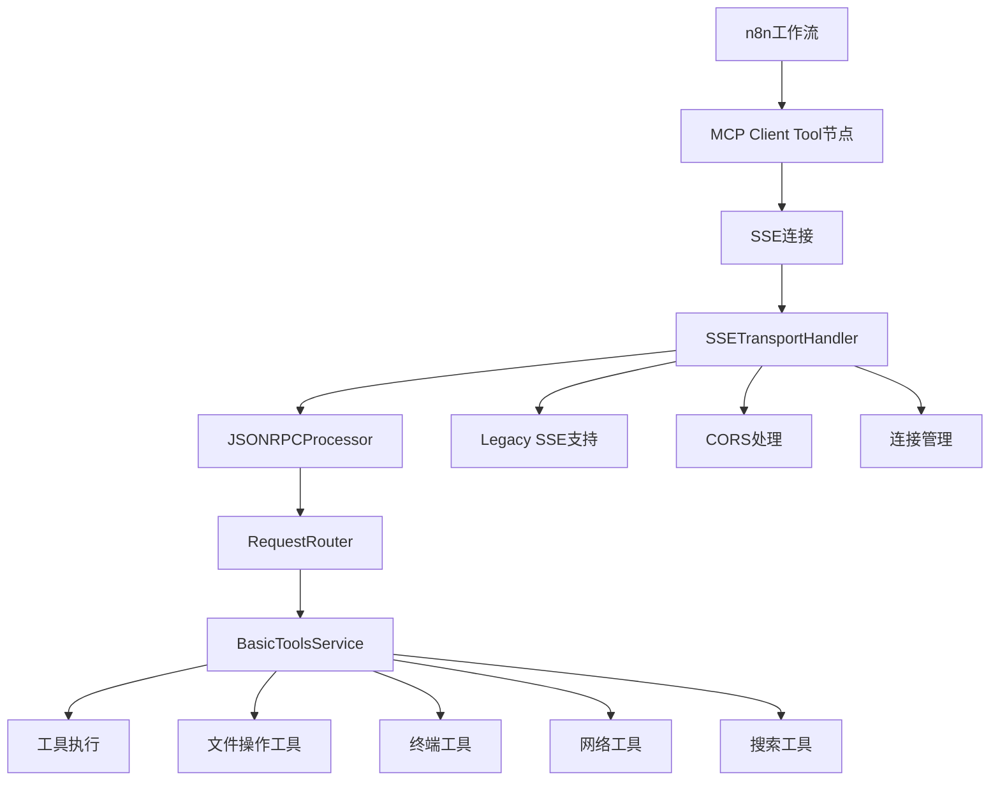

# 07_n8n集成模块设计

## 1. 模块概述

### 1.1 设计目标
为n8n工作流平台提供完整的MCP协议支持，通过SSE (Server-Sent Events) 传输协议实现与n8n MCP Client Tool节点的无缝集成。

### 1.2 核心职责
- **SSE协议支持**：实现符合n8n要求的SSE传输协议
- **Legacy兼容性**：支持n8n使用的传统SSE协议格式
- **工具集成**：将MCP工具集暴露给n8n工作流
- **会话管理**：处理n8n客户端的连接和会话状态
- **错误处理**：提供友好的错误信息和故障恢复

## 2. 架构设计

### 2.1 n8n集成架构


### 2.2 SSE传输处理器实现
```python
class SSETransportHandler(TransportHandler):
    """SSE传输处理器，专为n8n集成设计"""

    def __init__(self, host: str = "127.0.0.1", port: int = 8082):
        super().__init__(host, port)
        self._legacy_sse_support = True  # 支持n8n的Legacy SSE
        self._active_connections: Set[StreamResponse] = set()

    async def start(self) -> None:
        """启动SSE服务器"""
        self._app = web.Application()
        self._setup_routes()
        self._setup_middleware()

        self._runner = web.AppRunner(self._app)
        await self._runner.setup()

        site = web.TCPSite(self._runner, self.host, self.port)
        await site.start()

        self.logger.info(f"SSE服务器启动在 {self.host}:{self.port}")

    def _setup_routes(self) -> None:
        """设置路由"""
        # SSE端点 - n8n连接入口
        self._app.router.add_get("/sse", self._handle_sse_stream)
        # HTTP端点 - 兼容性支持
        self._app.router.add_post("/mcp", self._handle_http_request)
        # 健康检查
        self._app.router.add_get("/health", self._handle_health_check)
        # CORS预检
        self._app.router.add_options("/{path:.*}", self._handle_options)
```

## 3. n8n协议适配

### 3.1 SSE协议格式
n8n MCP Client Tool节点期望的SSE消息格式：
```
event: message
data: {"jsonrpc":"2.0","id":"req_123","result":{"status":"success"}}

event: error
data: {"jsonrpc":"2.0","id":"req_123","error":{"code":-32000,"message":"Tool execution failed"}}

event: close
data: {"reason":"Connection closed"}
```

### 3.2 Legacy SSE支持
```python
async def _send_sse_message(self, response: StreamResponse, data: Dict[str, Any], event: str = "message") -> None:
    """发送SSE格式消息"""
    try:
        # n8n期望的Legacy SSE格式
        message = f"event: {event}\n"
        message += f"data: {json.dumps(data)}\n\n"

        await response.write(message.encode('utf-8'))
        await response.drain()

    except Exception as e:
        self.logger.error(f"发送SSE消息失败: {e}")
```

### 3.3 CORS配置
```python
def _setup_middleware(self) -> None:
    """设置中间件"""

    @web.middleware
    async def cors_middleware(request: Request, handler: Any) -> web.Response:
        """CORS中间件 - 支持n8n跨域访问"""
        response = await handler(request)

        # n8n需要的CORS头
        response.headers['Access-Control-Allow-Origin'] = '*'
        response.headers['Access-Control-Allow-Methods'] = 'GET, POST, OPTIONS'
        response.headers['Access-Control-Allow-Headers'] = 'Content-Type, Accept, Mcp-Session-Id'
        response.headers['Access-Control-Expose-Headers'] = 'Mcp-Session-Id'

        return response

    self._app.middlewares.append(cors_middleware)
```

## 4. 工具集成

### 4.1 可用工具列表
当前支持的工具（通过BasicToolsService注册）：

1. **文件操作工具**
   - `read_file`: 读取文件内容
   - `write_file`: 写入文件内容
   - `list_files`: 列出目录文件
   - `create_directory`: 创建目录

2. **终端工具**
   - `run_command`: 执行系统命令
   - `get_environment`: 获取环境变量
   - `set_working_directory`: 设置工作目录

3. **网络工具**
   - `http_request`: 发送HTTP请求
   - `dns_lookup`: DNS查询

4. **搜索工具**
   - `file_search`: 文件搜索
   - `content_search`: 内容搜索

5. **测试工具**
   - `echo`: 回显测试

### 4.2 工具调用示例
在n8n中调用MCP工具的示例：
```json
{
  "jsonrpc": "2.0",
  "method": "tools/call",
  "params": {
    "name": "read_file",
    "arguments": {
      "path": "/path/to/file.txt"
    }
  },
  "id": "req_123"
}
```

## 5. 部署配置

### 5.1 启动脚本
```bash
#!/bin/bash
# scripts/run_mcp_daemon.sh

# 启动MCP工具集服务器，支持n8n集成
uv run python -m mcp_toolkit.main \
  --host 127.0.0.1 \
  --port 8080 \
  --ws-port 8081 \
  --sse-port 8082 \
  --debug
```

### 5.2 n8n配置
在n8n中配置MCP Client Tool节点：
- **SSE Endpoint**: `http://127.0.0.1:8082/sse`
- **Protocol**: `Legacy SSE`
- **Timeout**: `30000ms`

## 6. 监控和日志

### 6.1 连接监控
```python
async def _monitor_connections(self) -> None:
    """监控SSE连接状态"""
    while True:
        active_count = len(self._active_connections)
        self.logger.info(f"活跃SSE连接数: {active_count}")

        # 清理断开的连接
        disconnected = []
        for conn in self._active_connections:
            if conn.transport and conn.transport.is_closing():
                disconnected.append(conn)

        for conn in disconnected:
            self._active_connections.discard(conn)

        await asyncio.sleep(30)  # 每30秒检查一次
```

### 6.2 日志配置
- **连接日志**: 记录n8n客户端连接和断开
- **请求日志**: 记录所有MCP请求和响应
- **错误日志**: 记录协议错误和工具执行错误
- **性能日志**: 记录请求处理时间和资源使用

## 7. 故障排除

### 7.1 常见问题
1. **连接失败**: 检查端口是否被占用，CORS配置是否正确
2. **工具调用失败**: 检查工具参数格式和权限设置
3. **SSE断开**: 检查网络稳定性和超时配置

### 7.2 调试工具
- **健康检查端点**: `/health`
- **工具列表端点**: `/tools/list`
- **连接状态端点**: `/status`

---
*文档版本: 1.0*
*最后更新: 2025-07-09*
